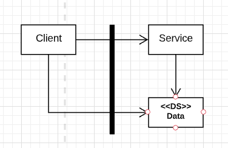
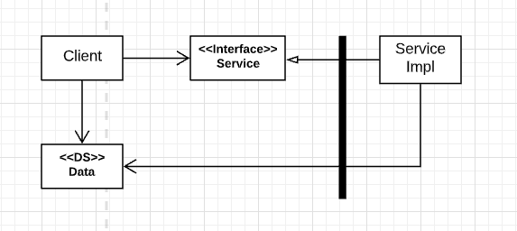

# Boundaries

* Overview
* Implementation
* Boundary Crossing
* Monolith example

## Overview

> Software architecture is the art of drawing lines called *boundaries*. The architecture of the system is defined by a set of software components and the boundaries that separate them.

Boundaries separate software elements from one another, and restrict those on one side from knowing about those on the other.

> You draw lines between things that matter and things that don't. The GUI doesn't matter to the business rules, so there should be a line between them. The database doesn't matter to the GUI, so there should be a line between them.

Some boundaries are drawn very early in a project's life, even before any code is written. Others are drawn much later. Those that are drawn early are *drawn for the purposes of deferring decisions for as long as possible*, and of keeping those decisions from polluting the core business logic.

> Note the two arrows leaving `DatabaseAccess` class. That means that none of these classes knows the class exists.

## Implementation

> Boundaries objects are _Interfaces_, that are implemented usually by Interactors.

Data goes into an Interactor, through Boundary, and goes out from an Interactor also through a Boundary.

## Boundary Crossing

At runtime, a boundary crossing is nothing more than a function on one side of the boundary calling a function on the other side and passing along some data. The trick to creating an appropriate boundary crossing is to *manage source code dependencies*.

## Monolith Example

The simplest and most common of the architectural boundaries has no strict physical representation. It is simply a disciplined segregation of functions and data within a single processor and a single address space.

When a higher-level client needs to invoke a lower-level service, dynamic polymoprhism is used to invert the dependency against the flow of control. *The runtime dependency opposes the compile-time dependency*.

In the figure, the flow of control crosses the boundary from left to right. The `Client` calls function `f()` on the `Service`. It passes along an instance of `Data` (data structure). The `Data` may be passed as a function argument or by some other more elaborate means. Note that the definition of the `Data` is on the *called* side of the boundary.

> The boundary is crossed as flow of control, from a higher level to a lower level. We want to avoid this.

In the latest figure, the flow of control crosses the boundary from left to right as before. The high-level `Client` calls the `f()` function of the lower level `ServiceImpl` through the `Service` interface. Note, however, that all dependencies cross the boundary from right to left *toward the higher-level component*. Note, also, that the definition of the data structure is on the calling side of the boundary.

> Crossing the boundary against the flow of control allows higher-level components to remain independent of lower-level details.
