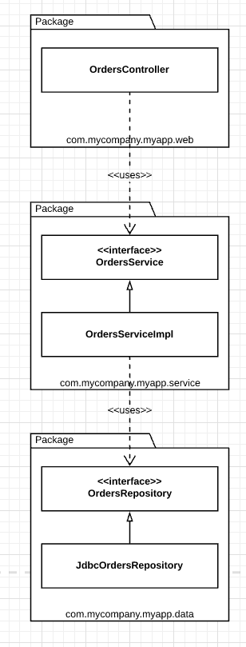

# Package By Layer

This design approach is the traditional horizontal layered architecture, where we separate our code based on what it does from a technical perspective.

In this typical layered architecture, we have one layer for the web code, one layer for our "business logic", and one layer for persistence. Code is *sliced horizontally into layers*. In an "strict layered architecture", *layers should depend only on the next adjacent lower layer*.

In "*Presentation Domain Data Layering*", Martin Fowler says that adopting such a layered architecture is a good way to get started. It's a very quick way to get something up and running without a huge amount of complexity. The problem, as Martin points out, is that once your software grows in scale and complexity, you will quickly find that having three large buckets of code isn't sufficient, and you will ned to think about modularizing further.

Another problem is that, as Uncle Bob says, a layered architecture doesn't scream anything about the business domain. Put the code for two layered architectures, from two very different business domains, side by side and they will likely look very similar: web, services, and repositories.

## Java Example

> In Java, layers are typically implemented as packages.

In this example, we have the following Java types:

* `OrdersController`: A web controller, something like a Spring MVC controrller, that handles requessts from the web.

* `OrdersService`: An interface that defines the "business logic" related to orders.
