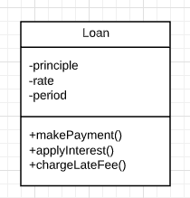

# Entities

An Entity is an object that embodies a small set of *Critical Business Rules* operating on *Critical Business Data*. The Entity object either contains the *Critical Business Data* or has very easy access to that data. The interface of the Entity consists of the functions that implement the critical business rules that operate on that data.

> Example loan entity as a class in UML.

When we create this kind of class, we are gatering together the software that iomplements a concept that is critical to the business, and separating it from every other concern in the automated system we are building. *This class stands alone as a representative of the business*. It is unsullied with concernes about databases, user interfaces, or third-party frameworks.

> The Entity is pure business and *nothing else*.
