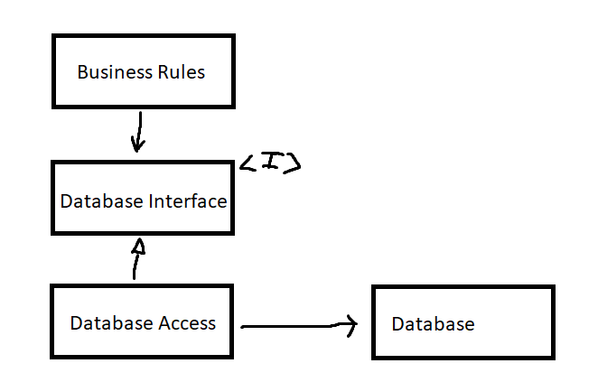

# Boundaries

* Overview
* Implementation

## Overview

> Software architecture is the art of drawing lines called *boundaries*.

Boundaries separate software elements from one another, and restrict those on one side from knowing about those on the other.

> You draw lines between things that matter and things that don't. The GUI doesn't matter to the business rules, so there should be a line between them. The database doesn't matter to the GUI, so there should be a line between them.

Some boundaries are drawn very early in a project's life, even before any code is written. Others are drawn much later. Those that are drawn early are *drawn for the purposes of deferring decisions for as long as possible*, and of keeping those decisions from polluting the core business logic.

> Note the two arrows leaving `DatabaseAccess` class. That means that none of these classes knows the class exists.

## Implementation

> Boundaries objects are _Interfaces_, that are implemented usually by Interactors.

Data goes into an Interactor, through Boundary, and goes out from an Interactor also through a Boundary.
