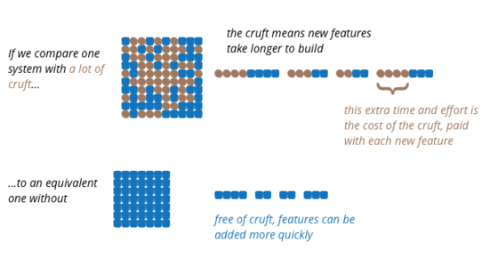

# Software Architecture

- [Software Architecture](#software-architecture)
  - [Ralph Johnson](#ralph-johnson)
  - [Martin Fowler](#martin-fowler)
  - [Robert C. Martin](#robert-c-martin)
  - [Grady Booch](#grady-booch)

## Ralph Johnson

Architecture the **shared understanding of a system's design** by the expert developers on a project. Commonly this shared understanding is in the form of the major components of the system and how they interact.

> Some people say architecture it's something like the fundamental organization of a system, or the way the highest level components are wired together. Ralph questioned this phrasing, arguing that there was no objective way to define what was fundamental, or high level.

Architecture is the *design decisions that developers wish they could get right early* on because they're perceived as *hard to change*.

> Ralph also disagreed with another common style of definition that said architecture is the design deecisions that need to be made early in a project.

Ralph conlusion is that **architecture is about the important stuff; whatever that is**. The heart of thinking architecturally about software is to decide what is important.

## Martin Fowler

> See [original post](https://www.martinfowler.com/architecture/) in Martin Fowler's webpage and [the email exchange with Ralph Johnson](https://www.martinfowler.com/ieeeSoftware/whoNeedsArchitect.pdf).

He ellaborates on Ralph Jonhson's conclusion: architecture is about the important stuff; whatever that is. It means that the heart of thinking architecturally about software is to *decide what is importart (i.e, what is architectural), and then expend energy on keeping those architectural elements in good condition*.

For a developer to become an architect, they need to be able to recognize what elements are important, *recognizing what elements are likely to result in serious problems should hey not be controlled*.

Architecture *isn't something immediately perceived* by customers and users of software products; but a poor architecture is a *major contributor to the grwoth of cruft* — elements of the software that impede the ability of developers to understand the software. Software that contains a lot of cruft is much harder to modify, leading to features that arrive more slowly and with more defects.

High internal quality leads to faster delivery of new features, because there is less cruft to get in the way.

> We are used to something that is "high-quality" as something that costs more. For some aspects of software, such as the user-experience, this can be true. But when it comes to the architecture, and other aspects of internal quality, this relationship is reversed.

## Robert C. Martin

The obvious appeal of architecture is __structure__ (components, classes, functions, modules, layers, and services, micro or macro).

This measure tells us how we can determine whether an architecture is good or not: Not only does a good architecture meet the needs of its users, developers, and owners at a given point in time, but it also meets them over time.

> _If you think good architecture is expensive, try bad architecture._ - Brian Foote and Joseph Yoder

This throws some light on the problem software architecture tries to solve. How to know what typical changes will be so that we can shape the system through _significant design decisions_ around them? How do we reduce future development effort and cost? 

> _Architecture is a hypothesis, that needs to be proven by implementation and measurement._ - Tom Gilb

Good software architecture __recognizes the softness__ of software and __aims to preserve it__ as a first-class property of the system. It recognizes that we operate with incomplete knowledge, but it also understands that, as humans, operating with incomplete knowledge is something we can do through experimentation and discovery. A good architecture comes form understanding it more as a journey than as a destination, more as an __ongoing process of enquiry than as a frozen artifact__.

> _The only way to go fast, is to go well._ - Robert C. Martin

When software is done right, it requires a fraction of the human resources to create and maintain. Changes are simple and rapid. Defects are few and far between. Effort is minimizsed, and functionality and flexibility are maximized.

> The goal of software architecture is to minimize the human resources required to build and maintain the required system.

The measure of design quality is simply the measure of the effort required to meeth the needs of the customer. If that effort is low, and stays low throughout the lifetime of the system, the design is good. If that effort grows with each new release, the design is bad.

> To build a system with a design and an architecture that minimize effort and maximize productivity, you need to know which attributes of system architecture lead to that end.

## Grady Booch

> Architecture represents the *significant design decisions that shape a system*, where significant is *measured by cost of change*.
