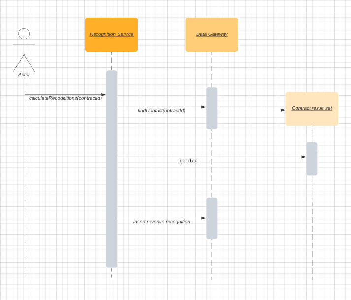
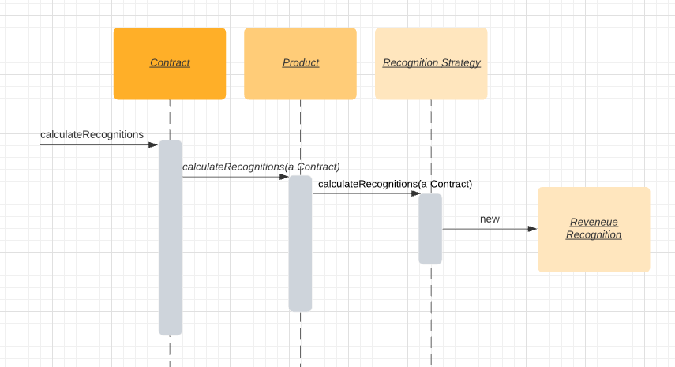

# Organizing Domain Logic

> Fowler presents three primary patterns for this problem, *Transaction Script*, *Domain Model* and *Table Module*.
 
* Three Approaches
  * 1. Transaction Script
  * 2. Domain Model (OO way)
  * 3. Table Module
* Making a Choice
* Service Layer

## Three Common Aproaches

### 1. Transaction Script

A *Transaction Script* is essentially a procedure that takes the input from the presentation, processes it with validations and calculations, stores data in the database, and invokes any operations from other systems. It then replies with more data to the presentation, perhaps doing more calculation to help organize and format the reply.

The fundamental organization is of a single procedure for each action that a user might want to do. Pieces get separated into subroutines, and these subroutines can be shared between different *Transaction Scripts*.  However, **thye driving force is still that of a procedure for each action**.

> A retailing system might have *Transaction Scripts* for checkout, for adding something to the shopping cart, for displaying delivery status, and so on.

#### Advantages

* Simple procedural model that most developers understand.

* It works well with a simple data source layer using *Row Data Gateway* or *Table Data Gateway*.

* It's obvious how to set the transaction boundaries: Start with opening a transaction and end with closing it.

#### Disadvantges

There are plently disadvantages, which tend to appear as the complexity of the domain logic increases.

* Often there will be duplicated code as several transactions need to do similar things, that is tricky to remove and harder to spot.

* Resulting application can end up being a tangled web of routines without a clear structure.

#### Case Study

A Transaction Script's *way of calculating revenue recognitions on a given contract*:

The method `calculateRecognition` method does all the work. The underlying objects are just *Table Data Gateways*, and all they do is pass data to the transaction script.

### 2. Domain Model

With a *Domain Model*, we build a model for our domain which, at least on a first approximation, is organized primarily around the nouns in the domain.

> A leasing system would have classes for lease, asset, and so forth.

The logic for handling validations and calculations would be placed into this domain model.

> A shipment object might contain the logic to calculate the shipping charge for a delivery. There might still be routines for calculating a bill, but such a procedure would quickly delegate to a Domain Model method.

Using a *Domain Model* as opposed to a *Transaction Script* is the essence of the paradigm shift that object-oriented people talk about so much:

Rather than one routine having all the logic for a user action, **each object takes a part of the logic that's relevant to it**.

> If you're not used to a Domain Model, learning to work with one can be very frustrating as you rush from object to object trying to find where the behavior is.

#### Advantages

* There are many techniques that allow you to **handle increasingly complex logic in a well-organized way**. 

#### Disadvantages

* There's a cost in complexity of using it and the complexity of your data source layer. It takes time for people new to rich object models to get used to a rich *Domain Model*.

* You have to deal with *database mapping*. The richer your Domain Model, the more complex your mapping to a relational database.

#### Case Study

A Domain Model's *way of calculating revenue recognitions on a given contract*:

The calculation method has to determine what kind of product a given contract is for, apply the correct algorithm, and then create revenue recognition objects to capture the results of the calculation.

Each object forwards part of the behavior to another until a strategy object creates the results.

### 3. Table Module

At very first blush the *Table Module* looks like a *Domain Model* since both have classes for contracts, products, and revenue recognitions. The vital difference is that a *Domain Model* has one instance of contract for each contract in the database whereas a *Table Module* has only one instance.

It is designed to work with a *Record Set*. Thus, the client of a contract *Table Module* will first issue queries to the database to for ma *Record Set* and will create a contract object and pass it the *Record Set* as an argument. The client can then invoke operations on the contract to do various things.

> A *Table Module* is in many ways a middle ground between a *Transaction Script* and a *Domain Model*.

#### Advantages

* Organizing the domain logic around tables rather than straight procedures (*Transaction Script*) provides more structure and makes it easier to find and remove duplication.

* It fits into the rest of the architecture easily. Many GUI environments are built to work on the results of a SQL query organized in a *Record Set*. You can easily run a query, manipulate data in the *Table Module*, and pass the manipulated data to the GUI for display.

#### Disadvantages

* You can't use a number of the techniques that a *Domain Model* uses for finer grained structure of the logic, such as inheritance, strategies and other OO patterns.

#### Case Study

## Making a Choice

It very much depends on how complex your domain logic is.

With simple domain logic the *Domain Model* is less atractive because the cost of understanding it and the complexity of the data source add a lot of effort to developing it that won't be paid back. Nevertheless, as the complexity of the domain logic increases, the other approaches tend to hit a wall where adding more features becomes exponentially more difficult.

There are some factors that alter the curves a bit. A team that's familiar with *Domain Model* will lower the initial cost of using this pattern.

The attractiveness of a *Table Module* depends very much on the support for a common *Record Set* structure in your environment. If you have an environment like .NET where lots of tools work around a *Record Set*, then that makes a *Table Module* much more attractive.

These **patterns are not mutually exclusive choices**. Indeed, it's quite common to use the *Transaction Script* for some of the domain logic and the *Table Module* or *Domain Model* for the rest.

## Service Layer

A common approach in handling domain logic is to **split the domain layer in two**: A *Service Layer* is placed over an underlying *Domain Model* or *Table Module*. The **presentation logic interacts with the domain purely through the Service Layer**, which acts as an API for the application.

As well as providing a clear API, the *Service Layer* is also a good spot to place such things as transaction control and security.

A key decision is how much behavior to put in a *Service Layer*.

The minimal case is to make it a *facade* so that all of the real behavior is in underlying objects and all the *Service Layer* does is forward calls on the facade to lower-level objects. In that case, the *Service Layer* provides an API that's easier to use because it's typically oriented around use cases.

At the other extreme, most business logic is placed in *Transaction Scripts* inside the *Service Layer*. The underlying domain objects are very simple; if it's a *Domain Model* it will be a one-to-one with the database and you can thus use a simpler data source layer such as *Active Record*.

Midway between these alternatives is a more even mix of behavior: the **controller-entity** style, where you have logic that's particular to a single transaction or use case placed in *Transaction Scripts* (**use-case controllers**), which are commonly referred to as controllers or services. These are different controllers to the input controllers in MVC. **Behavior that's used in more than one use case goes on the domain objects, which are called entities.**

> The use case controllers, like any transaction script, tend to encourage duplicate code. This approach can be used for improving  an original design that uses *Transaction Scripts* with *Row Data Gateway*, which will turn them into a simple *Domain Model* using *Active Record*.
