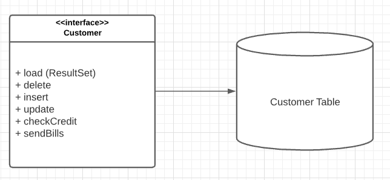
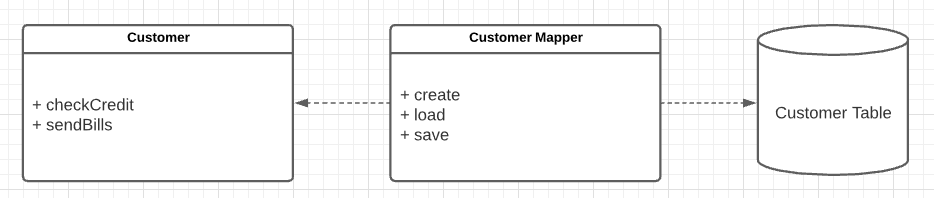
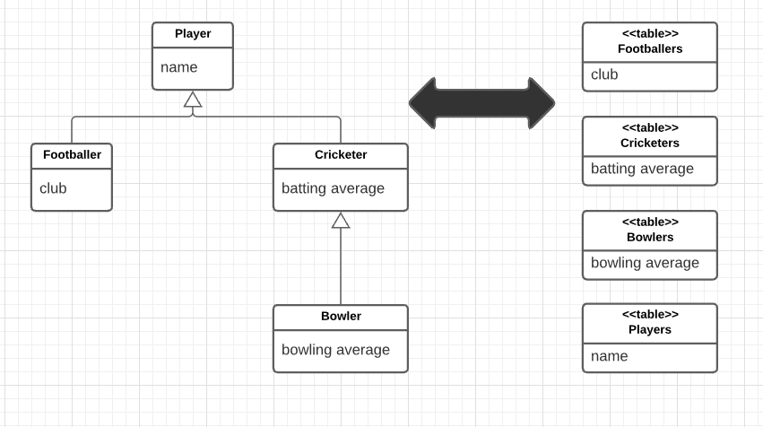

# Mapping to Relational Databases

> "I don't recommend using a *Gateway* as the primary persistence mechanism for a *Domain Model*. If the domain logic is simple and you have a close correspondence between classes and tables, *Active Record* is the simple way to go. If you have something more complicated, *Data Mapper* is what you need." - Martin Fowler

* Architectural Patterns
  * Gateways and DAOs
  * Active Record
  * Data Mapper
  * Repositories
* OO Databases
* Behavioral Problem
  * Unit of Work
  * Identity Map
  * Lazy Load
* Reading in Data
  * Finder Methods
  * Performance Rules of Thumb
* Structural Mapping Patterns
  * Mapping Relationships
  * Inheritance
* Building the Mapping
* Double Mapping
* Using Metadata
* Database Connections

## Architectural Patterns

Architectural patterns **drive the way in which the domain logic talks to the database**. The choice you make here is far-reaching for your design and thus difficult to refactor, and it's also a choice that's strongly affected by how you design your domain logic.

> Despite SQL's widespread use in enterprise software, there are still pitfalls in using it. Many applications developers don't understand SQL well and, as a result, have problems defininig effective queries and commands. Although various techniques exist for embedding SQL in a programming language, they're all somewhat awkward. It would be better to access data using mechanisms that fit in with the application development language. Database administrators (DBAs) also like to get at the SQL that accesses a table so they can understand how best to tune it and how to arrange indexes.

It's wise to **separate SQL access from the domain logic** and place it in separate classes.

The following **patterns aren't entirely mutually exclusive**. We can think in terms of the *primary persistence mechanism*, by which we mean how you save the data in some kind of in-memory model to the database. For that, you'll pick one of these patterns, you don't want to mix them because that ends up getting very messy. However, you can use a different pattern to wrap tables or services that are being treated as external interfaces.

### The Core: DAOs

> A DAO (Data Access Object) provides an interface enabling different underlying database implementations to be used.

A DAO **separates a data resource's client interface from its data access mechanism**s allowing data access mechanisms to change independently of the code that uses the data.

### Gateways

A good way of organizing these classes is to base them on the table structure of the database so that you have **one class per base table**. These classes then for ma *Gateway* to the table. The rest of the appliction needs to know nothing about SQL, and all the SQL that access the database is easy to find.

There are two main ways in which you can use a *Gateway*. The most obvious is to **have an instance of it for each row that's returned by a query**. This *Row Data Gateway* is an approach that naturally fits an object-oriented way of thinking about the data.


> A *Row Data Gateway* has one instance per row returned by a query.

Many environmnets provide a *Record Set*, that is, a **generic data structure of tables and rows that mimics the tabular nature of a database**. It's quite common for GUI tools to have controls that work with a *Record Set*. If you have a *Record Set*, you only need a single object for each table in the database. A *Table Data Gateway* provides methods to query the database that return a *Record Set*.


> A TableDataGateway is "a Gateway (object that encapsulates access to an external system or resource) to a database table. One instance handles all the rows in the table".

The fact that *Table Data Gateway* fits very nicely with *Record Set* makes it the obvious choice if you are using *Table Module*. It's also a pattern you can use to think about organizing stored procedures, and keeping calls to them encapsulated.

### Active Record

If you are using *Domain Model*, some further options come into play. Certainly you can use a *Row Data Gateway* or a *Table Data Gateway* with a *Domain Model*. That can be too much indirection or not enough.

In simple applications the *Domain Model* is an uncomplicated structure that actually corresponds pretty closely to the database structure, with one domain class per database table. Such domain objects often have only moderately complex buusiness logic. In this case it makes sense to have each domain object be responsible for loading and saving from the database, which is *Active Record*. 

Another way of thinking of the *Active Record* is that you start with a *Row Data Gateway* and then add domain logic to the class, particularly when you see repetitive code in multiple *Transaction Scripts*.

In this kind of situation, the added indirection of a *Gateway* doesn't provide a great deal of value. As the domain logic gets more complicated and you begin moving toward a rich *Domain Model*, the simple approach of an *Active Record* starts to break down.



> In the *Active Record*, a *customer* domain object knows how to interact with database tables.

The **one-to-one match of domain classes to tables starts to fail as you factor domain logic into smaller classes**. Relational databases don't handle inheritance, so it becomes difficult to use *Strategies* (Gang of Four) and other neat OO patterns. **As the domain logic gets feisty, you want to be able to test it without having to talk to the database all the time.**

All of these forces push you to indirection as your *Domain Model* gets richer. In this case, the *Gateway* can solve some problems but it still leaves you with the *Domain Model* coupled to the schema of the database, there's some transformation from the fields of the *Gateway* to the fields of the domain objects, and this transformation complicates your domain objects.

### Data Mapper

> A DataMapper "moves data between objects and a database while keeping them independent of each other and the mapper itself".

A better route is to **isolate the _Domain Model_ from the database completely, by making your indirection layer entirely responsible for the mapping between domain objects and database tables**. This *Data Mapper* handles all of the loading and storing between the database and the *Domain Model* and allows both to vary independently.

It's the **most complicated of the database mapping architectures**, but its benefit is **complete isolation** of the two layers.



> A *Data Mapper* insulates the domain objects and the database from each other.

### Repositories

> A Repository "acts like a collection, except with more elaborate querying capability" [Evans, Domain Driven Design] and may be considered as an "objects in memory facade".

## OO databases

With an OO database you don't have to worry about mapping or the "impedance mismatch" between objects and relations. You work with a large structure of interconnected objects, and the database figures out when to move objects on or off disks. Also, you can use transactions to group together updates and permit sharing of the data store.

The chief advantage of OO databases is that they improve productivity.

Most projects don't use OO databases, however. The primary reason against them is risk. Relational databases are a well-understood and proven technology backed by big vendors who have been around a long time. SQL provides a relatively standard interface for all sorts of tools.

Even if you can't use an OO database, you should seriously consider using an **O/R mapping tool** if you have a *Domain model*.

> Tool venders have spent many years working on this problem, and commercial O/R mapping tools are much more sophisticated than anything that can reasonably be done by hand. You should compare their price with the considerable cost of writing and amintaining such a layer yourself.

However, it's a good idea to be aware of these patterns. Good O/R tools give you a **lot of opinions in mapping** to a database, and these patterns will help you **understand when to use different choices**.

## Behavioral Problem

The behavioral problem is how to get the various objects to load and save themselves to the database.

With *Active Record* this is an easy problem, a customer object can have load ans save methods that do this task.

If you load a bunch of objets into memory and modify them, you have to keep track of which ones you've modified and make sure to write all of them back out to the database. If you only load a couple of records, this is easy. As you load more and more objects it gets to be more of an exercise, particularly when you create some rows and modify others since you'll need the keys from the created rows before you can modify the rows that refer to them.

As you read objects and modify them, you have to ensure that the database state you're working with stays consistent. If you read some objects, it's important to ensure that the reading is isolated so that no other process changes any of the objects you've read while you're working on them (*concurrency issues*).

### Unit of Work

A pattern that's essential to solving these problems is **Unit of Work**. A *Unit of Work* keeps track of all objects read from the database, together with all objects modified in any way. It also handles how updates are made to the database. 

Instead of the application programmer invoking explicit save methods, the programmer tells the unit of work to commit. That unit of work then sequences all of the appropriate behavior to the database, putting all of the complex commit processing in one place.

> A good way of thinking about *Unit of Work* is as an object that acts as the controller of the database mapping. Without it, typically the domain layer acts as the controller; deciding when to read and write to the database. The *Unit of Work* results from **factoring the database mapping controller behavior into its own object**.

### Identity Map

As you load objects, you have to be wary about loading the same one twice. If you do that, you'll have two in-memory objects that correspond to a single database row.

To deal with this you need to keep a record of every row you read in an **Identity Map**. Each time you read in some data, you check the *Identity Map* first to make sure that you don't already have it. If the data is already loaded, you can return a second reference to it. That way any updates will be properly coordinated.

As a benefit you may also be able to avoid a database call since the *Identity Map* also doubles as a cache for the database. Don't forget, however, that the primary purpose of an *Identity Map* is to maintain correct identities, not to boost performance.

### Lazy Load

If you're using a *Domain Model*, you'll usually arrange things so that linked objects are loaded together in such a way that a read for an order object loads its associated customer object. However, with many objects connected together any read of any object can pull an enormous object graph out of the database.

To avoid such inefficiencies you need to reduce what you bring back yet still keep the door open to pull back more data if you need it later on.

**Lazy Load** relies on having a placeholder for a reference to an object. There are several variants on the theme, but all of them have the object reference modified so that, instead of pointing to the real object, it marks a placeholder. Only if you try to follow the link does the real object get pulled in from the database.

> Using *Lazy Load* at suitable points, you can bring back just enough from the database with each call.

## Reading In Data

### Finder Methods

When reading in data, you can think of the methods as **finders** that wrap SQL select statements with a method structured interface. Where you put the finder methods depend on the interfacing pattern used.

* *Table based classes*: you can combine finder methods with the inserts and updates.

** *Row based classes*: you can make find operations static, but doign so will stop you from making the database operations substitutable with a *Service Stub*. To aviod this problem, the best approach is to have **separate finder objects**. Each finder class has many methods that encapsulate a SQL query. When you execute the query, the finder object returns a collection of the appropriate row-based objects.

> Finder methods work on database state, not the object state. So remember that in memory modifications won't get picked up by the query. As a result it's usually wise to do queries at the beginning.

### Performance Rules of Thumb

1. **Try to pull back multiple rows at once**. In particular, never do repeated queries on the same table to get multiple rows. It's almost always better to pull back too much data than too little.

2. **Use joins so that you can pull multiple tables back with a single query**. The resulting record set looks odd but you can really speed things up by using this approach with a *Gateway* that has data from multiple joined tables, or a *Data Mapper* that loads several domain objects with a single call. Bear in mind that *databases are optimized to handle up to three or four joins per query*.

3. **Beyond three/four joins per query performance suffers**. You can restore a good bit of this with *cached views*.

4. **Many optimizations are possible**. These involve clustering commonly referenced data together, careful use of indexes, and the database's ability to cache in memory.

## Structural Mapping Patterns

When people talk about *object-relational mapping*, mostly what they mean is these kinds of structural mapping patterns, which you use when **mapping between in-memory objects and database tables**.

> These patterns aren't usually relevant for *Table Data Gateway* but you way use a few of them if you use *Row Data Gateway* or *Active Record*. You'll probably need to use all of them for *Data Mapper*.

### Mapping Relationships

The central issue here is the **different way in which objects and relations handle links**, which leads to two problems:

#### 1. Difference in representation.

> Objects handle links by storing references that are held by the runtime of either memory-managed environments or memory addresses. Relational databases handle links by forming a key into another table.

You can keep the relational identity of each object as an *Identity Field* in the object, and to look up these values to map back and forth between the object references and the relational keys. It's a tedious process but not that difficult once you understand the basic technique.

When you read objects from the disk you use an *Identity Map* as a lookup table from relational keys to objects. Each time you come across a foreign key in the table, you use *Foreign Key Mapping* to wire up the appropriate inter-object reference. If you don't have the key in the *Identity Map*, you need to either go to the database to get it or use a *Lazy Load*. Each time you save an object, you save it into the row with the right key. Any inter-object reference is replaced with the target object's ID field.

#### 2. Objects can easily use collections to handle multiple references from a single field, while normalization forces all relation links to be single valued.

> This leads to reversals of the data structure between objects and tables. An order object naturally has a collection of line item objects that don't need any reference back to the order. However, the table structure is the other way around, the line item must include a foreign key reference to the order since the order can't have a multivalued field.

On the foundation of difference in representation, the collection handling requires a more complex version of *Foreign Key Mapping*. If an object has a collection, you need to issue another query to find all the rows that link to the ID of the source object (or avoid the query with *Lazy Load*). Each object that comes back gets created and added to the collection. Savcing the collection involves saving each object in it and making sure it has a foreign key to the source object. This gets messy, especially when you have to detect objects added or removed from the collection. Thjis can get repetitive when you get the hang of it, which is why some form of **metadata-based approach** becomes an obvious move for larger systems.

If the collection objects aren't used oustide the scope of the collection's owner, you can use *Dependent Mapping* to simplify the mapping.

A different case comes up with a *many-to-many relationship*, which has a collection on both ends. An example is a person having many skills and each skill knowing the people who use it. Relational databases can't handle this directly, so you use an *Association Table Mapping* to create a new relational table just to handle the many-to-many association.

When you're working with collections, a common gotcha is to rely on the **ordering within the collection**, such as lists and arrays in OO languages. Nevertheless, it's very difficult to maintain an arbitrarily ordered collection when saved to a relational database. For this reason it's worth considering using unordered sets for storing collections. Another option is to decide on a sort order whenever you do a collection query, although that can be quite expensive.

> In some cases referential integrity can make updates more complex. Modern systems allow you to defer referential integrity checking to the end of the transaction. Otherwise database will check on every write and you'll need alternatives approaches such as *doing a topological sort of your updates* or *hardcode which tables get written in which order*.

*Identity Field* is used for inter-object references that turn into foreign keys, but not all object relationships need to be persisted that way. Small *Value Objects*, such as date ranges and money objects clearly shouldn't be represented as their own table in the database. Instead, take all the fields of the *Value Object* and embed them into the linked object as an *Embedded Value*. Since *Value Objects* have value semantics, you can happily create them each time you get a read and you don't need to bother with an *Identity Map*. Writing them out is also easy, just dereference the object and spit out its fields into the owning table.

You can do this kind of thing on a larger scale by taking a whole cluster of objects and saving them as a single column in a table as a *Serialized LOB* (Large OBject), which can be iether binary (*BLOB*) or textual *CLOB* (Character Large OBject). Serializing a clump of objects as an XML document is an obvious route to take for a hierarchic object structure. This way you can grab a whole bunch of small linked objects in a single read.

> Often databases perform poorply with small highly interconnected objects, where you spend a lot of time making many small database calls. Hierarchic structures such as org charts and bills of materials are where a *Serialized LOB* can save a lot of database roundtrips.

The downside is that SQL isn't aware of what's happening, so you can't make portable queries against the data structure. Again, XML may come to the rescue here, allowing you to embed XPath query expressions within SQL calls, although is largerly nonstandard. As a result, *Serialized LOB* is best used when you don't want to query for the parts of the stored structure. Usually it's best for a relatively isolated group of objects that make part of an application.

> If you use *Serialized LOB* too much, it ends up turning your database into more than a transactional file system.

### Inheritance

Besides *compositional hierarchies*, there's the *class hierarchy linked by inheritance*. Since there's no standard way to do inheritance in SQL, we again have a mapping to perform.

For any inheritance structure there are basically three options:

1. *Single Table Inheritance*: one table for all the classes in the hierarchy.


2. *Concrete Table Inheritance*: one table for each concrete class.


3. *Class Table Inheritance*: one table per class in the hierarchy.



The trade-offs are all between duplication of data structure and speed of access. *Class Table Inheritance* is the simplest relationship between the class and the tables, but it needs multiple joins to load a single object, which usually reduces performance. *Concrete Table Inheritance* avoids the joins, allowing you pull a single object from one table, but it's brittle to changes. With any change to a superclass you have to remember to alter all the tables (and the mapping code). Altering the hierarcy itself can cause even bigger changes. Also, the lack of a superclass table can make key management awkward and get in the way of referential integrity, although it does reduce lock contentions on the superclass table.

In some databases *Single Table Inheritance*;s biggest downside is wasted space, since each row has to have columns for all possible subtypes and this leads to empty columns. However, many databases do a very good job of compressing wasted table space. Another problem with *Simple Table Inheritance* is its size, making it a bottleneck for accesses. Its great advantage is that it puts all the stuff in one place, which makes modification easier and avoids joins.

The three options **aren't mutually exclusive**, and in one hierarchy you can mix patterns, but of course that adds complexity.

> "My first choice tends to be *Single Table Inheritance*, as it's easy to do and is resilient to many refactorings. I tend to use the other two as needed to help solve the inevitable issues with irrelevant and wasted columns. Often the best is to talk to the DBAs." - Martin Fowler

In the case of **multiple inheritance**, you cope with it using variations of the trio of inheritance patterns:

* *Single Table Inheritance*: puts all superclasses and interfaces into the one big table.
* *Class Table Inheritance*: makes a separate table for each interface and superclass.
* *Concrete Table Inheritance*: includes all interfaces and superclasses in each concrete table.

## Building the Mapping

When you map to a relational database, there are essentially three situations:

* You choose the schema yourself.

* You have to map to an existing schema, which can't be changed.

* You have to map to an existing schema, but changes to it are negotiable.

The simplest case is where you're doing the schema yourself and you have little to moderate complexity in your domain logic, resulting in a *Transaction Script* or *Table Module* design. In this case you can design the tables around the data using classic database design techniques. Use a *Row Data Gateway* or *Table Data Gateway* to pull the SQL away from the domain logic.

If you're using a *Domain Model*, you should beware of a design that looks like a database design, so that you build your *Domain Model* without regard to the database and can best simplify the domain logic. Treat the database design as a way of persisting the object's data. *Data Mapper* gives you the most flexibility here, but it's more complex. If a database design isomorphic to the *Domain Model* makes sense, you might consider an *Active Record* instead.

Although building the model first is a reasonable way of thinking about it, this advide only applies within **short iterative cycles**. Spending six months building a database-free *Domain Model* and then deciding to persist it once you're done is highly risky. The danger is that the resulting design will have crippling performance problems that tkae too much refactoring to fix. Instead, **build up the database with each iteration**, of no more than six weeks in length and preferably fewer. That way, you'll get rapid and continuous feedback about how your database interactions work in practice. Within any particular task you should think about the *Domain Model* first, **but integrate each piece of it in the database as you go**.

When the schema's already there, your choices are similar but the process is slighlty different. With simple domain domain logic you build *Row Data Gateway* or *Table Data Gateway* classes that mimic the database, and layer domain logic on top of that. With more complex domain logic you'll need a *Domain Model*, which is highly unlikely to match the database design. Therefore, gradually build up the *Domain Model* and include *Data MAppers* to persist the data to the existing database.

## Double Mapping

Occasionally, the **same kind of data needs to be pulled from more than one source**. There may be multiple databases that hold the same data but have small differences in the schema because of some copy and paste reuse. Another possibility is using different mechanisms, storing the data sometimes in a database and sometimes in messages. You may want to pull similar data from a a combination of XML messages, CICS transactions, and relational tables.

The simplest option is to **have multiple mapping layers, one for each data source**. However, if data is very similar this can lead to a lot of duplication. In this situation you might consider a **two'step mapping scheme**. **The first step converts data from the in-memory schema to a logical data store schema**. 
gical data store schema is designed to maximize the similarities in the data source formats. **The second step maps from the logical data store scheme to the actual physical data store schema**. This second step contains the differences.

The extra step only pays for itself when you have many commonalities, so you should use it when you have similar but annoyingly different physical data stores. Treat the mapping from the logical data store to the physical data store as a *Gateway* and use any of the mapping techniques to map from the application logic to the logical data store.

## Using Metadata

There's much you can do by factoring out common behaviors with inheritance and delegation, good honest OO practices, but there's also a more sophisticated approach using **Metadata Mapping**.

*Metadata Mapping* is based on boiling down the mapping into a metadata file that details how columns in the database map to fields in objects. The point of this is that once you have the metadata you can avoid the repetitive code by using either code generation or reflective programming.

Using metadata buys you a lot of expresiveness from a little metadata. One line of metadata can say something like:

```html
<filed name="customer" targetClass="Customer" dbColumn="custId" targetTable="customers" lowerBound="1" upperBound="1" setter="loadCustomer" />
```

From that you can define the read and write code, automatically generate ad hoc joins, do all of the SQL, enforce the multiplicity of the relationship, and even do fancy things like computing write orders under the presence of referential integrity.

> This is why commercial O/R mapping tools tend to use metadata.

When you use *Metadata Mapping* you have the necessarty foundation to build queries in terms of in-memory objects. A *Query Object* allows you to build your queries in terms of in-memory objects and data in such a way that developers don't need to know either SQL or the details of the relational schema. The *Query Object* can then use the *Metadata Mapping* to translate expressions based on object fields into the appropriate SQL.

Take this far enough and you can form a *Repository* that largely hides the database from view. Any queries to the database can be made as *Query Objects* against a *Repository*, and developers can't tell whether the objects were retrieved from memory or from the database.

## Database Connections

Most database interfaces rely on some kind of database connection object to act as the link between application code and the database.

Typically a connection must be opened before you can execute commands against the database. Indeed, usually you need an explicit connection to create and execute a command. The whole time you execute the command this same connection must be open.

Queries return a *Record Set*. Some interfaces provide for disconnected *Record Sets*, which can be manipulated after the connection is closed. Other interfaces provide only connected *Record Sets*, implying that the connection must remain open while the *Record Set* is manipulated. If you're running inside a transaction, usually the transaction is bound to a particular connection and the connection must remaion open while the transaction is taking place.

In many environments **it's expensive to create a connection**, which makes it worthwhile to create a **connection pool**. In this situation developers request a connection from the pool and release it when they're done, instead of creating and closing the connection.

> Most platforms these days give you pooling. If you do have to do it yourself, first check to see if pooling actually does help performance. INcreasingly environments make it quicker to create a new connection so there's no need to pool.

Environments that give you pooling **often put it behind an interface that looks like creating a new connection**. Similarly, closing the connection may not actually close it but just return it to the pool.

Expensive to create or not, **connections need management**, so they **must be released as soon as you're done using them**. Furthermore, if you're using a transaction ,usually you need to ensure that every command inside a particular transaction goes with the same connection.

The most common advice is to get a **connection explicitly**, usng a call to a pool or connection manager, and then supply it to each database command you want to make. Once you're done with the connection, close it. This advice leads to a couple of issues: *making sure you have the connection everywhere you need it and ensuring that you don't forget to close it at the end*.

To ensure that you have a connection where you need it there are two choices. One is to **pass the connection around as an explicit parameter**. The problem problem with this is that the connection gets added to all sorts of method calls where its only purpose is to be passed so some other method five layers down the call stack. Of course, this is the situation to bring out **Registry**. Since you don't want multiple threads using the same connections, you'll want a *thread-scoped Registry*.

For avoiding explicit connection, modern environments these days provide automatic memory management and garbage collection, so one way to ensure that connections are closed is to use the garbage collector, which uses the same managment scheme that's used for memory. A problem is that unreferenced connections may sit around a while before they're collected by the garbage collector.

Since connections are so tied to transactions, a good way to manage them is to **tie them to a transaction**. Open a connection when you begin a transaction, and close it when you commit or roll back. Have the transaction know what connection it's using so you can ignore the connection completely and just deal with the transaction. Since the transaction's completion has a visible effect, it's easier to remember to commit and to spot if you forget. A *Unit of Work* makes a natural fit to manage both the transaction and the connection.

If you do things outside of your transaction, such as reading immutable data, you use a fresh connection for each command. Pooling can deal with any issues in creating short-lived connections.

If you're using a disconnected *Record Set*, you can open a connection to put the data in the record set and lcose it while you manipulate the *Record Set* data. Then, when you're done with the data, you can open a new connection, and transaction, to write the data out. If you do this, you'll need to worry about the data being changed while the *Record Set* was being manipulated (concurrency control).

> The specifics of connection management are very much a feature of your database interaction software, so the strategy uou use is often dictated by your environment.
