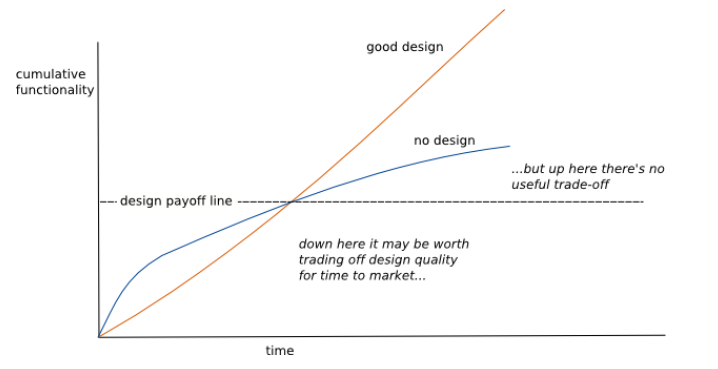

# Technical Debt

> Notes based on [Martin Fowler's post](https://www.martinfowler.com/bliki/TechnicalDebt.html).

- [Technical Debt](#technical-debt)

 - [Overview](#overview)

 - [Pay off gradually](#pay-off-gradually)

 - [Taking debt](#taking-debt)

 - [Design Stamina Hypothesis](#design-stamina-hypothesis)

   - [Example: Taking debt vs paying off](#example-taking-debt-vs-paying-off)

 - [Technical Debt Quadrant](#technical-debt-quadrant)

## Overview

Software systems are prone to the build-up of cruft — deficiencies in [internal quality](../quality) that make it harder than it would ideally be to modify and extend the system further. 

Technical debt is a *metaphor*, coined by [Ward Cunningham](https://en.wikipedia.org/wiki/Ward_Cunningham), that frames how to think about dealing with this cruft, think of it as *financial debt*. The *extra effort* that it takes to add new features is the interest paid on the debt.

## Pay off gradually

Sadly, we cannot measure these costs objectively. We can *estimate* how long it takes to do a feature, what it might be like if the cruft was removed, and the cost of removing the cruft. But our accuracy of such estimates is pretty low.

Given this, usually, the best route is to do what we usually do with financial debts: **pay the principal off gradually**.

On the first feature, I'll spend extra time to remove some of the cruft. That may be enough to reduce the interest rate on future enhancements. That's still going to take extra time, but by removing the cruft I'm making it cheaper for future changes to this code.

The great **benefit of gradual improvement** like this is that it naturally means we spend more time on removing cruft in those areas that we modify frequently, which are exactly those areas of the codebase where we most need the cruft to be removed.

Thinking of this as paying interest versus paying of principal can help decide which cruft to tackle. So crufty but stable areas of code can be left alone. In contrast, areas of high activity need a zero-tolerance attitude to cruft, because the interest payments are cripplingly high. This is especially important since cruft accumulates where developers make changes without paying attention to internal quality — the more changes, the greater risk of cruft building up.

## Taking debt

The metaphor of debt is sometimes used to justify neglecting internal quality to favor new critical features. The argument is that it takes time and effort to stop cruft from building up. If there are new features that are needed urgently, then *perhaps* it's best to take on the debt, accepting that this debt will have to be managed in the future.

The danger here is that most of the time this analysis isn't done well. Cruft has a quick impact, slowing down the very new features that are needed quickly. Teams who do this end up **maxing out all their credit cards**, but still delivering later than they would have done had they put the effort into higher internal quality.

Taking on debt to speed delivery only works if you stay below the design payoff line of the *Design Stamina Hypothesis*, and teams hit that line in weeks rather than months.

## Design Stamina Hypothesis

> There is a notion that design is something you can trade-off for greater speed.

Design activities certainly do take up time and effort, but *they payoff* because they make it **easier to evolve** the software into the future. You can save short-term time by neglecting design, but this accumulates *technical debt* which will slow your productivity later.

Putting effort into the design of your software improves the *stamina* of your project, allowing you to **go faster for longer**.

### Example: Taking debt vs paying off

Imagine I have a confusing module structure in my codebase. I need to add a new feature. If the module structure was clear, then it would take me 1 day to add the feature but with this cruft, it takes me 2 days. The difference is the interest on the debt.

I could take 2 days to clean up the modular structure, removing that cruft, metaphorically paying off the principal. If I only do it for this one feature, that's no gain, as I'd take 3 days instead of 2 days. But if I have two more similar features coming up, then I'll end up faster by removing the cruft first.

## Technical Debt Quadrant

Technical debt should be reserved for cases when people have made a *considered* decision to adopt a design strategy that isn't sustainable in the longer term but yields a short-term benefit, such as making a release. The point is that the debt *yields value sooner*, but needs to be paid off as soon as possible.

> [*"A mess is not a debt"* — Uncle Bob](https://sites.google.com/site/unclebobconsultingllc/a-mess-is-not-a-technical-debt). A mess is a reckless debt that results in crippling interest payments or a long period of paying down the principal. 

For Martin Fowler, the question of whether a *design flaw* is or isn't debt is the wrong question. *Technical debt is a metaphor*, so the real question is whether or not the debt metaphor is helpful about thinking about *how to deal with design problems*, and how to communicate that thinking.

> A particular benefit of the debt metaphor is that it's very handy for communicating with non-technical people.

Therefore, the useful distinction isn't between debt or non-debt, but between *prudent and reckless debt*.

*Inadvertent debt* is *inevitable* and thus should be *expected*. It can take a year of programming on a project before you understand what the best design approach should have been. The moment you realize what the design should have been, you also realize that you have an inadvertent debt. Even the best teams will have a debt to deal with it as a project goes on — even more reason not to recklessly overload it with crummy code.

