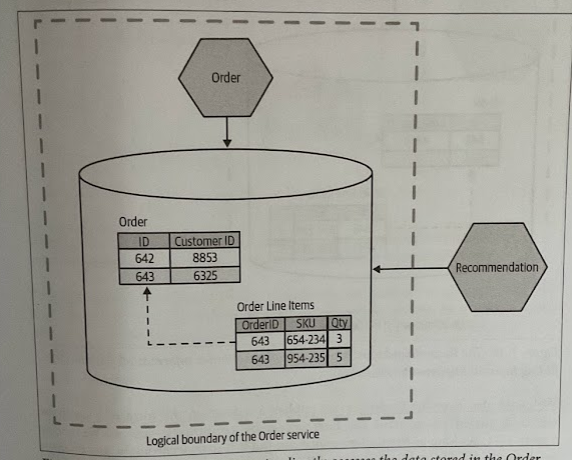
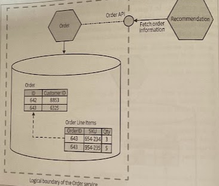
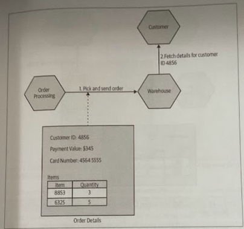
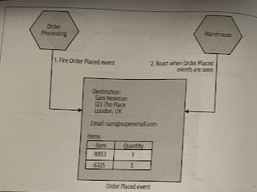

# Couplind and Cohesion

- [Couplind and Cohesion](#couplind-and-cohesion)
  - [Overview](#overview)
  - [Information Hiding](#information-hiding)
  - [Implementation Copling](#implementation-copling)
  - [Temporal coupling](#temporal-coupling)
  - [Deployment coupling](#deployment-coupling)
  - [Domain coupling](#domain-coupling)

## Overview

* *Coupling* speaks to how changing one thing requires a change in another; the code that changes together, stays together.

* *Cohesion* talks to how we group related code. The more things are coupled, the more they have to change

## Information Hiding

The core idea with information hiding is to *separate* the parts of the code that change frequently from the ones that are static. We want the module boundary to be stable and it should hide those parts of the module implementation that we expect to change more often. 

The idea is that *internal changes can be made safely* as long as module compatibility is maintained.

## Implementation Copling

Implementation coupling is typically the *most pernicious* form of coupling, but luckily it's often one of the easiest to reduce.

> If A is coupled to B in terms of how B is implemented, when the implementation of B changes, A also changes.

A classic and common example of implementation coupling comes in the form of sharing a database. We are coupled to a specific schema structure, SQL dialect, and perhaps even the content of the rows.

If an Order service changes the name of a column, splits the Customer Oorder table apart, or whatever else, it conceptually contains order information, but we break how the Recommendation service fetches this information. A better choice is to hide this implementation detail; now the Recommendation service accesses the information it needs via an API call.

We could also have the Order service publish a dataset, in the form of a database. ASs long as the Order service can publish data accordingly, any changes made inside the Order service are invisible to consumers, as it maintains the public contract.

This also opens up the opportunity to improve the data model exposed for consumers, tuning to their needs.

The act of hiding a database behind a well-defined service interface allows the service to limit the scope of what is exposed, and can allow us to change how this data is represented.

> With *"outside-in"* thinking, you first ask, "That do my service consumers need?", then drive the service interface by thinking of things from the point of service consumers first, and then work out how to implement that service contract.

## Temporal coupling

*Temporal coupling* is primarily a runtime concern that generally speaks to one of the key challenges of synchronous calls in a distributed environment. When a message is sent, and how that message is handled is connected in time, we are said to have a temporal coupling.

We could reduce this problem in various ways:

* **Caching** would be able to avoid temporal coupling on the downstream service in some cases.
* **Asynchronous transport**, perhaps using something like a message broker.

## Deployment coupling

If services *must* be deployed together, then we have deployment coupling.

Deployment coupling may be enforced (e.g., by a single process monolith), but can also be a matter of choice, driven by practices like a release train.

> In a release train, preplanned release schedules are drawn up in advance, typically with a repeating schedule. When the release is due,m all changes made since the last release train gets deployed. For some people, the release train can be a useful technique, but I strongly prefer to see it as a transitional step toward proper release-on-demand techniques.

The smaller the scope of the release, the easier and safer is to roll out, and the faster feedback we'll get.

## Domain coupling

Fundamentally, in a system that consistss of multiple independent services, there has to be some interaction between the participants.

If you want to place an order, you need to know what items were in a customer's shopping basket. If you want to ship a product, you need to know where you ship it. In a microservice architecture, by definition this information may be contained in different services.

We could further reduce the coupling by removing the need for the Warehouse service to even need to know about a customer, providing the appropriate details via the Pick instruction.

An alternative could be to have Order Processing emit some kind of event that the Warehouse consumes, therefore we effectively flip the dependencies. We go from Order PRocessing depending on the Warehouse service to be able to ensure an order gets sent, to the Warehouse listening to events from the Order Processing service.

