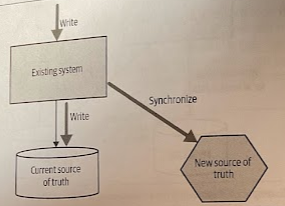
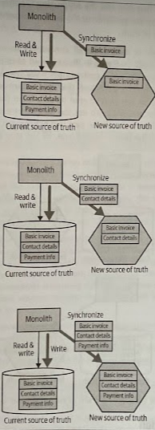
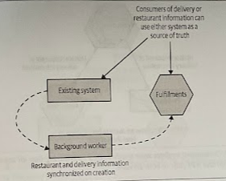
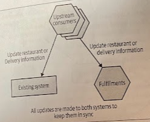
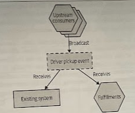

# Tracer Write

- [Tracer Write](#tracer-write)
  - [Overview](#overview)
  - [Where to Use It](#where-to-use-it)
  - [Data Synchronization](#data-synchronization)
  - [Case Study: Orders at Square](#case-study-orders-at-square)
    - [1. Creating a new service](#1-creating-a-new-service)
    - [2. Synchronizing the data](#2-synchronizing-the-data)
    - [3. Migrationg consumers](#3-migrationg-consumers)

## Overview

It is arguably a variation of the *synchronize data in application* pattern. With a *tracer write* we move the source of truth for data in an *incremental fashion*, tolerating there being *two sources of truth* during the migration.

You identify a new service that will host the relocated data. The current system still maintains a record of this data locally, but when making changes also ensures this *data is written to the new service via its service interface*. Existing code can be changed to start accessing the new service, and once all functionality is using the new service as the source of truth, the old source of truth can be retired.

Wanting a single source of truth is a totally rational desire. It allows us to ensure consistencyo f data, to control access to that data, and can reduce maintenance costs. The problem is that if we insist on only ever having one source of truth for a piece of data, then we are forced into a situation that changing where this data lives becomes a *single big siwtchover*.

A pattern like *tracer write* allows for a *phased switchover*, reducing the impact of each release, in exchang for being more tolerant of having more than one source of truth. You can *start with a small set of data* being synchronized and increase this over time, while also *increasing the number of consumers* of the new source of data.

> Other services that wanted invoice-related information would have a choice to source this from either the monolith or the new service itself, depending on what information they need.

Once we've established that the information is being properly synchronized, the monolith can start to read its data from the new service. As more data is synchronized, the monolith can use the new service as a source of truth for more and more of the data. Once all the data is synchronized, and the last consumer of the old source of truth has been switched over, we can stop synchronizing the data.

## Where to Use It

* If you can *avoid the need for two-way synchronization*, you'll likely find this patter much easier to implement.

* You are alredy making use of an *event-driven system*, or have a *change data capture* pipeline available. Therefore, you probably already have a lot of the building blocks available to you to get the synchronization working.

* (!) The shorter the windoe of acceptable inconsistency, the mroe difficult this pattern will be to implement.

## Data Synchronization

The biggest problem that needs to be addressed with the *tracer writer* pattern is the issue that plagues any situation where *data is duplicated-inconsistency*.

* **Write to one source**: All writes are sent to one of the sources of truth. Data is synchronized to the other source of truth after the write occurs.

* **Send writes to both sources**: All write requests made by upstream clients are sent to both sources of truth. You need to make sure that the client makes a call to each source of truth itself, or by relying on an intermediary to broadcast the request to each downstream service.

* **Send writes to either source**: Clients can send write requests to either source of truth, and behind the scenes the data is synchronized in a two-way fashion between the systems. This should be avoidable when possible as *two-way synchronization* can be very difficult to achieve

In all of these cases, there will be some delay in the data being consistent in both sources of truth that will depend on several factors, therefore we have **eventual consistency.**

## Case Study: Orders at Square

Derek Hammer detailed the usage of this pattern to help untangle part of *Square*'s domain relating to ordering takeout food for delivery. A single *Order* concept was used to manage multiple workflows: one for customers ordering food, another for the restaurant preparing the food, and a third workflow-managed state related to delivery drivers picking up the food and dropping it off to customers.

Square wanted to break apart an Order aggregate so changes to different workflows could be made in isolation (i.e., no more *delivery contention*) and also enable different scaling and robustness needs.

### 1. Creating a new service

The first step was to create a new *Fulfillment service*, which would manage the *Order* data associated with restaurant and dlivery drivers. This service would become the new source of truth going forward for this subset of the *Order* data.

Once the new service was live, the company had a background worker copy the Fulfillments-related data from the existing system to the new service. The background worker just made use of an API exposed by the Fulfillments service rather than doing a direct insertion into the database.

The background worker was controlled via a *feature flag* that could be enabled or disabled to stop this copying process. Once they were happy that the background worker was working as expected, they removed the feature flag.

### 2. Synchronizing the data

Square had to ensure that all updates were made to both systems. However, not all updates needed to be made to both systems because the Fulfillments service represented only a subset of the *Order* concept, therefore only changes made to the order that delivery or restaurant clients cared about needed to be copied.

> Subsequent updates were synchronized by ensuring that all consumers made appropriate API calls to both services.

Any code that changed restaurant- or delivery-oriented information needed to be changed to make two sets of API calls, one to the existing system, the other to the same microservice. These upstream clients would also need to handle any error conditions if the write to one worked but the other failed.

These changes to the two downstream systems were not done in an atomic fashion. This means there could be a brief window in which a change would be visible only in one system (*eventual consistency*).

If Square had been using an *event-driven system* for managing *Order* updates, rather than making use of API calls, they could have considered an alternative implementation using *message brokers*. With this approach, upstream clients don't need to know that there are multiple consumers for these messages.

Retrofitting Square's architecture to be event-based just to satisfy this sort of use case would be a lot of work. It's also worth noting that such an architecture would still exhibit *eventually consistent behavior*.

### 3. Migrationg consumers

With the new Fulfillments service now holding all the required information for the restaurant and delivery driver workflows, code that managed those workflows could start switching over to use the new service.

Derek Hammer said that getting to the point where all consumers had switched over ended up being pretty much a non-event. It was just another small change done during a routine release.

In Square's case, it decided to keep the duplicated data for restaurant and delivery-related order information in the existing system. This allowd the company to provide visibility of this information in the event of the Fulfillments service being unavailable. This requires keeping the synchronization in place. However, once there is sufficient confidence in the availability of the Fulfillments service, removing the background worker and need for consumers to make two sets of update calls may well help streamline the architecture.
