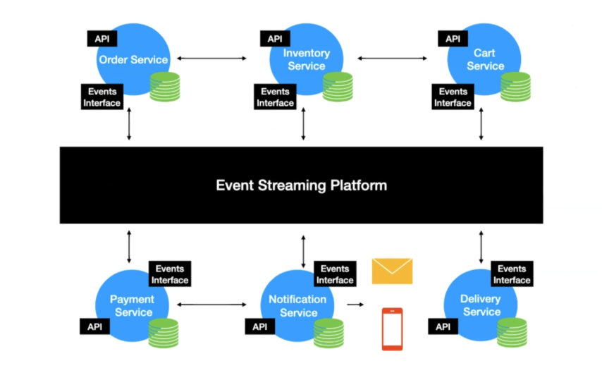

# Event Streaming Platform

> Event streaming is the digital equivalent of the human body's central nervous system. It is the technological foundation for the *always-on* world where businesses are increasingly software-defined and automated, and wherre the user of software is more software.

Event streaming is the practice of capturing data in real-time from event sources (i.e, databases, sensors, mobile devices, cloud services etc) in the form of stream of events; storing these event streams durably for later retrieval; manipulating, processing, and reacting to the event streams in real-time as well as retrospectively; and routing the event streams to different destination technologies as needed.

Event streaming thus ensures a continuous flow and interpretation of data so that the right information is at the right place, at the right time.

