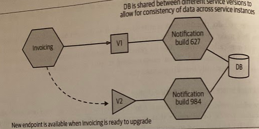
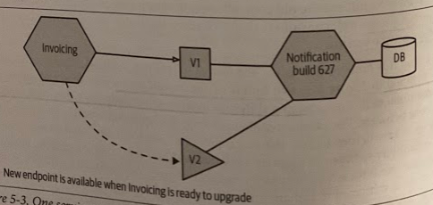
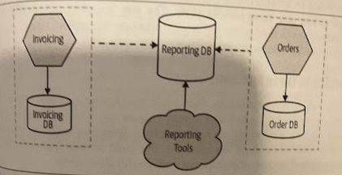
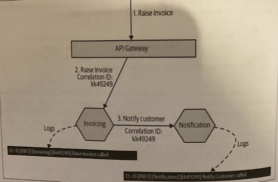
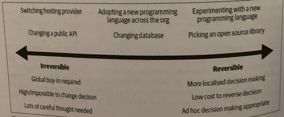

# Growing Pains

- [Growing Pains](#growing-pains)
  - [Overview](#overview)
  - [More Services, More Pain](#more-services-more-pain)
  - [Ownership at Scale](#ownership-at-scale)
    - [How Can This Problem Show Itself?](#how-can-this-problem-show-itself)
    - [Potential Solutions](#potential-solutions)
  - [Breaking Changes](#breaking-changes)
    - [How Can This Problem Show Itself?](#how-can-this-problem-show-itself-1)
    - [Potential Solutions](#potential-solutions-1)
      - [1. Eliminate accidental breaking changes](#1-eliminate-accidental-breaking-changes)
      - [2. Think twice before making a breaking change](#2-think-twice-before-making-a-breaking-change)
      - [3. Give consumers time to migrate.](#3-give-consumers-time-to-migrate)
  - [Reporting](#reporting)
    - [When Might This Problem Occur?](#when-might-this-problem-occur)
    - [Potential Solutions](#potential-solutions-2)
  - [Monitoring and Troubleshooting](#monitoring-and-troubleshooting)
    - [When Might These Problems Occur?](#when-might-these-problems-occur)
    - [Potential Solutions](#potential-solutions-3)
      - [Log aggregation](#log-aggregation)
      - [Tracing](#tracing)
      - [Test in production](#test-in-production)
      - [Toward obeservability](#toward-obeservability)
  - [Local Developer Experience](#local-developer-experience)
    - [How Can This Problem Show Itself?](#how-can-this-problem-show-itself-2)
    - [Potential Solutions](#potential-solutions-4)
  - [Running Too Many Things](#running-too-many-things)
    - [How Might This Problem Show Itself?](#how-might-this-problem-show-itself)
    - [Potential Solutions](#potential-solutions-5)
  - [End-to-End Testing](#end-to-end-testing)
    - [How Can This problem Show Itself?](#how-can-this-problem-show-itself-3)
    - [Potential Solutions](#potential-solutions-6)
      - [Limit scope of functional automated tests](#limit-scope-of-functional-automated-tests)
      - [Use consumer-driven contracts (CDCs)](#use-consumer-driven-contracts-cdcs)
      - [Use automated release remediation and progressive delivery](#use-automated-release-remediation-and-progressive-delivery)
      - [Continually refine your quality feedback cycles](#continually-refine-your-quality-feedback-cycles)
  - [Global vs Local Optimization](#global-vs-local-optimization)
    - [How Can This Problem Show Itself?](#how-can-this-problem-show-itself-4)
    - [Potential Solutions](#potential-solutions-7)
  - [Robustness and Resiliency](#robustness-and-resiliency)
    - [How Can This Problem Show Itself?](#how-can-this-problem-show-itself-5)
    - [Potential Solutions](#potential-solutions-8)
  - [Orphaned Services](#orphaned-services)
    - [How Can This Problem Show Itself?](#how-can-this-problem-show-itself-6)
    - [Potential Solutions](#potential-solutions-9)

## Overview

When exactly problems will occur with a microservice architecture is related to a multitude of factors. The complexity of service interactions, size of the organization, number of services, technology choices, latency, and uptime requirements are just a subset of the forces that can bring forth pain, suffering, excitment, and stress. This mean it's difficult to say when, or indeed if, you'll actually encounter these issues.

## More Services, More Pain

In general, the number of *logical* services seems to be as good a measure as any for indicating when certain issues are most likely to manifest themselves.

> When logical services are deployed into production, they may be deployed as multiple service instances.

Don't think of adopting microservices as flipping a switch; think about it as turning a dial. As you turn that dial, and have mor services, you'll have more opportunity to get the good stuff out of microservices.

This should *not* be used as a *general indicator*. You need to make sure you're building in *feedback mechanisms* to look for some of the potential indicators I outline here.

## Ownership at Scale

We're looking at owernship from a point of view of *making code changes*, not ownership in terms of who handles deployments, first-line support, and so on. The following concepts are [outlined by Martin Fowler](http://bit.ly/2n5pSAf)

* **Strong code ownership**: If someone outside the service's ownership group wants to make a change, they have to submit that change to the owners, who decide what to do with it.
* **Weak code ownership**: Anyone can directly change the service's modules without resorting to the need for things like pull requests. There is though an expectation that if you change someone else's service, you'll speak to them first.
* **Collective code ownership**: No one owns anything, and anyone can change anything they want.

### How Can This Problem Show Itself?

Rapid growth without any assigned responsibilities for different parts of the system or any concept of ownership other tan *"people know that is right"* is the recipe for problems with collective ownership.

> For collective ownership to work, the collective needs to be well-connected enough to have a common shared understanding of what a good change looks like, and in which direction you want to take a specific service from a technical point of view.

You may end up with a tangled "distributed monolith". An alternative name to the outcome architecture is the *"colander architecture"* because it is so full of holes; people would just "punch a new hole" whenever they felt like it by exposing data or just making lots of point-to-point calls.

### Potential Solutions

*Strong code ownership* is almost universally the model adopted by organizations implemeting large-scale microservice architectures consisting of multiple teams and over 100 developers. You can view each team as adopting collective code ownership locally. This model also allows for *product-oriented teams*; the team becomes more focused on one area of the business domain. This makes it easier to maintain *customer-focused teams* who build *domain expertise*, often with embedded product owners guiding their work.

## Breaking Changes

A microservice exists as part of a wider system. It either *consumes* functionality provided by others, *exposes* its own functionality to others, or possibly does both. We are striving for independent deployability, but for that to happen, we need to *make sure that when we make a change to a microservice we don't break our consumers*.

We can think of the functionality we expose to other microservices in terms of a *contract*. Whether or not you've made this contract with your consumers explicit, it exists.

Sooner or later, you'll need to deal with the challenges that breaking changes cause — either because you've made a conscious decision to make a backward-imcompatible change, or perhaps you made an innocent change that you thought would impact just your local service, only to find it broke other services in ways you didn't expect.

### How Can This Problem Show Itself?

The worst occurrence is when you see *production outages* caused by new microservices being sent live which break compatibility with existing services. This is a sign that you're *not catching accidental contract breakages early enough*.

Another sign is if you start seeing people try to *orchestrate simultaneous deployments* of multiple services together (someties called a *lock-step release*). This could also be a sign that this is happening due to trying to manage contract changes between client and server.`

### Potential Solutions

Making breaking changes to the contracts you expose is a pain to manage and should be avoided whenever possible. If you must do it, then these rules may help:

1. Eliminate accidental breaking changes.
2. Think twice before making a breaking change — can you possibly avoid it?
3. If you need to make a breaking change, give your consumers time to migrate.

#### 1. Eliminate accidental breaking changes

Having an explicit schema for your microservice can quickly detect *structural breakages* in your contract.

Structural breakages are only part of it, thought. You also have *semantic* breakages to consider (e.g., you don't change the signature of a method but you change its post conditions) In practice, testing is one of the best ways of detecting this.

Whatever you do, the quickest win is to make it as obvious to developers as possible when they make changes to the external contract.

> Making it hard to change a service contract is better than constantly breaking consumers.

#### 2. Think twice before making a breaking change

If possible, *prefer expansion changes* to your contract if you can. Add new methods, resource,s topics, or whatever that support the new functionality without removing the old. Sometimes supporting old colde still may be less work than handling a breaking change.

#### 3. Give consumers time to migrate.

You'll need to give all consumers time to change their service to migrate over to your newer service version.

There are multiple ways to do so:

1. *Run two versions of your service* each one exposing different incompatible endpoints that consumers can choose between. The primary challenges with this approach are that you have to have more infrastructure to run the extra services, you probably have to maintain data compatibility between the service versions, and bug fixes may need to be made to all running versions. The issues are somewhat mitigated if you are only coexisting the two versions for short periods of time.

2. *Have one running version of your service, but have it support both contracts*. This could involve exposing two APIs on different ports or simply two different endpoints, for example. This pushes complexity into your microservices implementation, but avoids the challenges of the earlier approach.

## Reporting

With a monolithic database, stakeholders who want to analyze all of the data together, often involving large join operations across data, have a ready-made schema against which to run their reports. With a microservice architecture, we've made it much more difficult, as now our data is scattered across multiple logically isolated schemas.

### When Might This Problem Occur?

This tends to appear eaarly at the stage when you're starting to consider decomposing a monolithic schema. All too often, the needs for downstream repoorting are not considered early enough, as it happens outside the realm of normal software development and system maintenance.

You may be able to sidestep this problem if your monolith already uses a dedicated data source for reporting purposes, like a data warehouse or data lake. Then all you need to ensure is that your microservices are able to copy the appropriate data to the existing data sources.

### Potential Solutions

Unless you want to change how stakeholders work, you're going to still need to present a single database for reporting, and quite possibly one that matches the old schema design to limit the impact of any changes.

The most straightforward approach for solving this problem is to first *separate* the need for a single database to store data for reporting purposes, from the databases your microservices use to store and retrieve data. This allows the content and design of your *reporting database* to be decoupled from the design and evolution of each service's data storage requirements. All you then need to do is to work out how your microservices can "push" data into your new schema.

> A *change data capture system* is an obvious potential solution for solving this, but techniques like *views* can also be useful.

## Monitoring and Troubleshooting

> "We replaced our monolith with microservices so that every outage could be more like a mureder mystery" — [@honest_update](http://bit.ly/2mldxqH)

Working out where you have problems, and understanding whether those problems you are seeing are actually things you need to worry about becomes much more complicated as you have more moving parts.

The way you approach monitoring and troubleshooting will need to change as your microservice architecture grows.

### When Might These Problems Occur?

It can be hard to roughly predict when your existing monitoring approach will start to let you down, so the suggestion is that you prioritize implementing some basic improvements ahead of time.

### Potential Solutions

#### Log aggregation

It will allow you to capture all your logs and forward them to a central location where they can be searched, and in some cases can even be used to generate alert.

> Many options exist, for example the open source [ELK stack (Elastic search, Logstash/Fluent D, and Kibana)](https://www.elastic.co/elk-stack) or [Humio](https://humio.com).

This should be one of the *first* thing you should do when implementing a microservice architecture. It's useful right from the start but also if your organization struggles to implement a suitable log aggregation system, you might want to reconsider whether you're ready for microservices.

#### Tracing

Being able to collate a *series of flows* and look at them as a whole is incredible useful. As a starting point, generate *corrleation IDs* for all calls coming into your system. Typically, an API gateway or service mesh would be a good fit to generate the initial correlation ID.

Tracing allows you to use a log aggregation system to query for all logs associated with a given correlation ID.

The more latency sensitive your application is, the sooner I'd be looking to implement a distributed tracing tool like [Jaeger](https://www.jaegertracing.io/).

#### Test in production

By injecting *fake user behavior* into our system, in the form of what is often called *synthetic transactions*, we can define the behavior we expect, and alert accordingly if this isn't the case.

A good starting point for testing in production could be to take existing end-to-end test cases and rework them for use in a production environment. An important consideration is to ensure that these "tests" don't cause unforeseen impact in production.

#### Toward obeservability

As our systems become more complicated, it is important to allow ourselves to ask open-ended questions of our systems when issues occur, to help us in the first instance to stop the bleeding and make sure the system can continue to operate, but to also wllo us to gather enough information to fix the problem going forward.

We need to be able to gather lots of information about what our system is doing, allowing us to after the fact ask questions of the data that we didn't know we'd have to ask in the first place. The secret is in *making this information easy to query and view in context*.

Adopt the view that you can and will get surprised, so get good at asking questions of your system, and make sure you use toolchains that allow for ad hoc querying of information.

> Recommended bibliography: *Distributed Systems Observability* by Cindy Sridharan.

## Local Developer Experience

You can't avoid conversationsa bout what to do when *you can't run the entire system on one machine*.

### How Can This Problem Show Itself?

The day-to-day development process can start to slow down, with local builds and execution taking longer, due to more services having to be stood up. Developers will start requesting bigger machines to handle the number of services they have to handle, and while that might be OK for a short-term fix, that will only buy you some time if your service estate continues to grow.

Also, teams practicing collective ownership of multiple services are more susceptible to this problem.

### Potential Solutions

A common technique is to *stub out* the services you don't want to run yourself, or else have a way to point them against instances running elsewhere. However, with that comes associated challenges of needing connectivity, potentially having slower feedback cycles with the need to deploy software remotely before you can see it working, and a potential explosion in resources (and associated costs) needed for developer environments.

> [Telepresence](https://telepresence.io) is an example of a tool that is aiming to make a hybrid local/remote developer workflow easier for Kubernetes users. You can develop your service locally, but Telepresence can proxy calls to other services to a remote cluster.

## Running Too Many Things

As you have more processes that need to be deployed, configured, and managed, your existing techniques for handling yyour monolithic application may well not scale well as you increase the number of moving parts that need to be managed.

*Desired state management* (i.e., the ability for you to specify the number and location of service instances that you require, and ensure that this is maintained over time) becomes increasingly important.

### How Might This Problem Show Itself?

You'll start to see an increasing percentage of time spent managing deployments and troubleshooting the issues that occur during these deployments.

You'll find youself needing more people to manage the activities associated with deploying and maintaining your production fleet. This could result in requests for more people to support your operations team, or perhaps seeing a high percentage of time being spent on deployment concerns by your delivery team.

### Potential Solutions

You want a tool that allos for a *high degree of automation*, that can allow developers ideally to self-service provision deployments, and that handles automated desired state management.

> For microservices, Kubernetes has emerged as the tool of choice in this space. Larger organizations tend to adopt packaged versions of Kubernetes, such as *OpenShift* from RedHat, which bundles Kubernetes with tooling that makes it easier to work with within a corporate environment.

## End-to-End Testing

With automated functional test, you have a *delicate balancing act*. The more functionality a test executes (i.e., the broader the scope of the test) the more confidence you have in your application. On the other hand, the larger the scope of the test, the longer it can take to run, and the harder it can be to work out what is broken when it fails.

End-to-end tests tend to be more problematic to write and maintain than smaller-scoped unit tests. Often this is worth it but with a microservice architecture, the "scope" of our end-to-end tests get *very* large. We are now having to *run tests across multiple services*, all of which need to be deployed and appropriately configured for the test scenarios. We also have to *be prepared for the false negative*s that occur when environmental issues, such as service instances dying or network time-outs or failed deployments.

As the scope of the test increase, you'll spend more of your time fighting the problems that arise, to the point where trying to create and maintain end-to-end tests becomes a huge time sink.

### How Can This problem Show Itself?

One sign is that your end-to-end test suite grows, taking longer and longer to complete. Tis is caused by multiple teams being unsure of what scenarios are covered and adding new ones "just in case". You see more failures in the end-to-end test suite that are not highlighting issues with your code.

This problem tends to sneak up on you, specially where *the work for different user journeys is handled by multiple teams*. The more you need to *test cross-team flows*, the more problematic end-to-end, large scoped tests become.

### Potential Solutions

#### Limit scope of functional automated tests

Avoid larger-scoped tests that cross team boundaries. Keeping ownership of tests within a single team makes it easier to understand what scenarios are properly covered, ensures that developers can run and debug the tests, and more clearly articulates responsibility for who should make sure the tests run and pass.

#### Use consumer-driven contracts (CDCs)

CDCs can replace the need for cross-service test cases. With CDCs, you have the consumer of your microservice define their expectations of youw your service should behave in terms of an executable specification — a test. When you change your service, you ensre that these tests still pass.

We can also understand our consumer requirements from their point of view, and most importantly understand how different consumers might want different things from us.

> [Pact](https://pact.io) is a tool designed to support CDCs.

#### Use automated release remediation and progressive delivery

*Progressive delivery* is the umbrella term for controlling how you roll out new versions of your software incrementally to your cusomters. The idea is that you can assess the impact of your new release, deciding if and when to continue or rollback (e.g., canary release).

By defining acceptable measures for how your service should behave, it then becomes possible to control the progressive delivery in an automated fashion. Therefore you can use *automated release remediation techniques*.

You should not consider automated release remediation *instead* of testing. Instead, you want to have a more robust system by putting some work into *catching problems if they do ocfur*, rather than just focusing on stopping problems from happening in the first place.

#### Continually refine your quality feedback cycles

Understanding how and where you should test is an ongoing challenge. This means having people who can identify the need to add new tests to cover areas of the system where they are seeing an increase in production defects, but also who can remove tests when there is already coverage in an effort to improve feedback cycles.

In short, it's all about *balancing the need for fast feedback with safety*.

> "You need to be just as willing to identify, and remove or replace, the wrong test as you are to add a new test". - Sam Newman

## Global vs Local Optimization

Assuming oyu embrace the model of teams having more responsibilities for local decision-making, perhaps owning the entire life cycle of the microservices they manage, you'll get to the point where you start to need to *balance* local decision-making with more global concerns.

### How Can This Problem Show Itself?

Someone suddendly realizes that multiple teams have solved the same problem in different ways, but were never aware that they were all trying to fix the same issue.

### Potential Solutions

The higher the cost of change, the larger the impact, and the more you'll want a broader consensus behind decision-making. The smaller the impact, the easier it is to rollback, and the more decisions can be left to local teams.

The trick is helping people in teams realize where their decisions might tend toward the irreversible or reversible ends of this spectrum. The more a decision tends towar irreversible, the more important it might be for them to involve other people outside their team boundary in their decision-making.

> Teams need to have at least a basic understanding of the *bigger-picture concerns* to see where they may overlap, and they'll also need a *network* where they can surface these issues and get involvement from their colleagues in other teams.

As a simple mechanism, having at least one technical leader fro meach team being part of a technical cross-cutting group where these concerns can be addressed is a sensible approach. This group may be chaired by a CTIO, chief architect, or some other person who is responsible for the overall technical vision of the company.

Each organization needs to find the *right balance between global and local decision-making*. The more responsibility you push to the teams, the more you'll get the benefits of greater autonomy, but the trade-off is that you may have less consistency in how problems are solved. The more you drive things from the center, the more you'll need to build consensus and that will likely slow you down.

## Robustness and Resiliency

Distributed systems can exhibit a whole host of failure modes that may be unfamiliar to you if you are more accustomed to monolithic systems. Just to mention a few of them:

* Networks packets can get lost
* Networks calls can time out
* Machines can die or stop responding

### How Can This Problem Show Itself?

These problems are, unfortunately, most likely to arise in a *production environment*.

As the number of services increases, and the number of service calls increase, you'll become more and more vulnerable to *resiliency issues* The more interconnected your services are, the more likely you'll suffer from things like *cascading failures* and *back pressure*.

### Potential Solutions

A good starting point is to ask yourself about each service call you make:

1. Do I know the way in which this call might fail?
2. If the call does fail, do I know what I should do?

Isolating services more from each other can help, perhaps including the introduction of asynchronous communication to avoid temporal coupling. Using *sensible time-outs* can avoid resource contention with slow downstream services, and in conjunction with patterns like *circuit breakers*, you can start failing fast to avoid problems with back pressure.

*Running multiple copies* of services can help with instances dying, as can a platform that can implement desired state management.

You want to *evolve working practices* as necessary. One concrete way is by *documenting production issues* when they arise and keeping a record of what you learned.

## Orphaned Services

Many organizations struggle with knowing exactly what they have, where it is, and who owns it. 

Sometimes you may find more and more services that have been happily running for weeks, months, or perhaps years without any changes being made to them, and fundamentally no one in the company is taking ownership or responsibility for them.

### How Can This Problem Show Itself?

> "I remember hearing (perhaps apocryphal) stories of old servers being discovered walled up in old offices. No one remembers they were there, but they are still happily running, doing whatever it is they do. As no one remembers exactly what these newly discovered computers do, people are scared to turn them off. Microservices can exhibit some of the same characteristics; they're out there and they're working (we assume), but we have the same problem that we may not know what to do with them, and that fear can put us off changing them." — Sam Newman

The fundamental problem is that if this service *does stop working or require a change*, people are at a loss as to what to do.

### Potential Solutions

Creating simple in-house registries to help collate metadata around services. Some of these registries simply crawl source code repositories, looking for metadata files to build up a list of services out there.

This information can be merged with real data coming from service discovery systems like *consul* or *etcd* to build up a richer picture of what is running, and who you could speak to about it.
