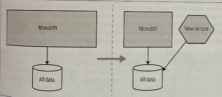
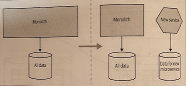

# Splitting Apart the Database

- [Splitting Apart the Database](#splitting-apart-the-database)
  - [Physical vs Logical Separation](#physical-vs-logical-separation)
  - [Splitting the Database First, or the Code?](#splitting-the-database-first-or-the-code)
    - [Split the Database First](#split-the-database-first)
    - [Split the Code First](#split-the-code-first)
    - [Split Database and Code Together](#split-database-and-code-together)
  - [So, Which Should I Split First?](#so-which-should-i-split-first)

## Physical vs Logical Separation

We need to find seams in our databases too so we can split them out cleanly. Databases, however, are tricky beats. We need to understand how logical separation and physical deployment may be related.

*Logical decomposition* allows for simpler independent change and information hiding, whereas *physical decomposition* potentially improves system robustness, and could help remove resource contention allowing for improved throughput or latency.

Having multiple schemas sharing the same database engine may be required if you want to expose views of your database. Also, it may be hard to justify having multiple database clusters because of the time, effort, and cost that may be involved.

## Splitting the Database First, or the Code?

Extracting a microservice isn't "done" until the application code is running in its own service, and the datta it controls is extracted into its own logically isolated database. We have a few options:

* Split the database first, then the code.
* Split the code first, then the database.
* Split them both at once.

### Split the Database First

With a separate schema, we'll be *potentially increasing the number of database calls* to perform a single action. Now we may need to pull the data back from two locations and join in memory. Also, we end up *breaking transactional integrity* when we move to two schemas.

By splitting the schemas out but keeping the application code together, we give ourselves the *ability to revert our changes or continue* to tweak things without impacting any consumers of our service if we realize we're heading dow nthe wrong path.

Once we are satisfied that the DB separation makes sense, we could then think about splitting out the application code into two services.

The flip side is that this approach is unlikely to yield much short-term benefit. We still have a monolithic code deployment. Arguably, the pain of a shared database is something you feel over time, so we're spending time and effort now to give us return in the long run, without getting enough of the short-term benefit.

We can go this route if we are *specially concerned* about the potential performance or data consistency issues.

> See *repository-* and *database-* *per bounded context* patterns.

### Split the Code First

Most teams split the code first, then the database. They get the short-term improvement (hopefully) from the new service, which gives them confidence to complete the decomposition by separating out the database.

By splitting out the application tier, it becomes much easier to understand what data is needed by the new service. You also get the benefit of having an *independently deployable* code artifact earlier.

We have to *be careful* of teams that may get this far and then stop, leaving a shared database in play on an ongoing basis.

Another potential challenge is that you *may be delaying* finding out nasty surprises caused by pushing join operations up into the application layer.

> See *monolith as data access layer* and *multischema storage* patterns.

### Split Database and Code Together

We have the option to just break things apart in *one big step*.

This is a much *bigger step* to take, and it will be longer before you can assess the impact of your decision as a result.

## So, Which Should I Split First?

**It depends**. But as a general rule:

* If you are able to change the monolith *and* you are concerned about the potential impact to performance or data consistence, look to *split the schema* apart first.

* Otherwise, look to *split the code* out, and use that to help understand how that impacts data ownership.
