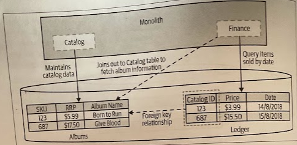

# Move Foreign-Key Relationship to Code

- [Move Foreign-Key Relationship to Code](#move-foreign-key-relationship-to-code)
  - [Overview](#overview)
    - [Moving the Join](#moving-the-join)
    - [Data Consistency](#data-consistency)
      - [Check before deletion](#check-before-deletion)
      - [Handle deletion gracefully](#handle-deletion-gracefully)
      - [Don't allow deletion](#dont-allow-deletion)
  - [Where to Use It](#where-to-use-it)

## Overview

We have defined a *foreign-key relationship* in our schema, such that a row in the *Ledger* table is identified as having a relationship to a row in the *Albums* table. By defining such a relationship, the underlying database engine is able to ensure data *consistency*.

We want to split out the *Catalog* and *Finance* code into their own corresponding services, and that means the data has to come too. We need to consider two things:

1. How do we handle data retrieval that we previously handled via a *database join*?
2. How do we handle potential *data inconsistency*?

### Moving the Join

What we previously retrieved through a database join, now we will need to *fetch this from a new service* (e.g., Catalog service). This request in turn would cause the new service to make its own local `SELECT` on its own database.

> We are replacing database join operations with *service calls*.

Logically, *the join operation is still happening*, but it is now happening inside the service rather than in the database. Unfortunately, it isn't going to be anywhere near as efficient. We can mitigate the likely impact of this *increase in latency* by allowing *bulk operations*, or perhaps even *caching* the required information locally.

> You need to have an understanding of acceptable latency for key operations, and be able to measure what the latency currently is.

### Data Consistency

With a single schema, you wouldn't be able to delete a row if there was a reference to it. The schema is enforcing data consistency. When you have separated schemas, no such enforcement out-of-the-box exists so we have to imeplement such mechanism ourselves:

* Check before deletion
* Handle deletion gracefully
* Don't allow deletion

We end up creating a *failure mode* that wouldn't exist in our monolithic system. We must consider the *needs* of our users, as different solutions could impact them in different ways. Choosing the right solution therefore requires an understanding of your *specific context*.

Let's consider our previous example for looking at each alternative:

#### Check before deletion

When removing a record from the *Albums* table, we check with the *Finance* service to ensure that it doesn't already have a reference to the record.

The problem is that guaranteeing we can do this correctly is difficult due to the lack of database transactions (e.g., while deleting a record, a new reference to it can get created in the *Finance* system). To stop this from happening, we'd need to stop new references being created on the record to be deleted until the deletion has happened — something that *would likely require locks*, and all the challenges that implies in a distributed system.

#### Handle deletion gracefully

A better option is to have the *Finance* service handle the fact that the *Catalog* service may not have information on the *Album* in a graceful way. This could be as simple as having our report show *"Album Information Not Available"* if we can't look up a given SKU.

In this situation, the *Catalog* service could tell us when we request a SKU that used to exist. This would be the good use of a `410 GONE` response code if using HTTP.

#### Don't allow deletion

One way to ensure that we don't introduce too much inconsistency could be to simply *not allow* records in the *Catalog* service to be deleted. In some cases we could just implement a *soft delete* capability (e.g., deleting an item was akin to ensuring it is not available for sale out or something similar).

## Where to Use It

* When you start considering effectively *brekaing foreign-key relationships*.

* (!) If you are worried that you are breaking appart an *aggregate*, pause and reconsider. You need to ensure that you aren't breaking apart two things that really want to be one.

* (!) Sometimes, by taking a bigger bite out of the monolithic schema, *you may be able to move both sides* of a foreign-key relationship with you, making your life much easier.
