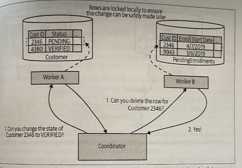
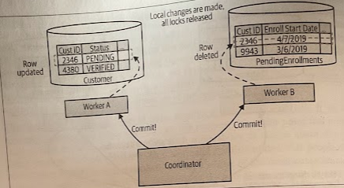
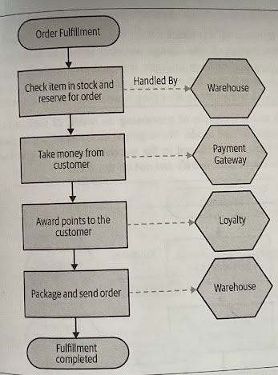

# Dealing with Transactions

- [Dealing with Transactions](#dealing-with-transactions)
  - [Overview](#overview)
  - [ACID Transactions](#acid-transactions)
  - [ACID but without atomicity?](#acid-but-without-atomicity)
  - [Distributed Transactions & Two-Phase Commits](#distributed-transactions--two-phase-commits)
  - [Distributed Transactions - Just Say No!](#distributed-transactions---just-say-no)
  - [Sagas](#sagas)
    - [Saga Failure Modes](#saga-failure-modes)

## Overview

When breaking apart our databases, maintaining *referential integrity* becomes problematic, *latency* can increase, and we can make activities like reporting *more compelex*.

The ability to make changes to our database in a transaction can make our system much easier to reason about, and therefore easier to develop and maintain. We rely on our database ensuring safety and consistency of our data, leaving us to worry about other things. But *when we split data across database*, we lose the benefit of using a database transacton to apply changes in state in an atomic fashion.

## ACID Transactions

Typically, when we talk about transactions, we are talking about ACID transactions:

* *Atomicity*: Ensures that all operations completed within the transaction either all complete or all fail. If any of the changes we're trying to make fail for some reason, then the whole operation is aborted, and it's as though no changes were ever made.

* *Consistency*: When changes are made to our database, we ensure it is left in a valid, consistent state.

* *Isolation*: Allows multiple transactions to operate at the same time without interfering. This is achieved by ensuring that any interim state changes made during one transaction are invisible to other transactions.

* *Durability*: Makes sure that once a transaction as been completed, we are confident the data won't get lost in the event of some system failure.

## ACID but without atomicity?

We could decide to sequence these two transactions; removing a row from the PendingEnrollments table only if we were able to change the row in the Customer table. But we'd still have to reason about what to do if the deletion from the PendingEnrollments table then failed — all *logic that we'd need to implement ourselves*.

Being able to *reorder steps* to handle these use cases can be a really useful idea. But fundamentally by decomposing this operation into two separate database transactions, we have to accept that we've *lost guaranteed atomicity* of the operation as a whole.

This *lack of atomicity* can start to cause significant problems especially if we are migrating systems that previously relied on this property.

## Distributed Transactions & Two-Phase Commits

The *2PC* algorithm is frequently used to attempt to give us the ability to make *transactional changes in a distributed system*.

The algorithm is broken into two phases, a *voting phase* and a *commit phase*:

* During the *voting phase*, a central *coordinator* contacts all the *workers* who are going to be part of the transaction, and asks for confirmation as to whether or not some state change can be made. If all workers agree that the state change they are asked for can take place, the algorithm proceeds to the next phase, otherwise the entire operation aborts. The worker is guaranteeing that it will be able to make that change at some point in the future; to guarantee that this change can be made later, Worker A will likely have to lock that record to ensure that such a change can take place.

* If any *workers* didn't vote in factor of the commit, a *rollback* message needs to be sent to all parties, to ensure that they can *clean up locally*, which allows the workers to *release any locks* they may be holding. If all workers agreed to make the change, we move to the *commit phase*. Here, the changes are actually made, and associated locks are released.

We *cannot* in any way *guarantee* that these commits will occur at exactly the same time. The *coordinator* needs to send the commit requests to all participants, and that message could arrive at and be processed at different times. This means it's possible that that we could see the change made to Worker A, but not yet see the change to Worker B, if we allow for you to view the states of these workers outside the transaction coordinator.

When 2PC work, at their heart they are very often just *coordinating distributed locks*.

> Managing locks, and avoiding deadlocks in a single-process system, isn't fun. Now imagine the challenges of doing so among multiple participants.

The more participants you have, and the more latency you have in the system, the more issues a 2PC will have. The longer the operations takes, the longer you've got resources locked for!

## Distributed Transactions - Just Say No!

Whenever possible, you should avoid the use of distributed transactions like the 2PC to coordinate changes in state across your microservices.

The first option could be to just not split the data apart in the first place if you want to manage this data in a truly atomic and consistent way, and you cannot work out how to sensibly get these characteristics without an ACID-style transaction; leave the functionality that manages that state in a single service.

## Sagas

> If we really do *need* to break this data apart, but you don't want all the pain of managing distributed transactions, you can use *sagas*.

A *saga* is by design an algorithm that can *coordinate* multiple changes in state, but *avoids the need for locking resources* for long periods of time.

We do this by modeling the steps involved as *discrete activities* that can be *executed independently*. It comes with the added benefit of forcing us to explicitly model our business processes.

The core idea, first outlinedby Hector Garcia-Molina and Kenneth Salem, reflected on the challenges on how best to handle operations of what they referred to as *long lived transactions (LLTs)*. These transactions might take a long time (minutes, hours, or perhaps even days), and as part of that process require changes to be made to a database.

> See ["Sagas"](https://www.cs.cornell.edu/andru/cs711/2002fa/reading/sagas.pdf), in ACM Sigmond Record 16, no. 3 (1987); and [IBM Sagas Pattern](https://www.ibm.com/cloud/architecture/architectures/event-driven-saga-pattern/).

Instead, the authors of the paper suggest we should *break down these LLTs* into a sequence of "sub" transactions, each of which can be *handled independently* and will be *short-lived*. Those will modify *only* part of the data affected by the entire LLT. As a result, there will be far less contention in the underlying database as the scope and duration of locks is greatly reduced.

While sagas were orginally envisaged as a mechanism to help with LLTs acting against a single database, the model works just as well for coordinating changes across multiple services. We can *break a single business process* into a set of calls that will be made to *collaborating services* as part of a *single saga*.

> A saga does *not* give us atomicity in ACID terms we are used to with a normal database transaction. As we break the LLT into individual transactions, we don't have atomicity at the level of the saga itself. We do have atomiticty for each subtransaction inside the LLT, as each one of them can relate to an ACID transactional change if needed. What a saga give us is *enough information to reason about which state it's in*; it's up to us to handle the implications of this.

Here, the order fulfillment process is represented as a single saga, with each step in this flow representing an operation that can be carried out by a different service. Within each service, *any state change can be handled within a local ACID transaction*.

### Saga Failure Modes

