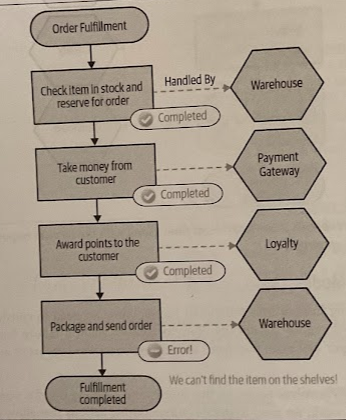

# Sagas

- [Sagas](#sagas)
  - [Overview](#overview)
  - [Saga Failure Modes](#saga-failure-modes)
    - [Saga Rollbacks](#saga-rollbacks)
    - [Reordering steps to reduce rollbacks](#reordering-steps-to-reduce-rollbacks)
  - [Implementing Sagas](#implementing-sagas)
    - [Orchestrated sagas](#orchestrated-sagas)
    - [Choreographed sagas](#choreographed-sagas)
    - [Mixing styles](#mixing-styles)
    - [Should I use choreography or orchestration?](#should-i-use-choreography-or-orchestration)
  - [Sagas vs Distributed Transactions](#sagas-vs-distributed-transactions)

## Overview

> If we really do *need* to break this data apart, but you don't want all the pain of managing distributed transactions, you can use *sagas*.

A *saga* is by design an algorithm that can *coordinate* multiple changes in state, but *avoids the need for locking resources* for long periods of time.

We do this by modeling the steps involved as *discrete activities* that can be *executed independently*. It comes with the added benefit of forcing us to explicitly model our business processes.

The core idea, first outlinedby Hector Garcia-Molina and Kenneth Salem, reflected on the challenges on how best to handle operations of what they referred to as *long lived transactions (LLTs)*. These transactions might take a long time (minutes, hours, or perhaps even days), and as part of that process require changes to be made to a database.

> See ["Sagas"](https://www.cs.cornell.edu/andru/cs711/2002fa/reading/sagas.pdf), in ACM Sigmond Record 16, no. 3 (1987); and [IBM Sagas Pattern](https://www.ibm.com/cloud/architecture/architectures/event-driven-saga-pattern/).

Instead, the authors of the paper suggest we should *break down these LLTs* into a sequence of "sub" transactions, each of which can be *handled independently* and will be *short-lived*. Those will modify *only* part of the data affected by the entire LLT. As a result, there will be far less contention in the underlying database as the scope and duration of locks is greatly reduced.

While sagas were orginally envisaged as a mechanism to help with LLTs acting against a single database, the model works just as well for coordinating changes across multiple services. We can *break a single business process* into a set of calls that will be made to *collaborating services* as part of a *single saga*.

> A saga does *not* give us atomicity in ACID terms we are used to with a normal database transaction. As we break the LLT into individual transactions, we don't have atomicity at the level of the saga itself. We do have atomiticty for each subtransaction inside the LLT, as each one of them can relate to an ACID transactional change if needed. What a saga give us is *enough information to reason about which state it's in*; it's up to us to handle the implications of this.

Here, the order fulfillment process is represented as a single saga, with each step in this flow representing an operation that can be carried out by a different service. Within each service, *any state change can be handled within a local ACID transaction*.

## Saga Failure Modes

With a saga being broken into individual transactions, we need to consider how to handle failure, or more specifically, how to recover when a failure happens.

* **Backward Recovery**: Reverting the failure and cleaning up afterwards — a *rollback*. For this to work, we need to define *compensating actions* that allow us to undo previously committed transactions.

* **Forward Recovery**: Allows us to pick up from the point where the failure occurred, and keep processing For this to work, we need to be able to *retry transactions*, which in turn implies that our system is persisting enough information to allow this retry to take place.

### Saga Rollbacks

With an ACID transaction, a rollback occurs before a commit. With our saga, though, we have multiple transactions involved, and some of those may have already committed before we decide to roll back the entire operation.

> There is no simple "rollback" for the entire operation.

If you want to implement a rollback, you need to implement a *compensating transaction*, which is an operation that undoes a previously committed transaction. We would trigger the compensating transaction for each step in our saga that has already been committed.

> Unlike a normal database rollback, we can't roll back time and make it as though the original transaction didn't occur. For example, you can't unsend an email. Instead, your compensating transaction could cause a second email to be sent to the customer, informing them that there had been a problem with the order and it had been canceled.

Because we cannot always cleanly revert a transaction, we say that these compensating transactions are **semantic rollbacks**.

It is totally appropriate for information related to the rollback saga to persist in the system. In fact, this may be very important information.

Also, it is totally appropriate to have a *mix of failure recovery modes*. Some failures may require a rollback; others may be fail forward.

### Reordering steps to reduce rollbacks

Sometimes you can simplify your rollback operations just by tweaking how the process is carried out. By pulling forward those steps that are most likely to fail and failing the process earlier, you avoid having to trigger later compensating transactions as those steps weren't even triggered in the first place.

> This can be especially important if implementing a compensating transaction is difficult. You may be able to move the step later in the process to a stage where it never needs to be rolled back.

## Implementing Sagas

We can look at two styles of saga implementation:

* *Orchestrated sagas*: Rely primarily on centralized coordination and tracking.
* *Choreographed sagas*: Avoid the need for centralized coordination in favor of a more loosely coupled model, but which can make tracking the progress of a saga more complicated.

### Orchestrated sagas

Orchestrated sagas use a *central coordinator*, also called *orchestrator*, to define the order of execution and to trigger any required compensating action. This comes with a good degree of visibility as to what is happenning with any given saga.

The orchestrator knows what services are needed to carry out the operation, and it decides when to make calls to those services. If the calls fail, it can decide what to do as a result.

Having our business process explicitly modeled inside the *orchestrator* is extremely beneficial. It allows us to look at one place in our system and understand how this process is supposed to work.

> That can make onboarding of new people easier, and help impart a better understanding of the core parts of the system.

There are a few downsides to consider, though. First, by its nature, this is a somewhat coupled approach. The orchestrator needs to know about all the associated services (*domain coupling*). The other issue, which is more subtle, is that logic that should otherwise be pushed into the services can start to instead become absorbed in the orchestrator.

> "If logic has a place where it can be centralized, it will become centralized!"

One of the ways to avoid too much centralization with orchestrated flows can be to ensure you have different services playing the role of the orchestrator for different flows.

### Choreographed sagas

Choreographed sagas aim to distribute responsibility for the operation of the saga among multiple collaborating services, somewhat a *trust-but-verify architecture*. They will often make heavy use of events for collaboration between services.

Services are reacting to events being received. Conceptually, events are broadcast in the system, and interested parties are able to receive them. YOu don't send events *to* a service; you just fire them out, and the services that are interested in these events are able to receive them and act accordingly.

Typically, you'd use some sort of message broker to manage the reliable broadcast and delivery of events. It's possible that multiple services may react to the same event, and that is where you would use a *topic*.

In those architectures, **no one service knows about any other service**. They only need to know what to do when a certain event is received. Inherently, this make for a much less coupled architecture and we also avoid the concerns about centralization of logic.

The flip side of this is that it can now be harder to work out what is going on. You'd have to look at the behavior of each service in isolation and reconstitute this picture in your own head.

The **lack of an explicit representation of our business process** is bad enough, we we also lack a way of knowing **what state a saga is in**, which can also deny us the chance to attach compensating actions when required. We can push some responsibility to the individual services for carrying out compensating actionsm but fundamentally we need a way of knowing what state a saga is in for some kinds of recovery.

One of the easiest ways to solve this is to *project a view* regarding the state of a saga from the existing system by consuming the events being emitted. If we generate a unique ID for the saga, we can put this into all of the events that are emitted as port of this saga — this is what is known as a **correlation ID**. We could then have a service whose job is to just vacuum up all these events and present a view of what state each order is in, and perhaps programatically carry out actions to resolve issues as part of the fulfillment process if the other services couldn't do it themselves.

### Mixing styles

You may have some business processes in your system that more naturally fit one model or another. You may also have a single saga that has a mix of styles.

### Should I use choreography or orchestration?

Implementing *choreographed sagas* can bring with it ideas that may be unfamiliar to you and your team. They typically assume heavy use of *event-driven collaboration*, which isn't widely understood. However, the extra complexitly associated with tracking the progress of a saga is almost always outweighed by the benefits associated with having a more loosely coupled architecture.

You can be relaxed in the use of *orchestated sagas* when one team owns implementation of the entire saga. The more inherently coupled architecture is much easier to manage within the team boundary.

If you have multiple teams involved, you'd want to favor decomposd choreographed saga as it is easier to distribute responsibility for implementing the saga to teams and to work more in isolation.

## Sagas vs Distributed Transactions

> "In most distributed transaction systems, the failure of a single node causes transaction commit to stall. This in turn causes the application to get wedged. In such systems, the larger it gets, the more likely the system is going to be down. When flying an airplane that needs all of its engines to work, adding an engine reduces the availability of the airplane." — Pet Helland, *Life Beyond Distributed Transactions*.

*Explicitly modeling business processes* as a saga may help avoiding many of the challenges of distributed transactions, while at the same time has the added benefit of making what might otherwise be implicitly modeled processes much more explicit and obvious to your developers.

> Making the core business processes of your system a first-class concept will have a host of benefits.
