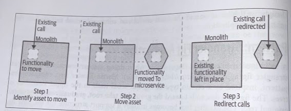
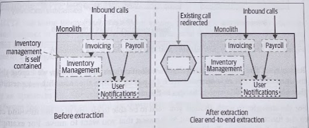
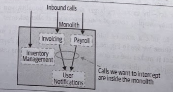

# Splitting the Monolith

- [Splitting the Monolith](#splitting-the-monolith)
  - [Summary](#summary)
  - [To Change the Monolith, or Not?](#to-change-the-monolith-or-not)
    - [Cut, Copy, or Reimplement?](#cut-copy-or-reimplement)
    - [Refactoring the Monolith](#refactoring-the-monolith)
    - [Seam](#seam)
    - [A modular monolith](#a-modular-monolith)
    - [Incremental rewrites](#incremental-rewrites)
  - [Migration Patterns](#migration-patterns)
    - [Strangler Fig Application](#strangler-fig-application)
      - [How It Works](#how-it-works)
      - [Where To Use It](#where-to-use-it)

## Summary

> For incremental rollout to work we have to ensure that we can continue to work with, and make use of, the existing monolithic software.

## To Change the Monolith, or Not?

Consider whether or not you plan (or be able) to change the existing monolith.

* If you have the ability to change the existing system, this will give you the most flexibility in terms of the various patterns at your disposal.
* The existing system may be a vendor product for which you don't have the source code, or it may also be written in a technology that you no longer have the skills for.
* The current monolith may be in such a bad state that the cost of change is too high.
* The current monolith may be being worked on by many other people, and you're worried about hetting in their way.

### Cut, Copy, or Reimplement?

We want to *copy* the code from from the existing code, and at this stage, at least, we don't want to remove the functionality from the monolith itself. Why? Because leaving the functionality in the monolith for a period of time gives you more options. It can give us a *rollback point*, or perhaps the opportunity to run both implementations in parallel.

Once you're happy that the migration has been successful, you can remove the functionality from the monolith.

### Refactoring the Monolith

> Often the biggest barrier to making use of existing code in the monolith in your new microservices is that existing codebases are traditionally not organized around business domain concepts. *Technical categorizations* are more prominent (e.g., MVC).

When you're trying to move business domain functionality, this can be difficult: the existing codebase doesn't match that categorization, so even finding the code you're trying to move can be problematic.

### Seam

> Michael Feathers defines the concept of seam in *Working Effectively with Legacy Code*.

A *seam* is a place where you can change the behavior of a program without having to edit the existing behavior. Essentially, you define a seam around the piece of code you want to change, work on a new implementation of the seam, and swap it in after the change has been made.

### A modular monolith

It is worth considering to take your newly identified seams and start to extract them as separate modules, making your monolith a *modular monolith*.

Having modules that can be veloped independently can deliver many benefits while side-stepping many of the challenges of a microservice architecture.

### Incremental rewrites

We are in danger of repeating the problems associated with big bang rewrites if we start reimplementing our functionality. The key is to ensure you're **rewriting only small pieces** of functionality at a time, **and shipping** this reworked functionality to your customers regularly.

## Migration Patterns

### Strangler Fig Application

> Martin Fowler first captured this pattern, inspired by a certain type of fig that seeds itself in the upper branches of trees. The fig then descends toward the ground to take root, gradually enveloping the original tree. The existing tree becomes intially a support structure for the new fig, and if taken to the final stages, you may see the original tree die and rot away, leaving only the new, now self-supporting fig in its place.

Have our new system initially be supported by, and wrapping, the existing system. The idea is that the old and the new can coexist, giving the new system time to grow and potentially entirely replace the old system. This allows for **incremental migration**.

Moreover, it gives us the ability to pause and even stop the migration altogether, while still taking advantage of the new system delivered so far.

We strive to not only take incremental steps toward our new application architecture, but also **ensure that each step is easily reversible**, reducing the risk of each incremental step.

#### How It Works

This may involve actually copying the code from the monolith (if possible), or else reimplementing the functionality in question.

If the functionality in question requires the persistence of state, then consideration needs to be given to how the state can be migrated to the new service, and potentially back again.

1. Identify the parts of the existing system that you wish to migrate.
2. Implement this functionality in your new microservice.
3. Reroute calls from the monolith to the new microservice.

The new functionality isn't technically live until the call to the moved functionality is redirected, even if it is deployed into a production enviornment.

> Separating the concepts of *deployment* from *release* is important. The deployment of software into a given environment doesn't mean that it's actually being used by customers. This way you enable the ability to validate your software in the final production environment before it is being used, allowing you to de-risk the rollout of the new software.

A key point of this strangler fig application is that we can also **roll back this chance very easily if required**.

#### Where To Use It

* Move functionality without having to touch or make any changes to your existing system.
* Monolith is being worked on by other people.
* Monolith is a black-box system.

In order to perform a clean end-to-end extraction like this, you might be inclined to extract larger groups of functionality to simplify this process. This can result in a tricky balancing act, by extracting larger slices of functionality, you are taking on more work, but may simplify some of your integration challenges.

If you do want to take a smaller bite, you may have to consider more "shallow" extractions, even if it makes use of other functionality that remains inside the monolith

We'd ideally like to move out the ability to send *User Notifications* to our customers into a new service. However, notifications are fired as a result of multiple inbound calls to the existing monolith. Therefore, we can't clearly redirect the calls from outside the system itself. **The strangler fig pattern doesn't work too weel when the functionality to be moved is deeper inside the existing system.**

