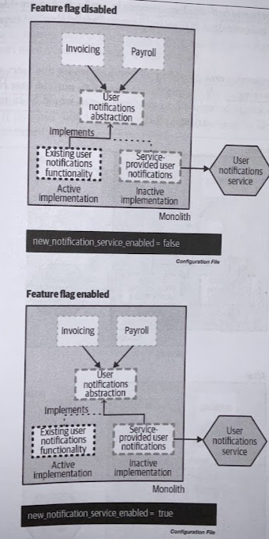
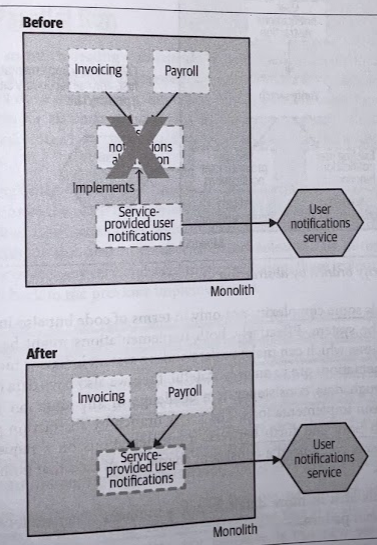
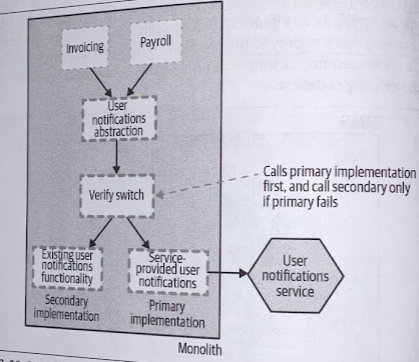

# Branch by Abstraction

## Overview

The branch by abstraction pattern relies on making changes to the existing codebase to **allow the implementations to safely coexist alongside each other**, in the same version of code, without causing too much disruption.

For the useful *strangler fig* pattern to work, we need to be able to intercept calls at the perimiter of our monolith. However if the functionality we want to extract is deeper inside the existing system, we will need to make changes to it that could be disruptive to other developers working on te codebase at the same time.

On the one hand, we want to make our changes in incremental steps. On the other hand, we want to reduce the disruption to other people working on other areas of the codebase, driving us toward wanting to complete the work quickly.

Often, when reworking parts of an existing codebase, people will do that work on a separate source code branch. The challenge is that once the change in the branch has been completed, these changes have to be merged back, which can often cause significant challenges. The longer the branch exists, the bigger these problems are.

## Where to Use It

*Branch by abstraction* is a fairly general-purpose pattern, usefuil in any situation where changes to the existing codebase are likely going to take time to carry out, but you want to avoid disrupting your colleagues too much.

This pattern assumes that you can change the code of the existing system.

## How It Works

*Branch my abstraction* consists of five steps:

1. **Create an abstraction** for the functionality to be replaced.
2. Change clients of the existing functionality to **use the new abstraction**.
3. **Create a new implementation** of the abstraction with the reworked functionality. In our case, this new implementation will call out to our new microservice.
4. Switch over the abstraction to **use the new implementation**
5. **Clean up** the abstraction and remove the old implementation.

> For an overview from a source code versioning point of view, you can check [Paul Hammat's Introducing Branch by Abstraction blog post](https://paulhammant.com/blog/branch_by_abstraction.html)

### 1. Create abstraction

Create an abstraction that represents the interactions between the code to be changed and the callers of that code.

### 2. Use abstraction

Refactor the existing clients of the old implementation to use the new abstraction point. 

At this point, there should be no functional change in system behavior.

### 3. Create new implementation

> This phase could last a significant amount of time. Jez Humble details the use of *branch by abstraction* pattern to migrate the database persistence layer used in the continuous delivery application GoCD (at that time called Cruise), where switching from using iBatis to Hibernate lasted several months and during which the appliction was still being shipped to clients on a twice weekly basis. - See more in [Continus Delivery's blog post](https://continuousdelivery.com/2011/05/make-large-scale-changes-incrementally-with-branch-by-abstraction/)

Inside the monolith, our implementation will mostly just be a client calling out to an external system; the bulk of the functionality will be in the service itself.

Although we have two implementations of the abstraction in the codebase at the same time, only one implementation is currently active in the system. This doesn't stop us writing tests for the functionality we have written.

Even if it is not finished, we can still deploy it, test it in situ, and verify the parts of the functionality we have implemented are working correctly.

### 4. Switch Implementation

Once we are happy that our new implementation is working correctly, we switch our abstraction point so that our new implementation is active, and the old functionality is no longer being used.

Ideally, as with the *strangler fig* pattern, we'd want to use a **switching mechanism** that can be toggled easily (e.g., feature toggles). This allows us to quickly switch back to the old functionality if we found a problem with it.

> Feature toggles can be implemented using a configuration file, allowing us to change the implementation being used without having to change code. If you want to know more, you can check [Pete Hodgson write-up on Feature Toggles (aka Feature Flags)](https://www.martinfowler.com/articles/feature-toggles.html).

At this stage, we have two implementations of the same abstraction, which we *hope* should be functionality equivalent. We can use tests to verify equivalancy, but we also have the option to use *both* implementations in production to provide additional verification (e.g., *Parallel Run*).

### 5. Clean up

When removing the old implementation, it would also make sense to remove any feature flag switching we may have implemented.

> One of the real problems associated with the use of feature flags is leaving old ones lying around.

Finally, with the old implementation gone, we have the option of removing the abstraction point itself, however, it's very possible that the abstraction may have improved the codebase to the point where you'd rather keep it in place.

## As a Fallback Mechanism

> Steve Smith details a variation of the branch by abstraction pattern called *verify branch by abstraction* that also implements a live verification step. The idea is that if calls to the new implementation fail, then the old implementation could be used instead. - See more in [Steve Smith's blog](https://www.stevesmith.tech/blog/application-pattern-verify-branch-by-abstraction/)

This clearly adds some complexity, not only in terms of code but also in terms of reasoning about the system. Effectively, both implementations might be active at any given point in time.

The *verify branch by abstraction* pattern allows for us to switch back and forth between implementations on a request-by-request basis, which means you'll need a consistent shared set of data that both implementations can access.
