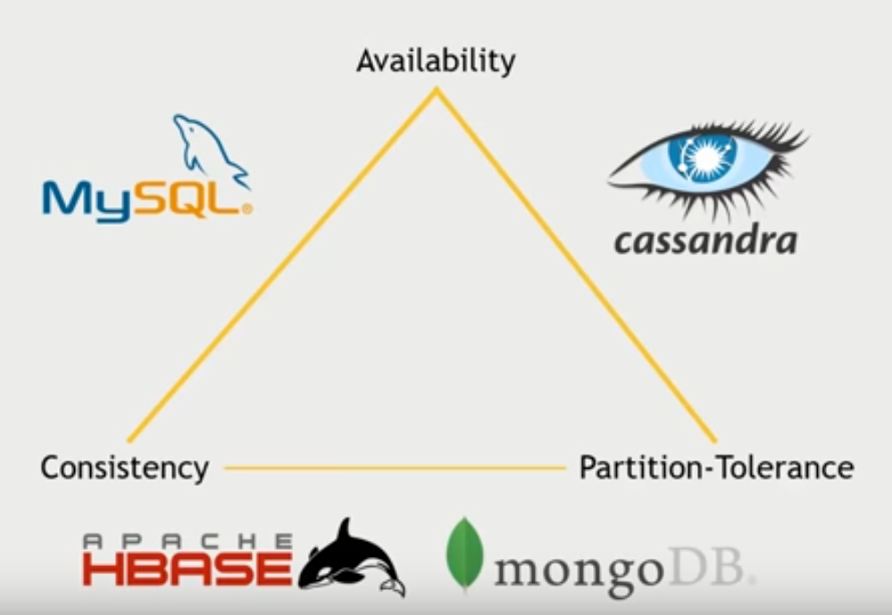

# CAP Theorem

> Great explanation: https://www.youtube.com/watch?v=k-Yaq8AHlFA

*CAP theorem*, also named *Brewer's theorem*, states that is impossible for a **distributed data store** to **simultaneously** provide **more than two** (CP vs AP) of the following three guarantees:

* **Consistency**: Every read receives the most recent write or an error.

* **Availability**: Every request receives a (non-error) response, without the guarantee that it contains the most recent write.

* **Partition tolerance**: The system continues to operate despite an arbitrary number of messages being dropped (or delayed) by the network between nodes.

> Eric Brewer argues that the often-used "two out of three" concept can be somewhat misleading because system designers only need to sacrifice consistency or availability in the presence of partitions, and that in many systems partitions are rare.

When a network partition failure happens should we decide to:

* Cancel the operation and thus decrease the availability but ensure consistency.
* Proceed with the operation and thus provide availability but risk inconsistency.

> Note that *consistency* as defined in the CAP theorem is quite different from the consisteny guaranteed in **ACID** database transactions.

## Explanation

No distributed system is safe from network failures, thus network partitioning generally has to be tolerated.

When choosing **consistency over availability**, the system will return an error or a time out if particular information cannot be guaranteed to be up to date due to network partitioning.

> **CP** is a good choice if your business needs require atomic reads and writes.

When choosing **availability over consistency**, the system will always process the query and try to return the most recent available version of the information, even if it cannot guarantee it is up to date due to network partitioning. 

> **AP** is a good choice if the business needs allow for **eventual consistency** or when the system needs to continue working despite external errors.

**In the absence of network failure** – that is, when the distributed system is running normally – **both availability and consistency** can be satisfied. 

> CAP is frequently misunderstood as if one has to choose to abandon one of the three guarantees at all times. In fact, the choice is really between consistency and availability only when a network partition or failure happens; at all other times, no trade-off has to be made.

Database systems designed with traditional **ACID** guarantees in mind such as RDBMS **choose consistency over availability**, whereas systems designed around the **BASE** philosophy, common in the NoSQL movement for example, **choose availability over consistency**.
