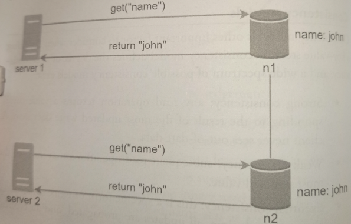

# Consistency Models

* Overview
* Inconsistency example
* Strong Consistency
* Weak Consistency
  * Eventual Consistency / Optimistic Replication
  * Strong Eventual Consistency (SEC)

## Overview

> From CAP Theorem: **Consistency** means that every read receives the most recent write or an *error*.

Consistency model is an important factor to consider when designing a key-value store. It defines the **degree of data consistency**, and a wide spectrum of possible consistency models exist.

> Since data is replicated at multiple nodes, it must be synchronized across replicas. A common technique for this is [quorum consensus](../quorum-consensus).

## Inconsistency Example

Let's see an example of how inconsistency happens:

Both replica nodes *n1* and *n2* have the same value. Let us call this value the original `value`. *Server 1* and *server 2* get the same value for `get("name")` operation.

Next, *server 1* changes the name to "johnSanFrancisco", and *server 2* changes the name to "johnNewYork". These two changes are performed simultaneously. Now, we have conflict values, called versions *v1* and *v2*.

In this example, the original value could be ignored because the modifications were based on it. However, there is no clear way to resolve the conlfict of the last two versions. To resolve this issue, we need a versioning system that can detect conflicts and reconcile conflicts.

## Strong Consistency

Any read operation returns a value corresponding to the result of the most updated write data item. **A client never sees out-of-date data**.

Strong consistency is usually achieved by forcing a replica not to accept new reads/writes until every replica has agreed on current write. This approach is **not ideal for high available systems** because it could block new operations.

## Weak Consistency

Subsequent read operations may not see the most updated value.

### Eventual Consistency / Optimistic Replication

> This is an specific form of weak consistency.

*Eventual Consistency* is commonly used in **distributed computing** to achieve **high availability** that informally guarantees (*liveness guarantee*) that, if no new updates are made to a given data item, eventually all accesses to that item will return the last updated value.

> Eventual consistency is sometimes criticized as increasing the complexity of distributed software applications.

A system that has achieved eventual consistency is often said to have **converged**, or achieved **replica convergence**.

*Eventual Consistency* is a weak guarantee, most stronger models, like **linearizability**, are trivially eventually consistent, but a system that is merely eventually consistent does not usually fulfill these stronger constraints.

> *Dynamo* and *Cassandra* adopt eventual consistency and it's usually recommended for distributed key-value stores.

From concurrent writes, eventual consistency allows inconsistent values to enter the system and force the client to read the values to reconcile.

### Strong Eventual Consistency (SEC)

Whereas eventual consistency is only a *liveness guarantee* (updates will be observed eventually), **SEC** adds the **safety guarantee** that any two nodes that have received the same (unordered) set of updates will be in the same state.

If furthermore, the system is monotonic, the application will never suffer rollbacks. *Conflict-free replicated data types* are a common approach to ensuring SEC.
