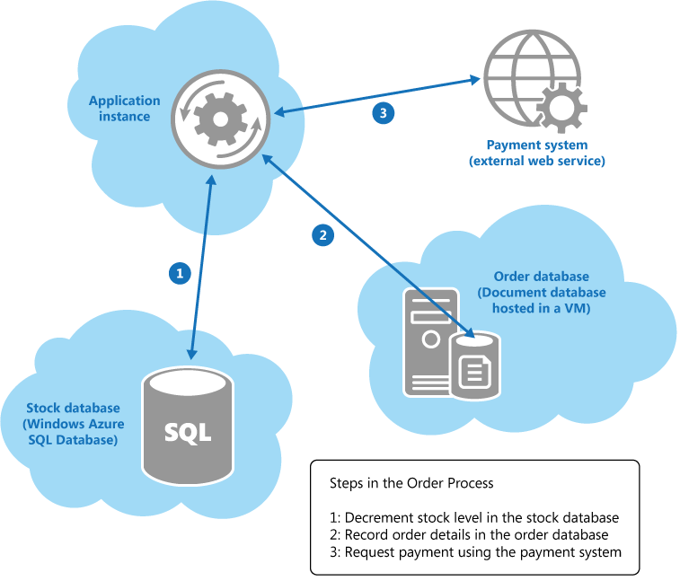

# Eventual Consistency

- [Eventual Consistency](#eventual-consistency)
  - [Overview](#overview)
  - [CAP Theorem](#cap-theorem)
  - [Caching](#caching)
  - [Implementation considerations](#implementation-considerations)
    - [Temporal inconsistencies](#temporal-inconsistencies)
    - [Retrying failing steps](#retrying-failing-steps)
    - [Partitioning & using idempotent commands](#partitioning--using-idempotent-commands)
    - [Compensating logic](#compensating-logic)

## Overview

Data update operations that span multiple sites can ripple through the various data stores in their own time, without blocking concurrent application instances that access the same data.

Traditional DB management systems focus on providing strong consistency, whereas cloud-based solutions that utilize partitioned data stores are typically motivated by ensuring higher availability, and are therefore more oriented towards eventual consistency.

It is worth bearing in mind that an application may not actually require data to be consistent all of the time.

> For example, in a typical ecommerce web application, any stock levels presented to a user are likely to be static values determined when the details for a stock item are queried. If another concurrent user purchases the same item, the stock level in the system will decrease but this change will probably not need to be reflected in the data displayed to the first user. If the stock level drops to zero and the first user attempts to purchase the item, the system could either alert the user that the item is now out of stock, or place the item on back order and inform the user that the delivery time may be extended.

## CAP Theorem

One of the drives for eventual consistency is that distributed data stores are subject to the _CAP Theorem_, which states that a distributed system can implement only two of the three features (i.e., Consistency, Availability, and Partition Tolerance) at any one time.

This means that you can either:

- Provide a consistent view of distributed (_partitioned_) data the cost of blocking access to that data while any inconsistencies are resolved. This may take an indeterminate time, especially in systems that exhibit a high degree of latency or if a network failure occurs.
- Provide immediate access to the data at the risk of it being inconsistent across instances.

## Caching

If the data stored changes, all copies cached by applications will be most likely out of date. Configuring a _cache expiration policy_ that prevents cached data from becoming too stale, and implementing techniques such as the [_cache-aside_ pattern](https://docs.microsoft.com/en-us/previous-versions/msp-n-p/dn589799(v=pandp.10)) can help to reduce the chances of inconsistencies.

However, these approaches are unlikely to completely eliminate inconsistencies in cached data, and it is important that applications that use caching as an optimization strategy can handle these inconsistencies.

## Implementation considerations

There are many issues that you must consider if you want to follow this eventual consistency model.

### Temporal inconsistencies

Consider the following example, a simple ecommerce application that could benefit from following the eventual consistency approach.

> A distributed transaction spanning three heterogeneous data sources.

When a customer places an order, the application instance performs the following operation across a collection of heterogeneous data stores held in various locations:

1. Update the stock level of the item ordered.
2. Record the details of the order.
3. Verify payment details for the order.

Although these operations comprise a _logical transaction_, attempting to implement strong transactional consistency in this scenario is likely to be impractical. Instead, implementing the order process as an eventually consistent series of steps, where each step in the process is essentially an autonomous operation, is a much more scalable solution.

While these steps are progressing, the state of the overall system is inconsistent.

> For example, after the stock level has been updated but before the details of the order have been recorded, the system has temporarily _lost_ some stock. However, when all the steps have been completed, the system returns to a consistent state and all stock items can be accounted for.

Despite the fact that implementing eventual consistency in this example appears to be conceptually quite simple, __the developer must ensure that the system does eventually become consistent__. In other words, __the application is responsible__ for guaranteeing either that all three steps in the order process complete, or determining the actions to take if any of the steps fail.

### Retrying failing steps

In a distributed environment, the inability to complete an operation is often due to some type of _temporary error_. Therefore, an application might assume that the situation is transient and simply attempt to repeat the step that failed. This approach could result in the same step actually being run twice, possible resulting in __multiple updates__.

> Application should attempt to render such repetition harmless.

One strategy is to design each step in an operation to be __idempotent__. This means that a step that had previously succeeded can be repeated without actually changing the state of the system. This requires a deep, domain-specific understanding of your system.

Some steps might be naturally idempotent. However, sometimes you need to implement some form of _artificial idempotency_, like a payment system. __De-dumping__ is a common technique for this, it associates the message sent to a service with a unique identifier. The service can store the identifier for each message it receives locally, and only process a message if the identifier does not match a previous one.

> De-dumping strategy is exemplified by the [_idempotent receiver_ pattern](https://martinfowler.com/articles/patterns-of-distributed-systems/idempotent-receiver.html).

### Partitioning & using idempotent commands

Multiple instances of an application competing to modify the same data at the same time are another common cause of failure to achieve eventual consistency. You should design your system to minimize these situtations.

You should try and partition your system to ensure that concurrent instances of an application attempting to perform the same operations simultaneously do not conflict with each other.

Rather thank thinking in terms of simple CRUD operations, you can __structure your system around atomic commands that perform business tasks in an idempotent style__ (e.g., CQRS & event sourcing pattern).

### Compensating logic

Application logic may determine that an operation cannot or should not be allowed to complete due to a variety of business-specific reasons. In these cases, you should implement _compensating logic_ that __undoes the work__ performed by the operation.

In the previos ecommerce example, as the application performs each step of the order process, it can record the tasks necessary to undo this step. If the order process fails, the application can apply the "undo" steps for each step that had previously completed to restore the system to a consistent state. Nevertheless, undoing a step may not be as simple as performing the exact opposite of the original step (e.g., additional bussines rules that the application must apply). 

> For example, undoing the step that records the details of an order in the document database may not be as straightforward as removing the document. For auditing purposes, it may be necessary to leave the original order document in place but change the status of the order to "cancelled".
