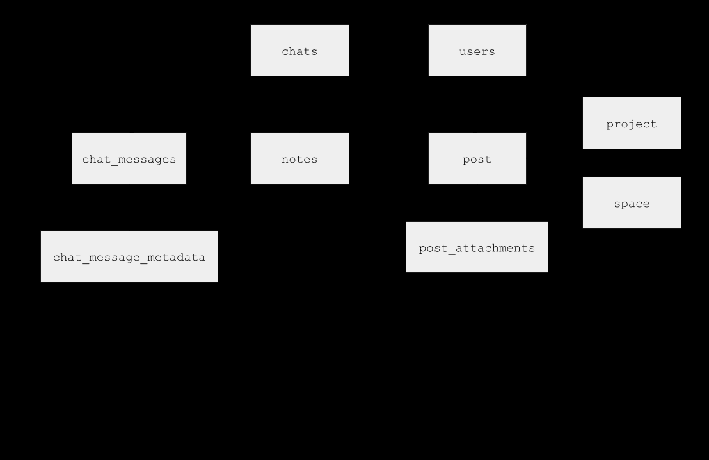
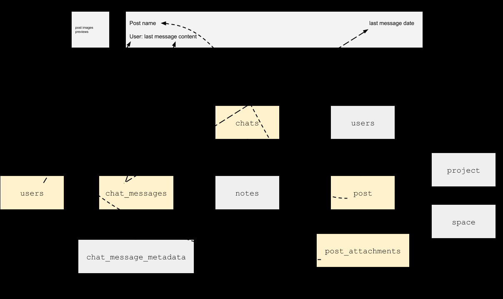

# Why use GraphQL?

- [Why use GraphQL?](#why-use-graphql)
  - [The Bad Reasons](#the-bad-reasons)
    - [Trending technology?](#trending-technology)
    - [Solves all performance issues?](#solves-all-performance-issues)
    - [The new REST?](#the-new-rest)
  - [The Good Reasons](#the-good-reasons)
    - [Mobile first & user experience](#mobile-first--user-experience)
    - [Handle complex schemas](#handle-complex-schemas)
      - [User interfaces](#user-interfaces)
      - [Server-to-Server](#server-to-server)
    - [As a Microservice Orchestration Solution](#as-a-microservice-orchestration-solution)
    - [Better Developer Experience](#better-developer-experience)
      - [Descriptive languge to handle complex data.](#descriptive-languge-to-handle-complex-data)
      - [Loading state management simplified](#loading-state-management-simplified)
      - [Type manipulation](#type-manipulation)
  - [Summary](#summary)
    - [Pros](#pros)
    - [Cons](#cons)

## The Bad Reasons

### Trending technology?

The main goals of GraphQL is to provide a "a query language for your API" that allows clients to specify the structure of the data they need.

### Solves all performance issues?

A GraphQL API (server) implementation, will have better performance out of the box than a standard REST API for clients. This is because *resolvers are called in parallel*, thus data will load faster.

However, without resolvers optimization (e.g., joins, batch systems, etc), your performance gain will not be that impressive.

> Dedicated tools like [Apollo Engine](https://www.apollographql.com/platform/) will help you identify bottlenecks of your API's.

### The new REST?

GraphQL is a specification and a technology while REST is an architecture pattern. 

Although GraphQL is useful to solve complex data exchange, it can be overkill to use it for simple use cases. For example, microservices or non-user facing APIs, like APIs exposing data for Business Intelligence has no need to provide heavy GraphQL API.

## The Good Reasons

### Mobile first & user experience

Forget the "all-in-one" or preload REST endpoint and enjoy the force of GraphQL: *loading what you need*, when you need it, in a glance.

This is specially useful for mobile applications with limited bandwith.

### Handle complex schemas

#### User interfaces

GraphQL suites very well cases like an application based on a schema using a lot of nested models and associations, or a complex UI that shows many resources all-in-one place.

GraphQL comes with a nice solution to *Domain Driven APIs*; building APIs that expose a data schema dedicated to its direct usage (e.g., computed values, flattened relations).

Developing and maintaining these kind of components, especially with realtime and paging can be hard with REST APIs since you will have to deal with many associations, up to 3 nesting levels.

#### Server-to-Server

Consider the example of the [Github Awards](https://gitawards.com/) that ranks Github users by counting stards on their repos. This has to fetch all users' repos and count stars, which is totally feasible with REST. However, imaginage that the maintainers want to update the ranking formula using:

* User followers count
* Number of forks for all repos
* Include repos from organizations that users belongs to

Then, it will become hard to do with REST. Hopefully, Github provides a [public GraphQL endpoint](https://docs.github.com/en/graphql). Therefore, fetching all this data will be easy to do and maintain — without even talking about performance.

### As a Microservice Orchestration Solution

GraphQL, especialyl when used with *Apollo Server*, provides two amazing features for orchestration:

1. Abstracting many REST APIs behind a unified *domain-driven* GraphQL Schema. Apollo Server provides [REST DataSource](https://www.apollographql.com/docs/apollo-server/data/data-sources/#REST-Data-Source) in order to implement REST API orchestration. Therefore you are able to provide a user unified and optimised public API of your microservices.

2. *Schema stiching* provides the means for creating a single GraphQL schema for multiple underlying GraphQL APIs. By unifying many GraphQL APIs into one, Apollo will forward types for you, no need to reimplement all abstracted sources resolvers.

### Better Developer Experience

GraphQL enhance developer experience in many ways, from the language to the ecosystem.

#### Descriptive languge to handle complex data.

GraphQL language is easy to learn and understand and also easy to organize in the code. Since your data requests are noew expressed by a language, stored via strings, it becomes instantly understandable which data your code is manipulating.

#### Loading state management simplified

Libraries such as Apollo bring more time to *focus on the domain centric features* — the actual product.

> Apollo React will handle for you two main technical difficulties: *client-side caching* using Observables, and *query state mechanism* provided byh the `<Query>` component.

#### Type manipulation

REST exposes JSON data, while GraphQL exposes types. Since everything is typed in GraphQL, it allows *Apollo React* to validate data sent on the client side, before reaching the API.

> Apollo also provides type generation tools for TypeScript, Flow and also Swift.

## Summary

### Pros

* **Helps providing a mobile first user experience**: Since mobile apps have rich UIs and are used over slow networks, GraphQL will help you to load only the relevant data without killing the Developer Experience.

* **Helps you handle complex schema**: Since modern UI applications become more and more complex with rich UX using data far away from the REST CRUD based API, GraphQL allows you to combine data from different sources.

* **Microservices orchestration solution**: GraphQL, especially with Apollo Server, provides many features to hide backend complexity from clients.

* **Better developer experience**: GraphQL is not just a new way to query data, it also enhances the way your team (front-mobile/back) will work together.

### Cons

* It will not solve all your performance issues out of the box.
* It is not REST and will not replace it.
* It can be overkill for simple CRUD APIs.
