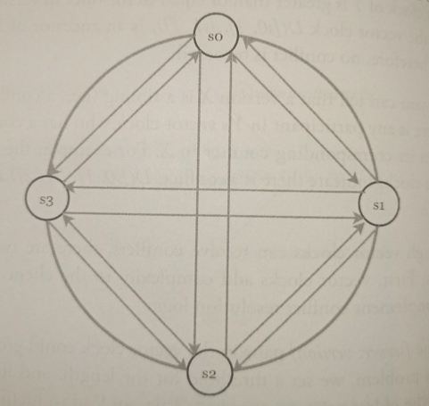
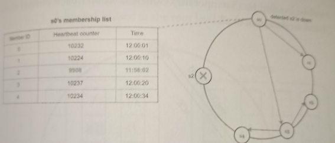
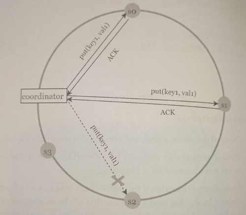

# Handling Failures

* Overview
* Failure detection
  * All-to-all multicasting
  * Descentralized methods
* Handling temporary failures
  * Sloppy quorum
  * Hinted handoff
* Handling permanent failures
  * Anti-entropy protocol
* Handling data center outage

## Overview

As with any large system at scale, failures are not only inevitable but common. Handling failure scenarios is very important, and there are some common failure resolution strategies.

## Failure detection

In a distributed system, it is insufficient to believe that a server is down because another server says so. Usually, it requires at least two independent sources of information to mark a server down.

### All-to-all multicasting

All-to-all multicasting is a straightforward solution. However, this is inefficient when many servers are in the system.

### Descentralized methods

A better solution is to use decentralized failure detection methods like *gossip protocol*:

* Each node maintains a membership list, which contains member IDs and heartbeat counters.

* Each node periodically increments its heartbeat counter.

* Each node periodically sends heartbeats to a set of random nodes, which in turn propagate to another set of nodes.

* Once nodes receive heartbeats, membership list is updated to the latest info.

* If the heartbeat has not increased for more than predefined periods, the member is considered as offline.

As shown in the previous image:

* Node *s0* maintains a node membership list shown on the left side.

* Node *s0* notices that node *s2*'s (member ID = 2) heartbeat counter has not increased for a long time.

* Node *s0* sends heartbeats that include *s2*'s info to a set of random nodes. Once other nodes confirm that *s2*'s heartbeat counter has not been updated for a long time, node *s2* is marked down, and this information is propagated to other nodes.

## Handling temporary failures

After failures have been detected through the *gossip protocol*, the system needs to deploy certain mechanisms to ensure availability. In the strict quorum consensus approach, read and write operations could be blocked.

### Sloppy quorum

A technique called *sloppy quorum* is used to improve availability. Instead of enforcing the quorum requirement, the system chooses the first *W* healthy servers for writes and first *R* healthy servers for reads on the hash ring. Offline servers are ignored.

### Hinted handoff

If a server is unavailable due to network or server failures, another server will process requests temporarily. When the down server is up, changes will be pushed back to achieve data consistency. This process is called *hinted handoff*.

Since *s2* is unavailable, reads and writes will be handled by *s3* temporarily. When *s2* comes back online, *s3* will hand the data back to *s2*.

## Handling permanent failures

### Anti-entropy protocol

If a replica is permanently unavailable, we implement an anti-entropy protocol to keep replicas in sync. Anti-entropy involves **comparing each piece of data on replicas and updating each replica to the newest version**. A *Merkle tree* is used for inconsistency detection and minimizing the amount of data transferred.

> A hash tree or *Merle tree* is a tree in which every non-leaf node is labeled with the hash of the labels or values (in case of leaves) of its child nodes. Hash trees allow efficient and secure verification of the contents of large data structures.

To compare two *Merkle* trees, start by comparing the root hashes. If root hashes match, both servers have the same data. If root hashes disagree, then the left child hashes are compared followed by right child hashes. You can traverse the tree to find which buckets are not synchronized and synchronize those buckets only.

Using *Merkle* trees, the amount of data needed to be synchronized is proportional to the differences between the two replicas, and not the amount of data they contain. In real-world systems, the bucket size is quite big.

## Handling data center outage

Data center outage could happen due to power outage, network outage, natural disaster, etc. To build a system capable of handling data center outage, it is important to replicate data across multiple data centers.

Even if a data center is completely offline, users can still access data through the other data centers.
