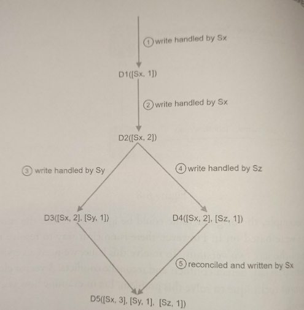

# Inconsistency resolution: Versioning

* Overview
* Vector Clock Technique

## Overview

Versioning means **treating each data modification as a new immutable version of data**. For resolving inconsistency issues, we need a versioning system that can detrect conflicts and reconcile them. A *vector clock* is a common technique to solve this problem.

## Vector Clock Technique

A *vector clock* is a `[server, version]` pair associated with a data item. It can be used to check if one version preceeds, succeeds, or in conflict with others.

Assume a vector clock is represented by `D([S1, v1], [S2, v2], ..., [Sn, vn])`, where `D` is a data item, `v1` is a version counter, and `s1` is a server number, etc. If data item `D` is written to server `Si`, the system must perform one of the following tasks:

* Increment `vi` if `[Si, vi]` exists.
* Otherwise, create a new entry `[Si, 1]`.

1. A client writes a data item `D1` to the system, and the write is handled by server `Sx`, which now has the vector clock `D1[(Sx, 1)]`.

2. Another client reads the latest `D1`, updates it to `D2`, and writes it back. `D2` descends from `D1` so it overwrites `D1`. Assume the write is handled by the same server `Sx`, which now has the vector clock `D2([Sx, 2])`.

3. Another clients reads the latest `D2`, updates it to `D3`, and writes it back. Assume the write is handled by server `Sy`, which now has vector clock `D3([Sx, 2], [Sy, 1])`.

4. Another client reads the latest `D2`, updates it to `D4`, and writes it back. Assume the write is handled by server `Sz`, which now has `D4([Sx, 2], [Sz, 1])`.

5. When another client reads `D3` and `D4`, it discovers a conflict, which is caused by data item `D2` being modified by both `Sy` and `Sz`. The conflict is resolved by the client and updated data is sent to the server. Assume the write is handled by `Sx`, which now has `D5([Sx, 3], [Sy, 1], [Sz, 1])`.

Even though vector clocks can resolve conflicts, there are two notable downsides:

* Vector clocks **add complexity to the client** because it needs to implement conflict resolution logic.

* Second, the `[server: version]` pairs in the **vector clock could grow rapidl**y. A potential fix is to set a treshold for the length, and if it exceeds it, the oldest pairs are removed. This can lead to inefficiencies in reconciliation because the descendant relationship cannot be determined accurately.

> Based on *Dynamo* paper, *Amazon* has not yet encountered this second problem in production; therefore, it is probably an acceptable solution for most companies.

### Conflict detection

Using vector clocks, it is easy to tell that a version *X* is an ancestor (i.e, no conflict) of version *Y* if the version counters for each participant in the vector clock of *Y* is greater than or equal to the ones in version *X*. For example, the vector clock `D([s0, 1], [s1, 1])` is an ancestor of `D([s0, 1])`. 

Similarly, you can tell that a version *X* is a sibiling (i.e., a conflict exists) of *Y* if there is any participant in *Y*'s vector clock who has both a counter that is greater, and another one that is less than its corresponding counter in *X*. For example, the following two vectors indicate there is a conflict: `D([s0, 1], [s1, 2])` and `D([s0, 2], [s1, 1])`.
