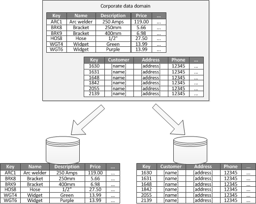

# Functional partitioning

- [Functional partitioning](#functional-partitioning)
  - [Overview](#overview)

## Overview

Functional partitioning is a way to improve isolation and data access performance when it's possible to identify a _bounded context_ for distinct business areas in an application. Another common use is to separate _read-write_ data from _read-only_ data.

This partitioning strategy can help __reduce data access contention__ across different parts of a system.
