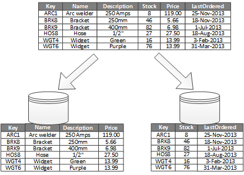

# Vertical partitioning

- [Vertical partitioning](#vertical-partitioning)
  - [Overview](#overview)
  - [Advantages](#advantages)

## Overview

> Different properties of an item are stored in different partitions. One partition holds data that is accessed more frequently, including product name, description, and price.

Vertical partitioning operates at the entity level within a data store, partially normalizing an entity to break it down from a _wide_ item to a set of _narrow_ items. It is ideally suited for column-oriented data stores such as HBase and Cassandra.

## Advantages

- __Optimized querying__: Properties can be stored together based on access frequency, or how frequently they are queried together. Therefore, efficiently separating slow-moving data from the more dynamic one. Moreover, slow-moving data is a good candidate for an application to cache.
- __Security__: Sensitive data can be stored in a separate partition with additional security controls.
- __Contention__: It can reduce the amount of concurrent access that's needed.
