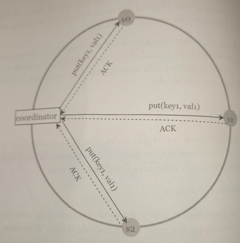

# Quorum Consensus

* Overview
* Design scope

## Overview

*Quorum consensus* can guarantee consistency for both read and write operations. Some definitions first:

* **N**: Number of replicas.
* **W**: A write quorum of size *W*. For a write operation to be considered as successful, write operation must be acknowledged from *W* replicas.
* **R**: A read quorum of size R. For a read operation to be considered as successful, read operation must wait for responses from at least *R* replicas.

**A coordinator acts as a proxy between the client and the nodes**.

$W = 1$ does not mean data is written on one server. For instance, with the configuration in previous example, data is replicated at *s0*, *s1*, and *s2*. $W = 1$ means that the coordinator must receive at least one acknowledgement before the write operation is considered successful. 

The configuration of *W*, *R*, and *N*, is a **typical tradeoff between latency and consistency**. If $W = 1$ or $R = 1$, an operation is returned quickly because a coordinator only needs to wait for a response from any of the replicas. If $W > 1$ or $R > 1$, the system offers better consistency; however, the query will be slower because the coordinator must wait for the response from the slowest replica.

## Design scope

How to configure *N*, *W*, and *R* to fit our use case? Here are some of the possible setups:

* If $R = 1$, and $W = N$, the system is optimized for a fast read.

* If $W = 1$ and $R = N$, the system is optimized for fast write.

* If $W + R > N$, strong consistency is guaranteed (Usually $N = 3$, $W = R = 2$) because there must be at least one overlapping node that has the latest data to ensure consistency.

* If $W + R <= N$, strong consistency is not guaranteed.
