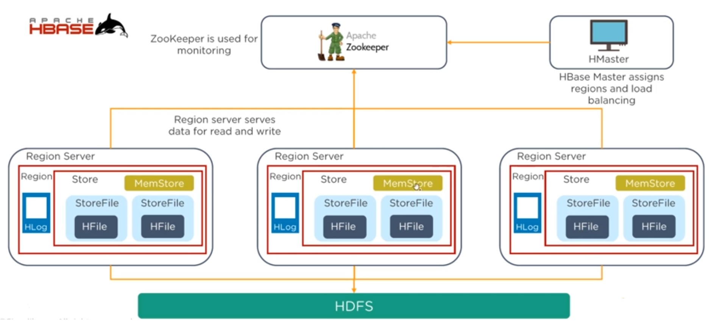
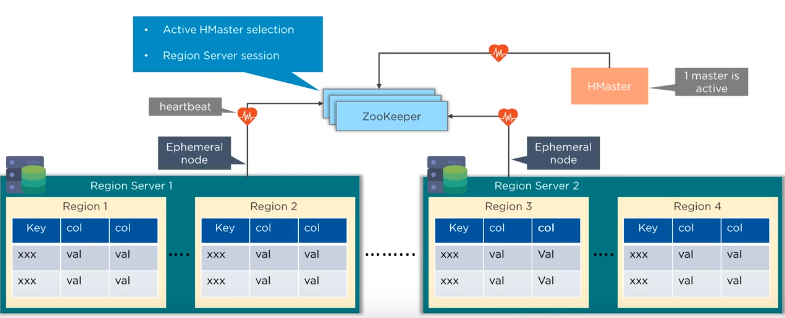
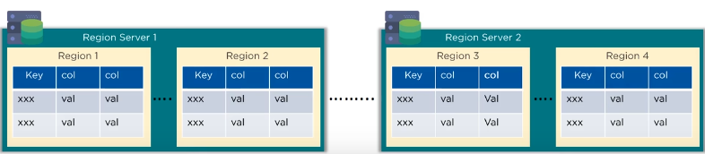

# HBase Architectural Components

## Regions

HBase tables are divided horizontally by row key range into *Regions*, thus a *Region* contains all rows in the table between the region's start key and end key.

*Regions* are assigned to the nodes in the cluster, called *Region Servers*. These servers serve data for read and write.

## HMaster

*HMaster* handles region management and *Data Definition Language operation* (create, delete, update tables).

> Region management means assigning regions for recovery or load balancing, and monitoring all servers.
