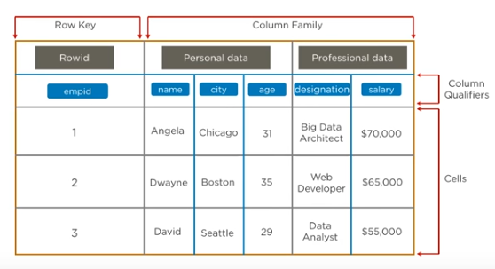

# Apache HBase

* Overview
* Column Oriented Storage
* Use Cases
* CP Type System

## Overview

*Hbase* is an open-source **non-relational distributed database** modeled after *Google's Bigtable* and written in Java. It is developed as part of *Apache Haddop* project and runs on top of *HDFS (Hadoop Distributed File System)* or *Alluxio*, providing Bigtable-like capabilities for Hadoop. That is, it provides a **fault-tolerant** way of storing **large quantities of sparse data**

> *Sparse data*: small amounts of information caught within a large collection of empty or unimportant data. Sparse data contain many meaningless values (i.e. zero).

*Hbase* features **compression**, **in-memory operation**, and **Bloom filters on a per-column basis** as outlined in the original Bigtable paper.

Tables in *HBase* can serve as the input and output for *MapReduce* jobs run in Hadoop, and may be accessed through the JAVA API but also through REST, *Avro*, or *Thrift* gateway APIs.

*HBase* is a **wide-column store**, well-suited for **fast read and write operations on large dataseets with high throughput and low I/O latency.**

> HBase is optimized for operations such as finding the 50 largest items in a group of 2 billion records, or finding the non-zero items representing less than 0.1% of a huge collection.

## Column Oriented Storage

## Use Cases

* *Medical*: storing genome sequences, disease history of people or an area.
* *E-Commerce*: storing logs about customer search history, perform analytics and target advertisement.
* *Sports*: match details and history for prediction.

## CP Type System

In the parlance of Eric Brewer's *CAP *Theorem*, *HBase* is a CP type system, meaning that it provides *Consistency* and *Partition Tolerance* guarantees, but not *Availability* guarantee.

> Refer to CAP Theorem for more details.
