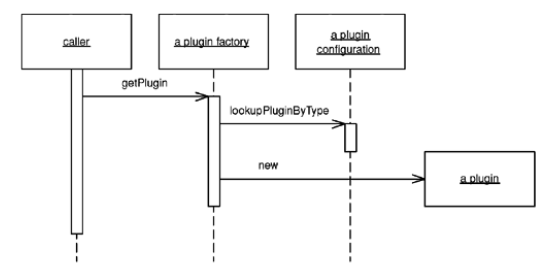

# Plugin

> Links classes during configuration rather than compilation.

* Overview
* How It Works
* When to Use It

## Overview

Configuration shouldn't be scattered troughout your application, nor should it require a rebuild ir redeployment. *Plugin* solves both problems by **providing a centralized, runtime configuration**.

## How It Works

* First define with a *Separated Interface* any behaviors that will have different implementations based on runtime environment.

* The *Plugin* will use a basic factory pattern, but it requires its linking instructions to be stated at a single, external point, in order that configuration can be easily managed.

* Additionally, the linking to implementations must occur dynamically at runtime rather than during compilation, so that reconfiguraiton won't require a rebuild. A text file works quite well as the means of stating linking rules. The *Plugin* factory will simply read the text file, look for an entry specifying the implementation of a requested interface, and return that implementation.

* *Plugin* works best in a language that supports reflection because the factory can construct implementations without compile-time dependencies on them. When using reflection, the configuration file must contain mappings of interface names to implementation class names. The factory can sit independently in a framework package and enedn't be changed when you add new implementations to your configuration options.

## When to Use It

Use *Plugin* whenever you have behaviors that require different implementations based on runtime environment.
