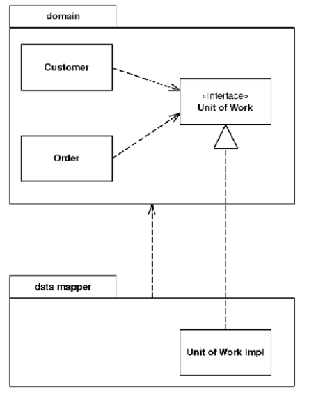

# Separated Interface

> Defines an interface in a separate package from its implementation

* Overview
* How It Works
* When to Use It

## Overview

You might need to invoke methods that contradict the general dependency structure. If so, use *Separated Interface* **to define an interface in one package but implement it in another**. This way a client that needs the dependency to the interface can be **completely unaware of the implementation**.

## How It Works

* *Separated Interface* takes advantage of the fact that an implementation has a dependency to its interface but not vice versa, so **the implementation package has a dependency to the interface package**. Other **packages can depend on the interface package without depending on the implementation package**.

* Implementation can be either resolved at compile time using a separate package or at configuration time using *Plugin*.

* You can place the interface in the client's package. Developers of the client package are responsible for defining the interface.

> Esentially the client package indicates that it will work with any other package that implements the interface it defines.

* You can place the interface in a third package if you have multiple separated clients. This would also indicate that interface definition is not the responsibility of the client package developers, but the developers of the implementations instead.

* One of the awkward things about separate interfaces is **how to instantiate the implementation**. It usually requires knowledge of the implementation class. The common approach is to **use a separate factory object**, where again there is a separate interface for the factory. You still have to bind an implementation to the factory, and *Plugin* is a good way to do this.

## When to Use It

* You use *Separated Interface* when **you need to break a dependency between two parts of the system**.
  * You've built some abstract code code for common cases into a framework package that needs to call some particular application code.
  * You have some code in one layer that needs to call code in another layer that it shouldn't see, such as domain code calling a *Data Mapper*.
  * You need to call functions developed by another development group but don't want a dependency into their APIs.

* *Separated Interface* provides a good plug point for a *Gateway*.
