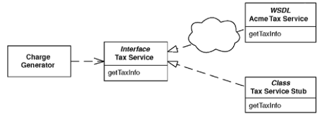

# Service Stub

> Removes dependence upon problematic services during testing.

* Overview
* How It Works
* When to Use It

## Overview

Enterprise systems often depend on access to third-party services. Quite likely, such dependencies will lead to times when tests can't execute, and then the development process is broken.

**Replacing the service during testing** with a *Service Stub* that runs locally, fast, and in memory, **improves your development experience**.

## How It Works

* The first step is to define access to the service with a *Gateway*. The *Gateway* should not be a class but rather a *Separated Interface* so you can have one implementation that calls the real service and at least one that's only a *Service Stub*.

* The desired implementation of the *Gateway* should be loaded using a *Plugin*.

## When to Use It

Use *Service Stub* whenever you find that dependence on a particular service is hindering your development and testing.

Many practicioners of *Extreme Programming* use the term **Mock Object**, for a *Service Stub*.
