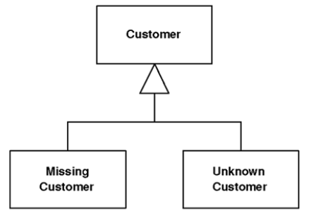

# Special Case

> A subclass that provides special behavior for particular cases.

* Overview
* How It Works
* When to Use It

## Overview

Nulls are awkward things in object-oriented programs because they defeat polymorphism. If it's possible for a variable to be null, you have to remember to surround it with null test code so you'll do the right thing if a null is present. You often end up writing similar code in lots of places.

Nulls are a common example of such problems and others crop up regularly (e.g., dealing with infinity, which has special rules for things like addition that break the usual invariants of real numbers).

__Instead of returning null, or some odd value, return a *Special Case* that has the same interface as what he caller expects__.

## How It Works

* __Create a subclass to handle the *Special Case*__. Thus, if you have a customer object and you want to avoid null checks, you make a null customer object, and override the objects in the *Special Case* to provde some harmless behavior. Then, whenever you have a null, put in an isntance of null customer instead.

* You can often implement a *Flyweight*, because there's usually no reason to distinguish between different instances of null customer.

* A **null can mean different things**.For example, a null customer may mean no customer or it may mean than there's a customer but we don't know who it is. Rather than just using a null customer, consider having separate *Special Cases* for missing customer and unknown customer.

* A common way for a *Special Case* to override methods is to return another *Special Case*. For example, if you ask an unknown customer for his last bill, you may well get an unknown bill.

## When to Use It

Use *Special Case* whenever you have multiple places in the system that have the same behavior after a conditional check for a particular class instance, or the same behavior after a null check.
