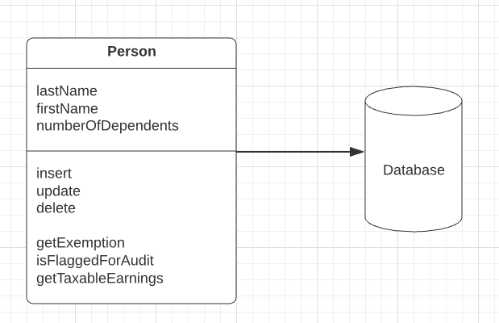

# Active Record Pattern (ARP)

> *"An object that wraps a row in a database table or view, encapsulates the database access, and adds domain logic on that data."* - Martin Fowler.

* Overview
  * Consequences
* How It Works
  * Active Record vs Data Mapper
  * Active Record vs Row Data Gateway
* When to Use It
* Example: A Simple Person (Java)

## Overview



This object carries both data and behavior. Much of this data is persistent and needs to be stored in a database. Active Record uses the most obvious approach, putting data access logic in the domain object. This way all people know how to read and write their data to and from the database.

### Consequences

#### Pros

* __Simple__. Because of how tightly matched the records in your database and the objects in your system are conceptually.

* __Easy to understand__. Intuitive understanding of how you can work with the system even if you've never had the least exposure to an ORM before.

#### Cons

* __Coupling__. The main drawback is that domain becomes tightly coupled to a particular persistence mechanism. Should that mechanism require a global change, every class that implements this pattern may change.

* __Tricky atomic operations__. If a group of objects must be saved in an all-or-nothing fashion, either one object must know about all these other objects and control their persistence, or the control over the entire transaction must be handled from outside the domain.

## How It Works

The essence of an *Active Record* is a *Domain Model* in which the classes match very closely the record structure of an underlying database. Each *Active Record* is responsible for saving and loading to the database and also for any domain logic that acts on the data. This may be all the domain logic in the application, or you may find that some domain logic is held in *Transaction Scripts* with common and data-oriented code in the *Active Record*.

> You may consider *Foreign Key Mapping*, but you may also leave the foreign keys as they are. You can use views or tables with *Active Record*, although updates through views are obviously harder.

The *Active Record* class typically has methods that do the following:

* Construct an instance of the *Active Record* from a SQL result set row.
* Construct an ew instance for later insertion into the table.
* Static finder methods to wrap commonly used SQL queries and return *Active Record* objects.
* Update the database and insert into it the data in the *Active Record*.
* Get and set the fields.
* Implement some pieces of business logic.

Because of the close coupling between the *Active Record* and the database, it's common to see static find methods in this pattern. However, there's no reason that you can't separate out the find methods into a separate class, and that is better for testing.

### Active Record vs Data Mapper

The biggest different between them is that the Data Mapper is meant to be a layer between the actual business domain and the database, where Active Record seeks to invisibly bridge the gaps between the two as seamlessly as possible.

### Active Record vs Row Data Gateway

The principal difference is that a *Row Data Gateway* contains only database access while an *Active Record* contains both data source and domain logic.

## When to Use It

*Active Record* is a good choice for domain logic that isn't too complex, such as CRUDs. Derivations and validations based on a single record work well in this structure.

In an initial design for a *Domain Model*, *Active Record* has the primary advantage of simplicity, it's easy to build and understand. Their primary problem is that they work well only if the *Active Record* objects correspond directly to the database tables: an **isomorphic schema**.

If your business logic is complex, you'll soon want to use your object's direct relationships, collections, inheritance, and so forth. These don't map easily onto *Active Record*, and adding them gets very messy. That's what will lead you to use *Data Mapper* instead.

*Active Record* is a good pattern to consider if you're using *Transaction Script* and are beginning to feel the pain of code duplication and the difficulty in updating scripts and tables. In this case you can gradually start creating *Active Records* and then slowly refactor behavior into them. It often helps to wrap the tables as a *Gateway* first, and then start moving behavior so that the tables evolve to a *Active Record*.

## Example: A Simple Person (Java)

> This is a simplistic example to show how the bones of *Active Record* work.

We setup the database:

```sql
CREATE TABLE people (ID int primary key, lastname varchar, firstname varchar, number_of_dependents int);
```

Then we setup our `Person` class (*Active Record*).

```java
class Person {
  private String lastName;
  private String firstName;
  private int numberOfDependents;

  // Any business logic such as calculation the exemption, sits directily in the Person class
  public Money getExemption() {
    Money baseExemption = Money.dollars(1500);
    Money dependentExemption = Money.dollars(750);
    return baseExemption.add(dependentExemption.multiply(this.getNumberOfDependents()));
  }

  // Finder and loading methods
  private final static String findStatementString =
    "SELECT id, lastname, firstname, number_of_dependents" +
    " FROM people" +
    " WHERE id = ?";

  public static Person find(Long id) {
    Person result = (Person) Registry.getPerson(id);
    if (result != null) return result;
    PreparedStatement findStatement = null;
    ResultSet rs = null;

    try {
      findStatement = DB.prepare(findStatementString);
      findStatement.setLong(1, id.longValue());
      rs = findStatement.executeQuery();
      rs.next();
      result = load(rs);
      return result;
    } catch (SQLException e) {
      throw new ApplicationException(e);
    } finally {
      DB.cleanUp(findStatement, rs);
    }
  }

  public static Person find(long id) {
    return find(new Long(id));
  }

  public static Person load(ResultSet rs) throws SQLException {
    Long id = new Long(rs.getLong(1));

    Person result = (Person) Registry.getPerson(id);
    if (result != null) return result;

    String lastNameArg = rs.getString(2);
    String firstNameArg = rs.getString(3);
    int numDependentsArg = rs.getInt(4);

    result = new Person(id, lastNameArg, firstNameArg, numDependentsArg);
    
    Registry.addPerson(result);

    return result;
  }

  // Updating an object takes a simple instance method
  private final static String updateStatementString =
    "UPDATE people"
    " set lastname = ?, firstname = ?, number_of_dependents = ?" +
    " where id = ?";

  public void update() {
    PreparedStatement updateStatement = null;

    try {
      updateStatement = DB.prepare(updateStatementString);
      updateStatement.setString(1, lastName);
      updateStatement.setString(2, firstName);
      updateStatement.setInt(3, numberOfDependents);
      updateStatement.setInt(4, getID().intValue());
      updateStatement.execute();
    } catch (Exception e) {
      throw new ApplicationException(e);
    } finally {
      DB.cleanUp(updateStatement);
    }
  }

  // Insertions are also pretty simple
  private final static String insertStatementString =
    "INSERT INTO people VALUES (?, ?, ?, ?)";

  public Long insert() {
    PreparedStatement insertStatement = null;
    try {
      insertStatement = DB.prepare(insertStatementString);
      setID(findNextDatabaseId());
      insertStatement.setInt(1, getID().intValue());
      insertStatement.setString(2, lastName);
      insertStatement.setString(3, firstName);
      insertStatement.setInt(4, numberOfDependents);
      insertStatement.execute();
      Registry.addPerson(this);
      return getID();
    } catch (Exception e) {
      throw new ApplicationException(e);
    } finally {
      DB.cleanUp(insertStatement);
    }
  }
}
```
