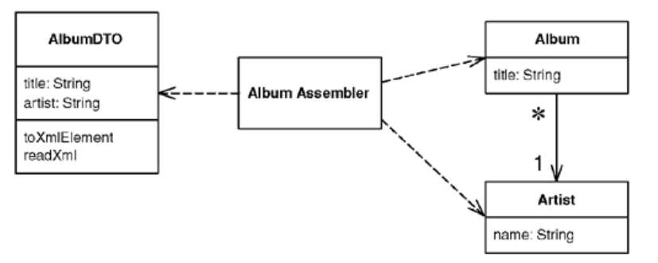

# Data Transfer Object

> An object that carries data between processes in order to reduce the number of method calls.

* Overview
* How It Works
* When to Use It

## Overview

When you're working with a remote interface, each call to it is expensive. As a result you want to reduce the number of calls, and that means that **tansfering more data wit each call**.

One solution is to create a *Data Transfer Object* that can **hold all the data for the call**. It needs to be **serializable** to go across the connection. Usually an assembler is used on the server side to transfer data between the DTO and any domain objects.

## How It Works

* It's often little more than a bunch of fields (primitives, or other *Data Transfer Objects*) and the getters and setters for them. Its value is that it allows you to **move several pieces of information over a network in a single call**.

* Any structure between *Data Transfer Objects* should be a **simple graph structure**, normally a hierarchy, as opposed to the more complicated graph structures in a *Domain Model*.

* Keep the attributes simple, because **have to be serializable** and they need to be **understood by both sides of the wire**. As a result the *Data Transfer Object* classes and any classes they reference must be present on both sides.

* It's **usually responsible for serializing itself** into some format that will go over the wire. You have to choose a mechanism that both ends of the connection will work with. If you control both ends, you pick the easiest one; if you don't, you may be able to provide a connect at the end you don't own. Then you can use a simple *Data Transfer Object* on both sides of the connection and use the connector to adapt to the foreign component.

* It usually carries much more data than what the remote object requested, but **it should carry all the data the remote object will need for a while**. It's better to err on the side of sending of sending too much data than to have to make multiple calls.

> For example, if a remote object requests data about an order object, the returned *Data Transfer Object* will contain data from the order, the customer, the line items, the products on the line items, the delivery information, all sorts of stuff.

* You can't usually transfer objects from a *Domain Model* due to the complex interconnection that makes difficult, if not impossible, to serialize. Also you usually don't want the domain object classes on the client, instead you have to transfer a simplified form of the data from the domain objects.

* A *Data Transfer Object* **doesn't know about how to connect with domain objects**. This is because it should be deployed on both sides of the connection. As a general rule, **keep the domain model independent of the external interfaces**. One approach is to **make a separate assembler object** responsible for creating a *Data Transfer Object* from the domain model and updating them odel from it. The assembler is an example of a *Mapper*.

* It makes sense to design the *Data Transfer Object* around the needs of a particular client. You may also see multiple *Data Transfer Objects* for a given domain object, depending on a particular view.

## When to Use It

* Whenever you need to **transfer multiple items of data between two processes in a single method call**.

* Another common prpose is to **act as a common source of data for various components in different layers**. Each component makes some changes to the *Data Transfer Object* and then passes it on to the next layer.

* For an asynchronous system, you can create a *Lazy Load* of the *Data Transfer Object*. The user of the *Data Transfer Object* will block only when it tries to access the results of the call. 

* An alternative is to not use an object all but simply a setting method with many arguments or a getting methods with several pass-by reference arguments. Many languages, such as Java, allow only one object as a return value, so, although this can be used for updates, it can't be used for retrieving information without more complex logic.

* Another alternative is to use some form of string representation directly, without an object acting as the interface to it. Here the problem is that everything else is coupled to the string representation and it's good to hide the precise representation behind an explicit interface, that way, if you want to change the string or replace it with a binary structure, you don't have to change anything else.
