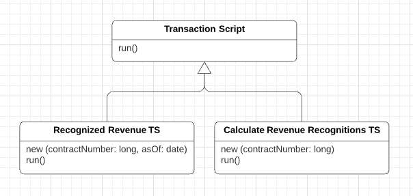
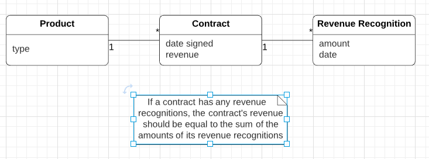

# Transaction Script

> *"Organizes business logic by procedures where each procedure handles a single request from the presentation."* - Martin Fowler

* Overview
* How It Works
* When to Use It
* Case Study: The Revenue Recognition Problem

## Overview


Most business applications can be though of as a series of transactions. A transaction may view some information as organized in a particular way, another will make changes to it.

Each interaction between a client system and a server system contains a certain amount of logic. In some cases this can be as simple as displaying information in the database. In others it may involve many steps of validations and calculations.

A **Transaction Script** organizes all this logic primarily as a single procedure, making calls directly to the database or through a thin database wrapper.

Each transaction will have its own *Transaction Script*, although common subtrasks can be broken into subprocedures.

## How It Works

With *Transaction Script* the domain logic is primarily organized by the transactions you carry out with the sstem.

> If your need is to book a hotel room, the logic to check room availability, calculate rates, and update the database is found inside the *Book Hotel Room procedure*.

One of the benefits of this approach is that you don't need to worry about what other transactions are doing. Your task is to get the input, interrogate the database, munge, and save your results to the database.

Where you put the *Transaction Script* will depend on how you organize your layers.

The most common is to have several *Transaction Scripts* in a **single class**, where each class defines a subject area of related *Transaction Scripts*.

The other way is to have each one in its own class, using the *Command patter* (Gang of Four). In this case you define a supertype for your commands that specifies some `execute` method in which *Transaction Script* logic fits.

> *"I use the term *Transaction Script* because most of the time you'll have one *Transaction Script* for each database transaction."* - Martin Fowler

In addition, don't have any calls from the *Transaction Scripts* to any presentation logic; that will make it easier to modify the code and test the *Transaction Scripts*.



## When to Use It

Organizing logic this way is natural for applications with only a **small amount of logic**, and it involves very little overhead either in performance or in understanding.

As the business logic gets more complicated, however, it gets progressively harder to keep it in a well-designed state.

One particular problem to watch for is its duplication between transactions. Careful factoring can alleviate many of these problems, but more complex business domains need to build a *Domain Model*. It's possible to refactor a *Transaction Script* design to a *Domain Model* design, but it's a harder change than it otherwise needs to be.

## Case Study: The Revenue Recognition Problem

> [The Revenue Recognition Problem](../../../problems/revenue-recognition)

### Java Example

This example uses two transaction scripts: one to calculate the revenue recognitions for a contract, and one to tell how much revenue on a contract has been recognized by a certain date.

The database structure has three tables: one of the products, one for the contracts, and one for the revenue recognition.



```sql
CREATE TABLE products (ID int primary key, name varchar, type varchar);

CREATE TABLE contracts (ID int primary key, product int, revenue decimal, dateSigned date);

CREATE TABLE revenueRecognitions (contract int, amount decimal, recognizedOn date, PRIMARY KEY (contract, recognizedOn));
```

The first script calculates the amount of recognition due by a particular day in two stages: first select the appropriate rows in the revenue recognition table; in the second sum up the accounts.

Many *Transaction Script* designs have *scripts* that operate directly on the databnase, putting SQL code in the procedure. Here we use a simple *Table Data Gateway* to wrap the SQL queries. Since the example is so simple, we'll use a single gateway rather than one for each table.

```java
class Gateway {
  // ...

  public ResultSet findRecognitionsFor (long contractId, MfDate asOf) throws SQLException {
    PreparedStatement stm = db.prepareStatement(findRecognitionsStatement);
    stmt.setLong(1, contractId);
    stmt.setDate(2, asOf.toSqlDate());
    ResultSet result = stmt.executeQuery();
    return result;
  }

  public ResultSet findContract (long contractId) throws SQLException {
    PreparedStatement stmt = db.prepareStatement(findContractStatement);
    stmt.setLong(1, contractId);
    ResultSet result = stmt.executeQuery();
    return result;
  }

  public void insertRecognition (long contractId, Money amount, MfDate asof) throws SQLException {
    PreparedStatement stmt = db.prepareStatement(insertRecognitionStatement);
    stmt.setLong(1, contractId);
    stmt.setBigDecimal(2, amount.amount());
    stmt.setDate(3, asof.toSqlDate());
    stmt.executeUpdate();
  }

  private static final String findRecognitionStatement =
    "SELECT amount " +
    " FROM revenueRecognitions " +
    " WHERE contract = ? AND recognizedOn <= ?";

  private static final String findContractStatement =
  "SELECT * " +
  " FROM contracts c, products p " +
  " WHERE ID = ? AND c.product = p.ID";

  private static final String isnertRecognitionStatement =
    "INSERT INTO revenueRecognitions VALUES (?, ?, ?)";
  
  private Connection db;
}
```

Then use `RecognitionService`'s `recognizedRevenue` to sum up based on the result set passed back from the gateway. When calculation is as simple as this, you can replace the in-memory script with a call to a SQL statement that uses an aggregate function to sum the amounts. For calculating the revenue recognitions on an existing contract, I use a similar split.

```java
class RecognitionService {
  // ...
  private static final db = new Gateway();

  // Sum op result set passed back from the gateway
  public Money recognizedRevenue(long contractNumber, MfDate asOf) {
    Money result  Money.dollars(0);

    try {
      ResultSet rs = db.findRecognitionsFor(contractNumber, asOf);
      while (rs.next()) {
        result = result.add(Money.dollars(rs.getBigDecimal("amount")));
      }
      return result;
    } catch (SQLException e) { throw new ApplicationException(e); }
  }

  // Calculate revenue recognitions on an existing contract
  public void calculateRevenueRecognitions(long contractNumber) {
    try {
      ResultSet contracts = db.findContract(contractNumber);
      contracts.next();

      Money totalRevenue = Money.dollars(contracts.getBigDecimal("revenue"));
      MfDate recognitionDate = new MfDate(contracts.getDate("dateSigned"));
      String type = contracts.getString("type");

      if (type.equals("S")) {
        Money[] allocation = totalRevenue.allocate(3);
        
        db.insertRecognition(contractNumber, allocation[0], recognitionDate);
        db.insertRecognition(contractNumber, allocation[1], recognitionDate.addDays(60));
        db.insertRecognition(contractNumber, allocation[2], recognitionDate.addDays(90));
      }
      else if (type.equals("W")) {
        db.insertRecognition(contractNumber, totalRevenue, recognitionDate);
      }
      else if (type.equals("D")) {
        Money[] allocation = totalRevenue.allocate(3);

        db.insertRecognition(contractNumber, allocation[0], recognitionDate);
        db.insertRecognition(contractNumber, allocation[1], recognitionDate(30));
        db.insertRecognition(contractNumber, allocation[2], recognitionDate(60));
      }
    } catch (SQLException e) { throw new ApplicationException(e); }
  }
}
```

It's harder to imagine this as the rules get more complicated. Typical revenue recognition rules get very involved, varying not just by product but also by date. It's difficult to keep a coherent design with *Transaction Script* once things get that complicated, which is why *Domain Model* could be more helpful in these circumstances.
