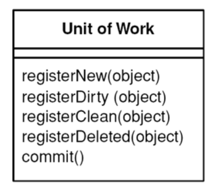
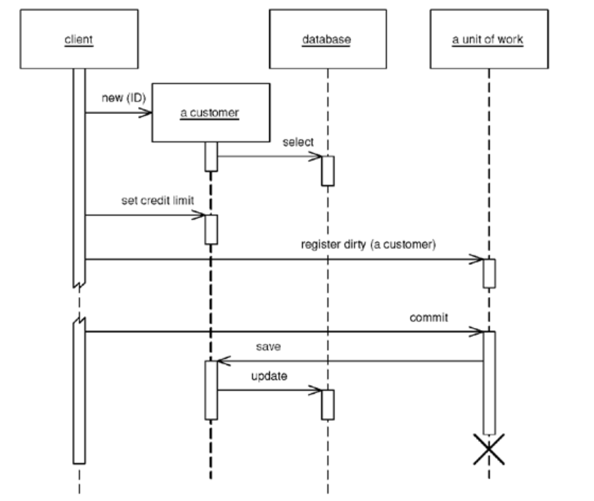

# Unit of Work

> Maintains a list of objects affected by a business transaction and coordinates the writing out of changes and the resolution of concurrency problems.

* Overview
* How It Works
  * Called Registration
  * Object Registration
  * Unit of Work Controller
* When to Use It

## Overview

You can change the database with each change to your object model, but this can lead to lots of very small database calls, which ends up being very slow. Furthermore it requires you to have a transaction open for the whole interaction, which is impractical if you have a business transaction that spans multiple requests. The situation is even worse if you need to keep track of the objects you've read to avoid inconsistent reads.

A *Unit of Work* keeps track of everything you do during a business transaction that can affect the database. When you're done, it figures out everything that needs to be done to alter the database as a result of your work.

## How It Works

As soon as you start doing something that may affect a database, you create a *Unit of Work* to keep track of the changes. Every time you create, change, or delete an object, you tell the *Unit of Work*. You can also let it know about objects you{ve readso that it can check for inconsistent reads by verifying that none of the objects changed on the database during the business transaction.

When it comes time to *commit*, the *Unit of Work* decides what to do:

* Opens a transaction
* Does any concurrency checking (*Pessimistic Offline Lock* or *Optimistic Offline Lock*)
* Writes changes to the database

Application programmers never explicitly call methods for database updates.

Objects need to be able to find their current *Unit of Work*. A good way to do this is with a thread-scoped *Registry*. Another way is to pass the *Unit of Work* to objects that need it.

*Unit of Work* makes an obvious point of **handling batch updates**.

> The idea behind a **batch update** is to send multiple SQL commands as a single unit so that they can be processed in a single remote call.

### Called Registration

With **called registration**, the user of an object has to remember to register the object with the *Unit of Work* for changes. Any objects that aren't registered won't be written out on commit. 

* Allows forgetfulness to cause trouble
* Gives flexibility in allowing people to make in-memory changes that they don't want written out.

### Object Registration

With **object registration**, the onus is removed from the caller.

* *Unit of Work* needs either to be passed to the object or to be in a well-known place
* Loading methods registers the object as clean
* Setting methods register the object as dirty

### Unit Of Work Controller

* The *Unit of Work* handles all reads from the database and registers clean objects whenever they're read.
* Rather than makring objects as dirty, the *Unit of Work* takes a copy at read time and then compares the object at commit time.

Although this adds overhead to the commit process, it allows a selective update of only those fields that were actually changed; it also avoids registration calls in the domain objects.

A hybrid approach is to take copies only of changed objects. This requires registration, but it supports selective update and greatly reduces the overhead of copy if there are many more reads than updates.

## When To Use It

When you need to **keep track of the various objects you've manipulated** so that you know **which ones you need to consider to synchronize** your in-memory data with the database, while avoiding multiple database calls by leaving all your updates to the end at a commit call.

You could give each object a *dirty flag* that you set when the object changes. If all of them are in a single hierarchy, then you can traverse the hierarchy and write out any that have been changed. However, a more general object network, such as a *Domain Model*, is harder to traverse. *Unit of Work* keeps all this **information in one place**.

Also, *Unit of Work* works well for more complicated situations, such as handling business transactions that span several system transactions using *Optimistic/Pessimistic Offline Lock*.
