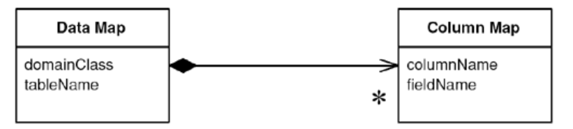

# Metadata Mapping

> Holds details of object-relational mapping in metadata.

* Overview
* How It Works
  * Code Generation
  * Reflective Programming
* When to Use It

## Overview

Much of the code that deals with object-relational mapping describes **how fields in the database correspond to fields in in-memory objects**.

*Metadata Mapping* allows to **define the mappings in a tabular form, which can be processed by generic code** to carry out the details of reading, inserting, and updating the data.

## How It Works

There are two approaches, using *code generation* or *reflective programming*.

### Code Generation

You write a program whose input is the metadata and whose output is the source code of classes that do the mapping, which are deployed with the server code.

> If you use code generation, you should make sure that it's fully integrated into your build process with whatever build scripts you're using.

This is the less dynamic approach since any changes to the mapping require recompiling and redeploying at least that part of the software. Generated code is more explicit so you can see what's going on in the debugger.

### Reflective Program

> A *reflective program* may ask an object for a method named `setName`, and then run an invoke method on the `setName` method passing in the appropriate argument.

By treating methods (and fields) as data, the reflective program can read in field and method names from a metadata file and use them to carry out the mapping.

Reflection can be slow, and often causes code that's hard to debug. But in a reflective approach, you can just change the mapping data file and the existing classes will use the new metadata.

## When to Use It

Compare adding new mappings using handwritten code with using *Metadata Mapping*. If you use reflection, look into its consequences for performance.

The extra work of hand'coding can be greatly reduced by creating a good *Layer Supertype* that handles all the common behavior.

*Metadata Mapping* can interfere with refactoring, particularly if you're using automated tools. If you change the name of a private field, it can break an application unexpectedly. Using code generation is a little easier, still, any automated update will get lost when you regenerate the code.

On the other hand, *Metadata Mapping* can make refactoring the database easier, since **the metadata represents a statement of the interface of your database schema**.
