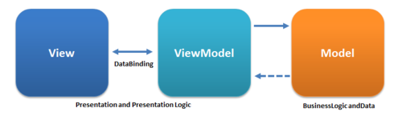

# MVVM: Model View View-Model

> I've used as reference the [blog post by John Smith: Patterns - WPF apps with the MVVM design pattern](https://docs.microsoft.com/en-us/archive/msdn-magazine/2009/february/patterns-wpf-apps-with-the-model-view-viewmodel-design-pattern).

- [MVVM: Model View View-Model](#mvvm-model-view-view-model)
  - [History](#history)
  - [Overview](#overview)
  - [Architectural Constraints](#architectural-constraints)

## History

Back in 2004, Martin Fowler published an article about *Presentation Model* (PM). The PM is similar to MVP in that **it separates a view from its behavior and state**. A view, then, becomes merely a rendering of a *presentation model*, which frequently updates its views. That synchronization logic exists as code in the presentation model classes.

In 2005, John Gossman, one of the WPF and Silverlight Architects at Microsoft, unveiled the *MVVM* pattern on his blog. MVVM is identical to Fowler's PM, in that both patterns feature an abstraction of a view, which contains a view's state and behavior. Gossman introduced MVVM as a standardized way to **leverage core features of WPF** to simplify the creation of user interfaces. In that sense, you could consider MVVM to be **specialization of the more general PM pattern, tailormade for the WPF and Silverlight platforms**.

Here are some relevant entries:

* [Oct 8th 2005: Introduction to MVVM pattern for building WPF apps](https://docs.microsoft.com/en-us/archive/blogs/johngossman/introduction-to-modelviewviewmodel-pattern-for-building-wpf-apps)
* [Oct 9th 2005: MVVM of Mt. Fuji](https://docs.microsoft.com/en-us/archive/blogs/johngossman/100-modelviewviewmodels-of-mt-fuji)
* [Oct 11th 2005: Further reflection on Presentation Model](https://docs.microsoft.com/en-us/archive/blogs/johngossman/further-reflection-on-presentationmodel)

## Overview

MVVM is a variation of MVC that is tailored for *modern UI development platforms* where the View is the responsibility of a designer rather than a classic developer.MVVM is thus **a refinement of MVC** that evolves it from its Smalltalk origins where the entire application was built using one environment and language into a modern development environment.

The *Model* is defined as in MVC; it is the data or business logic, completely UI independent, that stores the state and does the processing of the problem domain.

The *View* consists of the visual elements, the buttons, windows, graphics and more complex controls of a GUI. It encodes the keyboard shortcuts and the controls themselves manage the interaction with the input devices that is the responsibility of Controller in MVC.

At this point **data binding comes into play**. In simple examples, the View is data bound *directly* to the Model. Parts of the Model are simply displayed in the view by one-way data binding. Other **parts of the model can be edited by directly binding controls two-way to the data**. For example, a boolean in the Model can be data bound to a CheckBox, or a string field to a TextBox.

The UI may want to perform *complex* operations that must be implemented in code which doesn't make sense in our strict definition of the View but are **too specific to be included in the Model** (or didn't come with the pre-existing model). Finally we need a place to put *view state* such as selection or modes.

The ViewModel is responsible for these tasks. The term means **"Model of a View"**, and can be thought of as *abstraction of the view*, but it also provides a *specialization of the Model* that the View can use for data-binding. In this latter role the ViewModel contains *data-transformers* that convert Model types into View types, and it contains *Commands* the View can use to interact with the Model.

## Architectural Constraints

* The view binds to properties on a ViewModel, which, in turn, exposes data contained in model objects and other state specific to the view.

> Unlike the Presenter in MVP, a ViewModel does not need a reference to a view. The bindings between view and ViewModel are simple to construct because a ViewModel object is set as the DataContext of a view.

* If property values in the ViewModel change, those new values automatically propagate to the view via data binding.

* When the user clicks a button in the View, a command on the ViewModel executes to perform the requested action. The ViewModel, never the View, performs all modifications made to the model data.

* The view classes have no idea that the model classes exist, while the ViewModel and model are unaware of the view. In fact, the model is completely oblivious to the fact that the ViewModel and view exist. 
