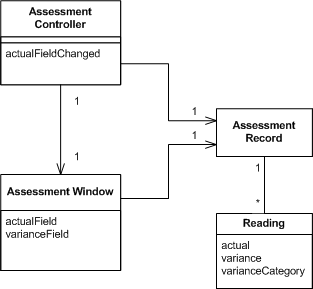
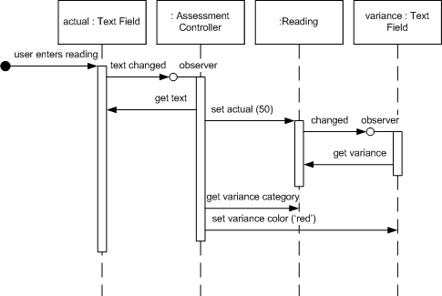

# Supervising Controller

> These notes are based on [Martin Fowler's Supervising Controller post](https://martinfowler.com/eaaDev/SupervisingPresenter.html).

## Overview

Factor the UI into a View and Controller where the View handles simple mapping to the underlying model and the Controller handles input response and complex view logic.

Many UI frameworks provide the ability to easily map between the view and model, often using some kind of Data Binding. These approaches are very effective in allowing you to declaratively set up a relationship between elements in the view and model. Usually, however, there are *more complex relationships* which require you to have *more complex view logic*. This logic can be hard to manage, and in particular hard to test, while embedded in the view.

Supervising Controller **uses a controller both to handle input response but also to manipulate the view to handle more complex view logic**. It leaves simple view behavior to the declarative system, intervening only when effects are needed that are beyond what can be achieved declaratively.

## How It Works

Supervising Controller decomposes presentation functionality into two parts: a *controller* (often called *presenter*) and *view*. The domain data that needs to be displayed is separated. The basic division of responsibilities echoes the *Model-View-Presenter* architecture in its *Dolphin form*, as described by Bower and McGlashan.

A Supervising Controller has two primary responsibilities: 

1. Input response
2. Partial view/model synchronization.

For *input response* the controller operates in the *presenter style*. The user gestures are handled initially by the screen widgets, however all they do in response is to *hand these events off to the presenter*, which handles all further logic.

For view/model synchronization the controller *defers as much of this as reasonable to the view*. The view typically uses some form of *Data Binding* to populate much of the information for its fields. Where Data Binding isn't up to *more complex interactions* then the controller steps in.

> "The essence of a good *Supervising Controller* is to **do as little as possible**. Let the view handle as much as possible and only step in when there's more complex logic involved."

The discussion so far suggests using [Flow Synchronization](https://martinfowler.com/eaaDev/FlowSynchronization.html) with Supervising Controller, but this need not be the case. It is possible to use [Observer Synchronization](https://martinfowler.com/eaaDev/MediatedSynchronization.html), but it needs to be modified so that it's the controllers that observe the model rather than the views.

## Testability

One of the prime reasons to use Supervising Controller is for **testability**. Assuming the view is hard to test, by moving any complex logic into the controller, we put the logic in a place that's easier to test.

In order to run tests on the controller, however, we do need some form of view, so a Test Double is often in order. This testability issue affects another decision - whether the controller should access the view and its widgets directly, or through an intermediary. With an intermediary we build a Gateway for the the controller. The gateway defines an interface for the controller to manipulate.

## When to Use IT

There are two main reasons to look into using a Supervising Controller:

1. Separate out the complexity of an *Autonomous View* (i.e. a View with both state and behavior). 
2. Improve *testability*.

> The separation advantage is that it pulls all the behavioral complexity away from the basic window itself, making it easier to understand. This advantage is offset by the fact that *the controller is still closely coupled to its screen*, needing a pretty intimate knowledge of the details of the screen.
