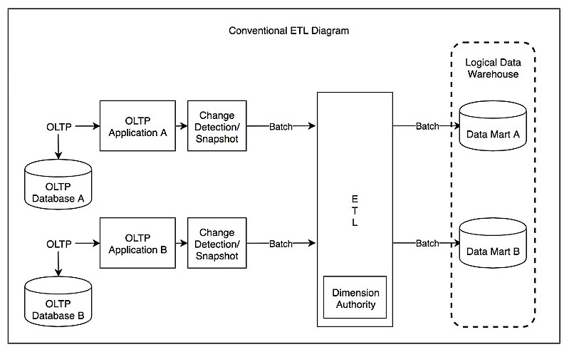

# ETL: Extract, Transform, Load

ETL is the general procedure of **copying data from one or more sources into a destination system which represents the data differently** from the source(s) or in a different context.

*Data Extraction* involves extracting data from homogeneous or heterogeneous sources, *Data Transformation* processes data by *data cleaning* and *transforming* them into a proper storage format/structure for the purposes of querying and analysis; finally *Data Loading* describes the insertion of data into the final target database such as an operational data store, a data mart, a data lake, or a data warehouse.

> A properly designed ETL system extracts data from the source systems, enforces data quality and consistency standards, conforms data so that separate sources can be used together, and finally delivers data in a presentation-ready format so that application developers can build applications and end users can make decisions.

Since the data extraction takes time, it is common to execute the three phases in pipeline. While the data is being extracted, another transformation process executes while processing the data already received and prepares it for loading while the data loading begins without waiting for the completion of the previous phases.