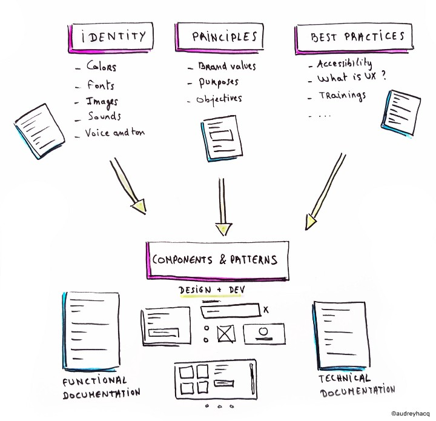
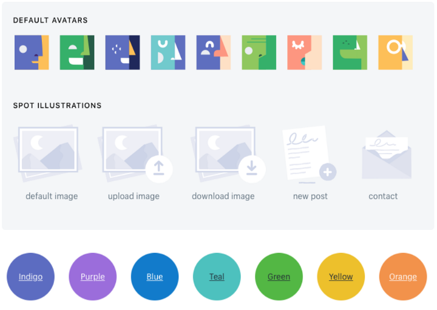
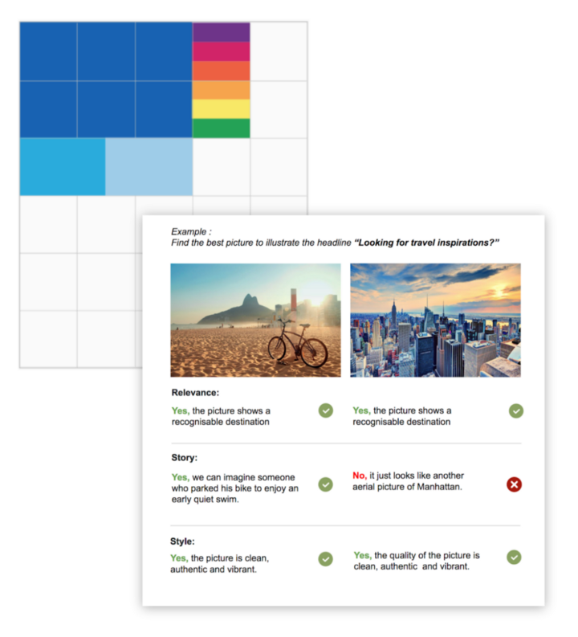
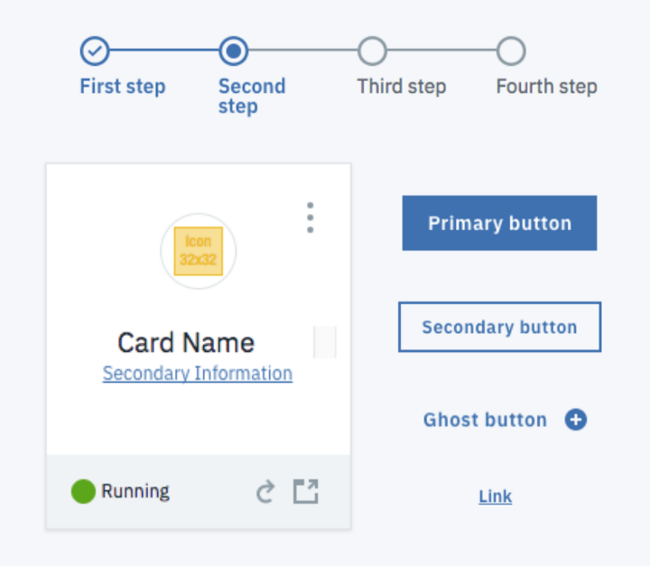

# Design System

- [Design System](#design-system)
  - [Overview](#overview)
  - [What's the difference with Style guide or Pattern library?](#whats-the-difference-with-style-guide-or-pattern-library)
  - [Components](#components)
    - [Purpose and shared values](#purpose-and-shared-values)
    - [Design principles](#design-principles)
    - [Brand identity & language](#brand-identity--language)
    - [Components & patterns](#components--patterns)
  - [Examples](#examples)

## Overview

A _design system_ is the single source of truth which groups all the elements that will allow the teams to design, realize, and develop a product. It is a _set of deliverables_ that will evolve constantly with thew product.

It is composed of tangible and non-tangible elements:

- Tools for designers & developers, patterns, components, guidelines.
- Abstract elements such as brand values, mindset, and culture.

## What's the difference with Style guide or Pattern library?

They are just some of the deliverables of a design system.

A _style guilde_ will focus on graphic styles (colours, fonts, illustrations...) and their usage.

A _pattern library_ will integrate functional components and their usage.

## Components

### Purpose and shared values

> Where are we going? Why? How?

Align teams around a clear set of __shared goals__. These goals will evolve with time and have to be broadly communicated.

### Design principles

__Design principles__ are the guiding sentences that helps the teams to reach the purpose of the product thanks to the design. They will help teams to make meaningful design decisions.

> One of _Medium_'s design principles is "_direction over choice_". It means that the product should guide the user instead of giving him too many choices (e.g., colours and fonts). Thay allows the users to focus on the content of their articles rather than on its visual aspect.

### Brand identity & language

> Shopify brand identity

The identity should be defined in line with the strategy and the objectives of the brand. The "_alphabet_" of the brand consists in "_perceptual patterns_":

- Colors
- Fonts
- Spaces
- Shapes
- Icons
- Illustrations
- Photographies
- Animations
- Voice and tone
- Sounds

These brand elements will need some rules to be applied consistently, and will work as the grammar and the conjugation of the system. It's materialized in by the __brand guidelines__, the _do's_ and _don'ts_, and good examples of use.

This will ensure the design teams use the "right combinations" of this language, and make the brand unique and recognizable.

### Components & patterns

The __components__ are our LEGO blocks. They're used in Sketch by designers, and directly in the code by developers. Their _functional behavior_ must be specified.

As for the __patterns__, they are the _functional combinations_ of components, the building instructions that allow us to use the components in a logical and consistent way. They are used by designers to create a page or a screen.

> Yahoo pattern vs Bootstrap component

## Examples

- [Polaris](https://polaris.shopify.com/foundations)
- [Atlassian](https://atlassian.design/)
- [Lightning](https://www.lightningdesignsystem.com/)
- [Material](https://m2.material.io/design)
- [IBM](https://www.ibm.com/design/language/)
