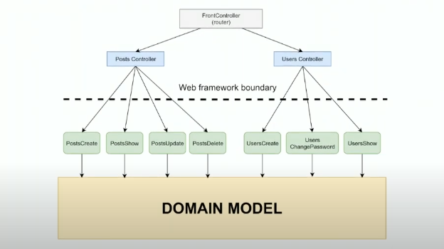

# Working Architecture - Viktor Tuskyi

* [Source: Video Conference](https://www.youtube.com/watch?v=eVGdV53q68I)

## Microservices Drawbacks

Monolith are usually associated with the _Big Ball of Mud_, but Microservices can end up being a _Big and Distributed Ball of Mud_.

> If you cannot build a Monolith what makes oyu think that you can build Distributed Microservices. - Simon Brown

* High operational complexity (increases costs)
* Versions compatibility issues (harder to track all dependencies)
* Extremely hard to support transactions
* Distribution issues
* Traceability issues
* Technology diversity (increase support cost, standardization issues, hiring issues, etc)
* Need more experienced team

## Best Architectural Decision

The decision that hasn't been made. So, __we start with monolith in 90% of cases__.

> "The job of an architect is not to make decision, the job of the architect is to defer decision as long as possible." Robert C Martin
---
> " Good architecture maximizes number of decisions not made." - Robert C Martin
---

## MVC

Most people don't really understand Model-View-Controller architecture.

Most people would place the following code in the controllers:

```js
const user = User.findById(id)
const tax = user.salary * taxRate;
```

This is refered as __Fat Stupid Ugly Controllers__:

> The M in MVC: Why Models are Misunderstood and Unappreciated." Padraic Brady

* [Blog post, the M in MVC](https://sites.google.com/site/dhntclub/thiet-ke-web-site/trao-doi/the-m-in-mvc-why-models-are-misunderstood-and-unappreciated)

## Model (MVC) vs Domain Model

In both cases, the Model is where you store your business logic.

### Model from MVC

* Domain model
* __Transaction script__
  * Organize business logic by procedures, where each procedure handles a single request from the presentation.
* Table module
* Service layer

### Domain model

> "An object model of the domain that incorporates both __behavior and data__." - M Fowler

You have your business logic in the form of classes and objects.

Works well for medium and large applications.

## Key Principles




* Aplication architecture does not depend on web framework.
* Never put your business logic in your controllers.
* Controllers
  * Layer as thin as possibly.
  * Protects underneath layers from everything related to HTTP.
  * If you change JSON to XML (or even CLI), only controllers should be rewritten.
* Domain Model
  * Belongs to Model layer of MVC.
  * Core part of your application.
  * Almost all business logic here.
  * Knows nothing about service layer and upper layers.
  * Responsible for data storing and data integrity.
  * Fine grained API (not suited for remote invocation).
* Services
  * Also belongs to Model layer of MVC.
  * Contains Application logic.
  * Does not trust any incoming params.
  * Keep thin as possible.
  * Knows nothing about Controllers/Transport/UI.
  * __Use cases based API__.
  * Coarse grained API (well suited for remote invocation).
  * Knows about __Context__ (what user asks for data).
  * Knows when and how to notify user (emails, etc).
  * Does __Coordination & Security__.

## Core Patterns

* Application level (Martin Fowler):
  * MVC
  * Service layer
  * Domain model
* Class level (GoF):
  * Template method
  * Command

## Service Layer

### Rule 1: Separate Service class (implemented as Command) for each endpoint

```js
router.post('/posts', function(req, res) {
  const context = req.session.context;
  const params = req.body;
  const service = new PostsCreate({ context });
  const promise = srevice.run(params);
  renderPromiseAsJson(res, promise);
});
```

```js
import chista from '../chista.js';

import PostsCreate from '../services/posts/Create';
import PostsUpdate from '../services/posts/Update';
import PostsDelete from '../services/posts/Delete';
import PostsList from '../services/posts/List';
import PostsShow from '../services/posts/Show';

export default {
  create: chista.makeServiceRunner(PostCreate, req => req.body),
  update: chista.makeServiceRunner(PostsUpdate, req => ({ ...req.body, id: req.params.id })),
  delete: chista.makeServiceRunner(PostsDelete, req => ({ ....req.query, ...req.params })),
  list: chista.makeServiceRunner(PostsList, req => ({ ...req.query, ...req.params })),
  show: chista.makeServiceRunner(PostsShow, req => ({ id: req.params.id }))
};
```

Example of service class:

```js
class Base {
  constructor(args) {
    if (!args.context) throw new Error('CONTEXT_REQUIRED');
    this.context = args.context;
  }

  run(params) {
    return this.validate(params).then(cleanParams => this.execute(cleanParams));
  }
}

import { dumpPost } from '../utils';
const Post = mongoose.model('Post');

export default class PostCreate extends Base {
  async validate(data) {
    const rules = {
      data: [ 'required', { 'nested_object': {
        title: ['required'],
        subtitle: ['required'],
        image: ['not_empty', 'url'],
        text: ['required'],
        isPublished: ['not_empty']
      } }]
    };

    return validator.validate(data, rules);
  }

  async execute(data) {
    const post = await Post.create(data.data);
    return {
      data: dumpPost(post)
    }
  }
}
```

The "`run`" Template method in base class guarantees that al procedures are kept:

* Data was validated.
* "execute" will be called only after validation.
* "execute" will receive only clean data.
* Checks permissions before calling execute.
* Throws exception in case of validation errors.
* Can do extra work like caching validator objects, etc.

### Rule 2: Never return objects directly

Whitelist every object properly:

* Know what you return (no internal/secret data).
* API is stable.

```js
export function dumpPost(post) {
  return {
    id: post.id,
    title: post.title,
    subtitle: post.subtitle,
    text: post.text,
    isPublished: post.isPublished,
    image: post.image
  };
}
```

### Rule 3: Use Promises or await/async

* Error handling is one of the most powerful promise features.
* Never see "uncaughtException".
* Manageable code.

### Rule 4: Unified approach to validation

* Don't trust any user input.
* Declarative validation.
* Exclude all fields that do not have validations rules described.
* Returns understandable code errors.
* Should be clear for the service use what is wrong with his data.

### Rule 5: Be aware of "Anemic domain model" antipattern

It should be clear where any code should be. Otherwise you do not architecture.

If you have a large project, this can be a reason of project failure as you will implicitly switch to "transaction script" approach which is not well suited for large applications.

## Full Example

### Controller/Dispatcher

```js
router.post('/users', controllers.users.create);
```

### Controllers

```js
import chista from '../chista.js';

import UsersCreate from '../services/users/Create';
import UsersUpdate from '../services/users/Update';
import UsersResetPassword from '../services/users/Delete';
import UsersList from '../services/users/List';
import UsersShow from '../services/users/Show';

export default {
  create: chista.makeServiceRunner(UsersCreate, req => req.body),
  update: chista.makeServiceRunner(UsersUpdate, req => ({ ...req.body, id: req.params.id })),
  resetPassword: chista.makeServiceRunner(UsersResetPassword, req => ({ ....req.query, ...req.params })),
  list: chista.makeServiceRunner(UsersList, req => ({ ...req.query, ...req.params })),
  show: chista.makeServiceRunner(UsersShow, req => ({ id: req.params.id }))
};
```

### Service

```js
export default class UsersCreate extends Base {
  static validationRules = {
    // ...
  };

  async execute(data) {
    const userData = data.data;

    if (await User.findOne({ email: userData.email })) {
      throw new X({
        code: 'NOT_UNIQUE',
        fields: { email: 'NOT_UNIQUE' }
      });
    }

    const action = await new Action({
      type: 'confirmEmail',
      data: {
        email: userData.email
      }
    }).save();

    userData.actionId = action.id;

    const user = new User(userData);

    await user.save();
    await emailSender.send('confirmEmail', userData.email, userData);

    return { data: dumpUser(user) };
  }
}
```

### Model

```js
const userSchema = new Schema({
  email: { type: String, required: true, index: { unique: true } },
  // ...
})

mongoose.model('User', UserSchema);
```

### Action

```js
const ActionSchema = new Schema({
  _id: { type: String, default: uuid.v4 },
  type: { type: String, required: true, enum: ['confirmEmail', 'resetPassword'] },
  data: { type: Object, required: true, default: {} }
});

ActionSchema.methods = {
  run(data) { return this[this.type](data) };

  async confirmEmail(externalData) {
    // ...
  }

  async resetPassword(externalData) {
    // ...
  }
}
```
