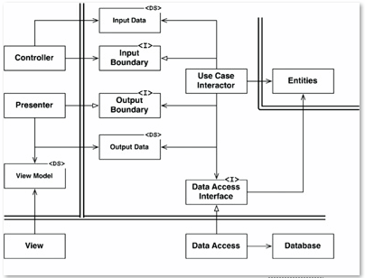

# Clean Architecture

> Reference: https://blog.cleancoder.com/uncle-bob/2012/08/13/the-clean-architecture.html

* Formal Definition.
* Generalization of Clean Architectures
* Only Four Circles?
* Typical Example

## Formal Definition

The Clean Architecture style aims for a loosely coupled implementation focused on use cases and it is summarized as:

1. It is an architecture style where the _Use Cases_ are the centran organizing structure.

2. Follows the _Ports and Adapters_ pattern.
  * Implementation guided by tests (TDD Outside-In).
  * Decoupled from technology details.

3. Follows lots of principles (_Dependency Rule_, _Stable Abstractions Principle_, _Stable Dependencies Principle_, _SOLID_, and so on).

By separating the software into layers, and conforming to _The Dependency Rule_, you will achieve *separation of concerns* and create a system that is intrinsically testable, with all the benefits that implies. When any of the external parts of the system become obsolte, you can replace those with a minimum of fuss.

## Generalization of Clean Architectures

> * __Hexagonal Architecture (Ports and Adapters)__ by Alistair Cockburn and adopted by Steve Freeman, and Nat Pryce in their book _Growing Object Oriented Software_.
> * __Onion Architecture__ by Jeffrey Palermo.
> * __Screaming Architecture__ from Robert C Martin.
> * __DCI__ from James Coplien, and Trygve Reenskaug.
> * __BCE__ by Ivar Jacobson from his book _Object Oriented Software Engineering: A Use-Case Driven Approach_.

Though architectures all vary somewhat in their details, they are very similar. They all have the same objective, which is the separation of concerns. They all achieve this separation by dividing the software into layers. Each has at least one layer for business rules, and another for interfaces.

Each of these architectures produce systems that are:

1. __Independent of Frameworks__. The architecture does not depend on the existence of some library of feature laden software. This allows you to use such frameworks as tools, rather than having to cram your system into their limited constraints.

2. __Testable__. The business rules can be tested without the UI, Database, Web Server, or any other external element.

3. __Independent of UI__. The UI can change easily, without changing the rest of the system. A Web UI could be replaced with a console UI, for example, without changing the business rules.

4. __Independent of Database__. You can swap out Oracle or SQL Server, for Mongo, BigTable, CouchDB, or something else. Your business rules are not bound to the database.

5. __Independent of any external agency__. In fact your business rules simply don’t know anything at all about the outside world.

## Only Four Circles?

No, the circles are schematic. You may fin that you need more than just these four. However, __The Dependency Rule always applies__. Source code dependencies always point inwards.

## Typical Example

This diagram shows a typical scenario for a web-based Java system using a database.

1. The web server gathers input data from the user and hands it to the `Controller` on the upper left. The `Controller` packages that data into `InputData` interface as a plain old Java object and passes this object trough the `InputBoundary` to the `UseCaseInteractor`.

2. The `UseCaseInteractor` interprets that data and uses it to orchestate the `Entities`. It also uses the `DataAccessInterface` to bring the data used by those `Entities` into memory from the `Database`.

3. Upon completion, the `UseCaseInteractor` gathers data from the `Entities` and constructs the `OutputData` as another plain old Java object The `OutputData` is then passed through the `OutputBoundary` interface to the `Presenter`.

4. The job of the `Presenter` is to repackage the `OutputData` into viewable form as the `ViewModel`, which is yet another plain old Java object. The `ViewModel` contains mostly `Strings` and flags that the `View` uses to display the data. Whereas the `OutputData` may contain `Date` objects, the `Presenter` will load the `ViewModel` with corresponding `Strings` already formatted properly for the user. The same is true for any other business-related data.

5. This leaves the `View` with almost nothing to do other than to move the data from the `ViewModel` into the HTML page.

> Note the directions of the dependencies. All dependencies cross the boundary lines pointing inward, following the _Dependency Rule_.
