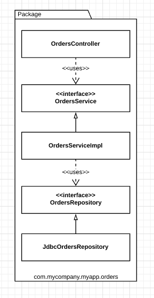

# Package by Feature

This is a vertical slicing, based on related features, domain concepts, or aggregate roots (domain-driven design terminology).

With this approach, the top-level organization of the code now screams something about the business domain. Another benefit is that it's potentially easier to find all of the code that you need to modify in the event that an use case changes.

## Java example

All of the types are placed into a single Java package, which is named to reflect the concept that is being grouped.
 

