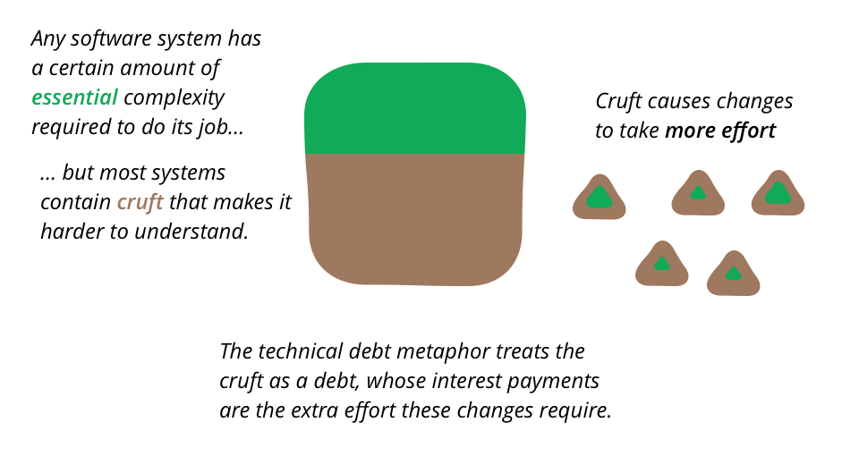
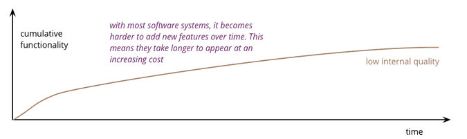
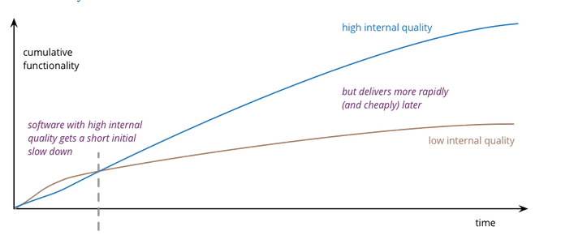

# Is Quality Worth the Cost?

> Based on Martin Fowler's post ["Is High Quality Software Worth The Cost?"](https://www.martinfowler.com/articles/is-quality-worth-cost.html).

- [Is Quality Worth the Cost?](#is-quality-worth-the-cost)
  - [Overview](#overview)
  - [Software quality](#software-quality)
  - [At first glance, internal quality does not matter to costumers](#at-first-glance-internal-quality-does-not-matter-to-costumers)
  - [Why Internal quality matters?](#why-internal-quality-matters)
    - [It makes easier to enhance software](#it-makes-easier-to-enhance-software)
      - [How?](#how)
      - [Why?](#why)
    - [Impact of internal quality (cruft)](#impact-of-internal-quality-cruft)
    - [Even the best teams create cruft](#even-the-best-teams-create-cruft)
  - [High quality software is cheaper to produce](#high-quality-software-is-cheaper-to-produce)

## Overview

A common debate is between *spending time on improving the quality* versus concentrating on *releasing more valuable features*. Usually the pressure to deliver functionality domaintes the discussion.

We are used to a *trade-off* between quality and cost, usually higher quality costs more. But this relationship is reversed when talking about software, **high quality software is actually cheaper to produce**.

## Software quality

You can device software quality attributes into **external** (such as UI and defects) and **internal** (architecture).

The distinction is that users and customers can see what makes a software product have high external quality, but cannot tell the difference between higher or lower internal quality.

## At first glance, internal quality does not matter to costumers

For a customer, it makes sense to *trade cost for external quality* but it makes no sense to trade cost for internal quality. A user can judge whether they want to pay more to get a better user interface, but a user can't see the internal modular structure of the software, let alone judge that it's better.

> If a customer is presented with two equally functioning applications, one for $5 with a tangled mess of source code, and another one with $10 with a neatly organized source code, why would a customer pay an extra $5 if they never see this source code?

## Why Internal quality matters?

### It makes easier to enhance software

#### How?

One of the primary features of internal quality is making it easier for me to *figure out how the application works so I can see how to add things*. If the software is nicely divided into **separate modules**, I don't have to read all thousands lines of code, I can quickly find a few hundred lines in a couple of modules.

If we've put the effort into **clear naming**, I can quickly understand what the various part of the code does without having to puzzle through the details. If the data sensibly follows the language and structure of the underlying business, I can easily understand how it correlates to the request I'm getting from the customer service reps.

> **Cruft** adds to the time it take for me to understand how to make a change, and also increases the chance that I'll make a mistake.

#### Why?

When I want to add a new feature to the software, my first task is to *figure out how this feature fits into the flow of the existing application*. I then need to change that flow to let my feature fit in. I often need to use data that's aready in the application, so I need to understand what the data represents, how it relates to the data around it, and what data I may need to add for my new feature.

All of this is about me *understanding the existing code*. But it's very easy for software to be hard to understand. Logic can get tangled, the data can be hard to fllow, the names used to refer to things may have made sense to another programmer six months ago, but are as mysterious to me as his reasons for leaving the company.

> All of these are forms of what developers refer to as **cruft** — the difference between the current code and how it would ideally be.

> A common methaphor for *cruft* is **technical debt**. The extra cost on adding features is like paying interest. Cleaning up the cruft is like paying down to the principal.

### Impact of internal quality (cruft)

> A common metaphor is that it's like cleaning up work surfaces and equipment in the kitchen. You can't not make things dirty when you cook, but if you don't clean things quickly, muck dries up, is harder to remove, and all the dirty stuff gets in the way of cooking the next dish.

The fundamental role of internal quality is that it **lowers the cost of future change**; but there is some extra effort required to write good software, which does impose **some cost in the short term**.

My changes also **affect the future**. A may see a quick way to put in this feature, but it's a route that goes against the modular structure of the program, *adding cruft*. If I take that path, I'll make it **quicker for me today, but slow down everyone else** who has to deal with this code in future weeks and months. Once other members of the team make the same direction, it can quickly accumulate cruft.

> This is what happens with poor internal quality. Progress is rapid initially, but as time goes on it gets harder to add new features. Even small changes require programmers to understand large areas of code, code that's difficult to understand. When they make changes, unexpected breakages occur, leading to long test times and defects that need to be fixed.

While it is true that **we can sacrifice quality for faster delivery in the short term**, before the build up of cruft has an impact, people understimate how quickly the cruft leads to an overall slower delivery. While this isn't something that can be objectively measured, experienced developers reckon that **attention to internal quality pays off in weeks not months**.

> The subtlety here is that there is a period where the low internal quality is more productive than the high track. During this time there is some kind of trade-off between quality and cost.

### Even the best teams create cruft

> "We made good decisions, but only now do we understand how we *should* have built it."

Building software exists in a world of uncertainty unknown to the physical word. Software's customers have only a rough idea of what features they need in a product and learn more as the software is built; particularly once early versions are released to their users.

The building blocks of software development (i.e., languages, libraries, and platforms) change significantly every few years.

Given this level of change, we hardly ever find ourselves working on a well-understood problem that's been solved before. Naturally **we learn most about the problem as we're building the solution**.

Therefore, even the best teams will have cruft in their software. The difference is that best teams:

* Create much less cruft.
* Remove enough of the cruft they do create so that they can continue to add features quickly.
* They spend time less time removing bugs.
* They refactor frequently so that they can remove cruft before it builds up enough to get in the way.
* Continues integration minimizes cruft building due to team members working at cross-purposes.

## High quality software is cheaper to produce

* Negleting internal quality leads to rapid build up of cruft.
* This cruft slows down feature development.
* Even a great team produces cruft, but by keeping internal quality high, is able to keep it under control.
* High internal quality keeps cruft to a minimum, allowing a team to add features with less effort, time, and cost.

When thinking about internal quality, I stress that **we should only approach it as an economic argument**. High internal quality reduces the cost of future features, meaning that putting the time into writing good code actually reduces cost.

The usual trade-off between cost and quality, one that we are used to for most decisions in our life, does not make sense with the internal quality of software. (It does for external quality, such as a carefully crafted user-experience.) Because **the relationship between cost and internal quality is an unusual and counter-intuitive relationship**, it's usually hard to absorb.
