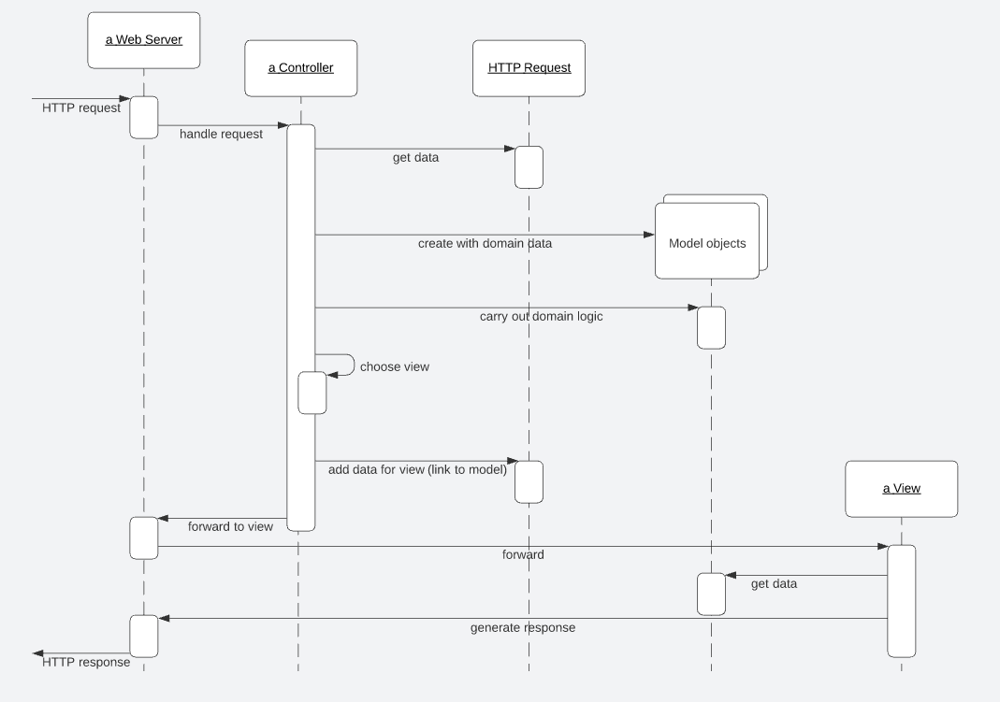

# Web Presentation

> Web-browser-based user interfaces bring with them a lot of advantages: no client software to instsall, a common UI approach, and easy universal access.

* Web Server
  * As a Script
  * As a Server Page
* MVC: Model View Controller
  * Overview
  * Why
  * Application Controller
* View Patterns
  * Template View
  * Transform View
  * Two Step View
* Input Controller Patterns

## Web Server

Preparing a Web app **begins with the server software itself**. Usually this indicates which URLs are to be handled by which programs.

Often a single Web server can handle many kinds of programs. These programs may be dynamic and can be added to a server by placing them in an appropriate directory.

> The Web server's job is to interpreter the URL of a request and hand over control to a Web server program.

There are two main forms of structuring a program in a Web server: as **a script** or as **a server page**.

> *Script style* works best for interpreting the request and the *Server Page style* works best for formatting a response.

There's the obvious option to use a script for request interpretation and a server page for response formatting. This separation is in fact an old idea that first surfaced in user interfaces with MVC.

### As a Script

The script form is a program, usually with functions or methods to handle the HTTP call.

> Examples include CGI scripts and Java servlets.

The script can be broken down into subroutines, and can create and use other services. It gets data from the Web page by examining *the HTTP request object*, which is a string.

> Some platforms, such as Java servlets, do this parsing for the programmer, which allows the programmer to access the information from the request through a keyword interface.

The output of the Web server is another string, *the response*, which the script can write to using the usual write stream operations in the language.

### As a Server Page 

In *server pages*, the program is structured around the returning text page. You write the return page in HTML and insert into the HTML scriptlets of code to execute at certain points.

> Examples of this approach include PHP, ASP, and JSP.

The server page approachs **works well when there's little processing of the response**, such as "*Show me details of album #1234*". 

## MVC: Model View Controller

> "MVC is a widely referenced pattern but one that's often misunderstood. A main reason for the confusion was the use of the word '*controller*'. [...] Controller is used in a number of different contexts, and I've usually found it used in a different way to that described in MVC. As a result I prefer to use the term **input controller** for the controller in MVC." - Fowler

### Overview

A *request* comes in to an **input controller** which pulls information off the *request*. It then forwards the bussiness logic to an appropriate model object. The **model object** talks to the **data source** and does everything indicated by the *request* as well as gather information for the *response*. When it's done it returns control to the **input controller**, which looks at the results and decides which **view** is needed to display the *response*. It then passes control, together with the *response data*, to the **view**.

The **input controller**'s handoff to the **view** often isn't always a straight call but often involves forwarding with the data placed in an agreed place on some form of HTTP session object that's shared between the **input controller** and the **view**.

> A broad picture of how the model, view, and input controller roles work together in a Web server. The controller handles the request, gets the model to do the domain logic, and then gets the view to create a response based on the model.

### Why

The first, and most important, reason for applying *MVC*, is to **ensure that the models are completely separated from the Web presentation**. This makes it easier to modify the presentation as well as easier to add additional presentations later.

> Putting the processing into separate *Transaction Script* or *Domain Model* objects will make it easier to test them as well. This is particularly important if you're using a server page as your view.

### Application Controller

> At this point we come to a second use of the word *"controller"*.

A lot of UI designs separate the *presentation objects* from the *domain objects* with an intermediate layer of **Application Controller** objects.

The purpose of an *Application Controller* is to handle the flow of an application, deciding which screens should appear in which order. It may appear as part of the *presentation layer*, or you can think of it as a separate layer that mediates between the *presentation* and *domain layers*.

*Application Controllers* may be written to be independent of any particular presentations, in which case they can be reused between presentations. This works well if you have different presentations with the same basic flow and navigation, although often it's best to give different presentations a different flow.

Not all systems need an *Application Controller*. They're **useful if your system has a lot of logic about the order of screens and the navigatio nbetween them.** They're also useful **if you haven't got a simple mapping between your pages and the actions on the domain**. But if someone can pretty much see any screen in any order, you'll porbably have little need for an *Application Controller*.

> "A good test is this: If the machine is in control of the screen flow, you need an *Application Controller*; if the user is in control, you don't." - Martin Fowler.

## View Patterns

On the view side there are three patterns to think about:

* *Template View*
* *Transform View*
* *Two Step View* (variation that you can apply to either)

These give rise to essentialy two choices:

1. Use *Transform View* or *Template View*.
2. Whether eiher of them uses one stage or a *Two Step View*.

### Template View

The *Template View* allows you to write the presentation in the structure of the page and embed markers into the page to indicate where dynamic content needs to go.

> Quite a few popular platforms are based on this pattern, many of which are the server pages technologies (ASP, JSP, PHP) that allow you to put a full programming language into the page.

This clearly provides a lot of power and flexibility; sadly, it also leads to very messy code that's difficult to maintain.

As a result if you use server page technology, you must be very disciplined to keep programming logic out of the page structure, often by using a helper object.

### Transform View

The *Transform View* uses a transform style of program.

> The usual example is XSLT.

This can be very effective if you're working with domain data that's in XML format or can easily be converted to it. An *input controller* picks the appropriate XSLT stylesheet and applies it to XML gleaned from the model.

### Two Step View

The second decision is whether to be *single-stage* or to use *Two Step View*.

A *single-stage* view  mostly has one view component for each screen in the application. The view takes domain oriented data and renders it in HTML.

> Similar logical screens may share views. Even so, most of the time you can think of it as one view per screen.

A *two-stage* view breaks this process into two stages, producing a logical screen from the domain data and then rendering it in HTML. There's one first-stage view for each screen but only one second-stage view for the whole application.

The advantage of the *Two Step View* is that it puts the decision of what HTML to use in a single place. This makes global changes to the HTML easy since there's only one object to alter in order to alter every screen on the site. Of course, you only get that advantage if your logical presentation stays the same, so it works best with sites where different screens use the same basic layout.

> Highly design intensive sites won't be able to come up with a good logical screen structure.

## Input Controller Patterns

There are two patterns for the *input controller*: *Page Controller* & *Front Controller*.

The most common is **an input controller object for every page on your Web site**.

In the simplest case this **Page Controller** can be a server page itself, combining the roles of *view* and *input controller*. In many implementations it makes things easier to split the *input controller* into a separate object. The *input controller* can then create appropriate models to do the processing and instantiate a view to return the result

Often you'll find that there isn't quite a one-to-one relationship between *Page Controllers* and views. A more precise thought is that you have a **Page Controller for each action**, where an action is a button or link. Most of the time the actions correspond to pages, but occasionally they don't, such as a link that may go to a couple of different pages depending on some conditions.

With any *input controller* there are two responsibilities: handling the HTTP request and deciding what to do wih it, and it often makes sense to separate them. A server page can handle the request, delegating a separate helper object to decide what to do with it. *Front Controller* goes further in this spearation by **having only one object handling all requests**. This single handler interprets the URL to figure out what kind of request it's delaing with and creates a separate object to process it. In this way you can centralize all HTTP handling with a single object, avoiding the need to reconfigure the Web server whenever you change the action structure of the site.
