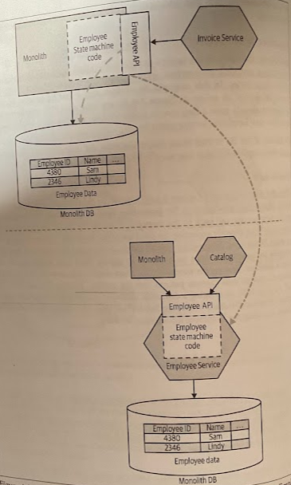

# Aggregate Exposing Monolith

- [Aggregate Exposing Monolith](#aggregate-exposing-monolith)
  - [Overview](#overview)
  - [Where to Use It](#where-to-use-it)
  - [As a Pathway to More Services](#as-a-pathway-to-more-services)

## Overview

By exposing information we need about our aggregate via a service endpoint on the monolith itself, we make explicit what information an external service needs.

> In this example, the *Invoice Service* requires information on our current *Employee aggregate* that is still managed by the monolith.

We want to think of our microservices as *combinations of behavior and state*; microservices as containing one or more *state machines* that manage domain aggregates.

When exposing an aggregate from the monolith, we want to think in the same terms. The monolith still "owns" the concept of what is and isn't an allowable change in state; we don't want to treat it just like a wrapper around a database.

Beyond just exposing data, we're *exposing operations* that allow external parties to query the current state of an aggregate, and to make requests for new state transitions. We can still decide to *restrict* what state of an aggregate is exposed from our service boundary and to *limit* what state transtions operations can be requested from the outside.

## Where to Use It

* When the data you want to access is still "owned" by the monolith database.

* When extracting services, having the new service call back to the monolith to access the data it needs is likelly little more work than directly accessing the database of the monolith, but in the long term is a much better idea.

* Consider a database view over this approach only if the monolith in question cannot be changed to expose these new endpoints.

## As a Pathway to More Services

By defining the needs of a service, and explicitly exposing the information needed in a *well-defined interface*, we're on a path to potentially discovering *future service boundaries*.

> Using the scope of an existing endpoint to drive extraction of a new Employee service.
