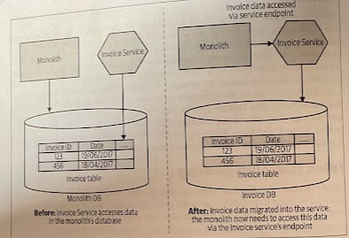
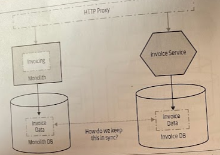

# Change Data Ownership

- [Change Data Ownership](#change-data-ownership)
  - [Overview](#overview)
  - [Where to Use It](#where-to-use-it)
  - [Considerations](#considerations)
    - [Data Synchronization](#data-synchronization)

## Overview

When we consider that that is currently in the monolith that should be under the control of a newly extracted service, we'd need to change the monolith to treat the new service as the *source of truth* for service-related data, and change it such that it called out to the new service endpoint to read the data or request changes.

> In this example, the Invoice Service will be the new source of truth for the invoice-related data.

Untangling the new service data from the existing monolithic database can be a complex problem, however. We may have to consider the impact of breaking foreign-key constraints, breaking transactional boundaries, and more.

If the monolith can be changed such that it needs only read access to the service data, you could consider projecting a view from the new service's database.

## Where to Use It

If your newly extracted service encapsulates the business logic that changes some data, that data should be under the new service's control.

## Considerations

### Data Synchronization

If we want to aply something like a *strangler fig* pattern we need to maintain the ability to switch between implementations and ensure that both sets of code can see the same data, therefore the data managed by the new service in question will need to be kept in sync between both the monolith and the new service in a consistent way.

We need to consider the degree to which the data needs to be consistent between the two views. If either set of code needs to always see a totally consistent view of service data, one of the most straightforward approaches would be to ensure the data is kept in one place. However, you should consider using a *shared database* only a as a *very short term measure*, as part of a more complete extraction.

> Leaving a shared database in place for too long can lead to significant long-term pain.

If we were doing a *big-bang switchover*, migrating both the application code and the data at the same time, we could use a *batch process* to copy the data oer in advance of switching to the new microservice. However, what happens if we need to fall back to using the functionality in the existing monolithic system? Data changed in the microservices' schema will not be reflected in the satete of the monolithic database, so we could end up losing state.

Another approach could be to consider *keeping the two databases in sync* via our code. So we would have either the monolith or the new service make writes to both databases.
