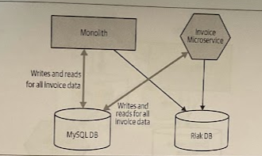
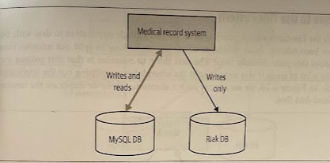
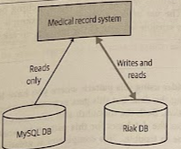

# Synchronize Data in Application

- [Synchronize Data in Application](#synchronize-data-in-application)
  - [Overview](#overview)
  - [Where to Use It](#where-to-use-it)
  - [How It Works](#how-it-works)
    - [Step 1: Bulk Synchronize Data](#step-1-bulk-synchronize-data)
    - [Step 2: Synchronize on Write, Read from Old Schema](#step-2-synchronize-on-write-read-from-old-schema)
    - [Step 3: Synchronize on Write, Read from New Schema](#step-3-synchronize-on-write-read-from-new-schema)
  - [Case Study - Trifork](#case-study---trifork)

## Overview

The application itself would perform the synchronization between two data sources. The existing database would remain the source of truth, but for a period of time the application would ensure that data is synchronized with the new service's database. After a period of time, the new service's database would move to bgeing the source of truth for the application, prior to the previously existing database being retired.
o

## Where to Use It

* You want to split the schema *before* splitting out the application code.

* You can be sure that at any point in time either the new service is making writes, or the old functionality is.

* (!) If requests can hit either the old or the new functionality, perhaps as part of a *canary*, then you may not want to use this pattern, as the resulting synchronization will be tricky.

## How It Works

### Step 1: Bulk Synchronize Data

Get to the point where **you have a copy of the data in the new database**.

While the batch import is going on, the existing system was kept running, so the source of data for the import was a snapshot of data taken from the existing database. When the batch import finishes, if the application can't be affected by downtime, the data in the source system could well have changed, so a change data capture process can be implemented whereby changes since the import could be applied.

### Step 2: Synchronize on Write, Read from Old Schema

With both databases now in sync, a new version of the application was deployed that would **write all data to both databases**.

By still reading from the original database, we ensure that even if the new database fails, data could still be retrieved.

### Step 3: Synchronize on Write, Read from New Schema

The last step is to make sure that **reads work too.** A simple change to the application now has the new database as being the source of truth. Note that wie still write to *both* databases, so if there is an issue, you have a *fallback option*.

Once you are confident enough that the new system is working properly, you can decomission the old one.

## Case Study - Trifork

Several years ago, the consultancy Trifork was involved in a project to help store a consolidated view of a Danish citizens' medical records. The initial version of this system had stored the data in a MySQL database but a decision was made to use a more suitable alternative database, Riak. The ope was that Riak would allow the system to better scale to handle expected load, but would also offer improved resiliency characteristics.

> Detailed presentation of Kresten Krab Thorup's talk: ["Riak on Drugs (and the Other Way Around)"](https://www.infoq.com/presentations/Case-Study-Riak-on-Drugs/)

An existing system stored data in one database, but there were limits to how long the system could be offline, and it was vital that data wasn't lost. So a solution was needed that allowed the company to move the data to a new database, but also build in mechanisms to **verify the migration**, an have **fast rollback** mexchanisms along the way.

The decision was made that **the application itself would perform the synchronization between the two data sources**. The existing MySQL database would remain the source of truth, but for a period of time the application would ensure that data in MySQL and Riak were kept in sync. After a period of time, Riak would move to being the source of truth for the application, prior to MySQL being retired.
